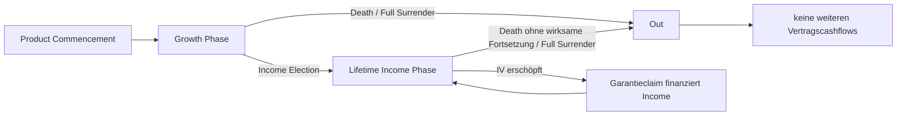
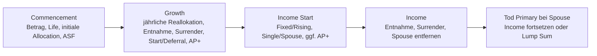
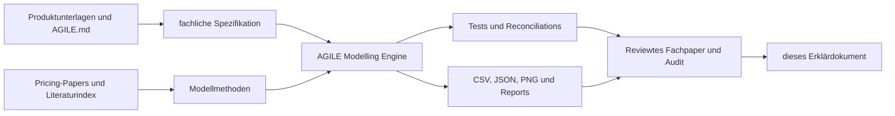
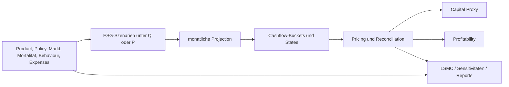

> **Dokumentstatus.** Dieses Dokument erklärt, wie AGILE vertraglich
> funktioniert und wie die lokale AGILE Modelling Research Engine 1.3.0 diese
> Mechanik abbildet. Es trennt konsequent zwischen veröffentlichter
> Produktregel, Modellannahme, technischer Implementierung und verbleibender
> Lücke. Es ist weder Produktberatung noch eine Pricing-, Reserve-, Bilanz-,
> Kapital-, Hedge- oder Produktfreigabe. Nicht veröffentlichte Allianz-
> Adminformeln werden nicht als bekannt vorausgesetzt.

> **Aktueller Behaviour-Stand (12. Juli 2026).** Für Policy Behaviour ist
> [Policy_Behaviour_Modellierung.md](documentation_and_background_info/Policy_Behaviour_Modellierung.md)
> maßgeblich. Der produktive Pfad lädt dynamische Lapse-, Income-Take-up- und
> Withdrawal-Annahmen aus `input_dynamic_behaviour`; jede Reaktion verwendet
> Markt-/Moneyness-Zustand und die eingezahlte Bruttoprämie. LSMC bleibt als
> Quellcode archiviert, ist aber aus API, CLI und allen verwendeten Modellpfaden
> ausgeklammert. Abweichende LSMC- oder statische Behaviour-Passagen weiter
> unten beschreiben einen historischen Implementierungsstand.

# 1. Zweck und Leselogik

AGILE kombiniert vier Mechanismen, die getrennt leicht verständlich, in ihrer
Wechselwirkung aber anspruchsvoll sind:

1. eine **indexgebundene, jährlich begrenzte Gutschrift** in der Growth Phase;
2. **Schutz gegen negative Indexrenditen** durch Total oder Partial Protection;
3. ein später aktivierbares **lebenslanges Einkommen**; und
4. vertragliche Wahlrechte zu **Allokation, Income-Start und -Ausgestaltung,
   Spouse, Age Pension+ und Kapitalzugriff** sowie die davon getrennten
   Leistungsfolgen bei Tod.

Die Engine übersetzt diese Mechanismen in eine monatliche State Machine. Sie
simuliert Marktpfade, führt Investment Value und Income-Zustände fort, gewichtet
Cashflows mit Mortalität und Storno und bewertet die resultierenden
Versicherer- und Kundencashflows. „Genau modelliert“ bedeutet dabei nicht, dass
jede echte Adminregel bekannt ist. Es bedeutet:

| Ebene | Frage | Beleg |
|---|---|---|
| **Produktfakt** | Was sagt der veröffentlichte Vertrag? | PDS, Rate Sheets, Guaranteed Minimums |
| **Modellannahme** | Welche nicht beobachtbare Größe wird gesetzt? | Settings, Model Point, Manifest |
| **Implementierung** | Wie wird die Regel numerisch berechnet? | Engine-Code, Tests, Methodology |
| **Ergebnis** | Welche Cashflows/Kennzahlen entstehen im konkreten Lauf? | CSV/JSON/PNG-Ergebnispack |
| **Interpretation** | Was darf daraus geschlossen werden? | Review, Reconciliation, Model-Risk-Grenzen |

Die wichtigste Leseregel lautet:

> Eine intern konsistente Berechnung kann trotzdem eine unvollständige
> Vertragsabbildung sein. Produktregel, Proxy und Produktionsformel sind nicht
> automatisch dasselbe.

# 2. Das Produkt in einem Bild

## 2.1 Rechtliche Rollen

AGILE wird von Allianz Australia Life Insurance Limited ausgegeben. Die
Investments werden Statutory Fund No. 2 zugeordnet. Die Group Policy wird an
Allianz Australia Life Policy Services Pty Limited ausgegeben; der Investor
ist specified beneficiary und erhält die im Investor Certificate
dokumentierten Rechte [@allianz2026pds, S. 2 und 83--85].

| Rolle | Bedeutung | Warum die Trennung wichtig ist |
|---|---|---|
| **Investor** | Inhaber des individuellen AGILE-Investments und specified beneficiary, aber nicht Inhaber der Group Policy | übt grundsätzlich die Investment-, Income- und Withdrawal-Wahlrechte aus und erhält die Leistungen |
| **Life Insured** | Leben, an das Lifetime Income und Death Event anknüpfen | muss nicht selbst Investor sein |
| **Surviving Spouse** | zweites gedecktes Leben bei wirksamer Spouse-Option | Fortsetzung hängt von Ownership, Eligibility und Election ab |
| **Allianz Australia Life** | Issuer und Leistungsschuldner | Garantie ist keine Garantie von Allianz SE |
| **Allianz Policy Services** | rechtlicher Inhaber der Group Policy | ist der eigentliche Group-Policyholder und nicht mit dem Investor zu verwechseln |

Bei Trustee-, Plattform- oder Company-Strukturen können Life Insured und
Surviving Spouse ohne eigenes unmittelbares Interesse unter der Group Policy
bleiben. Für Death-/Spouse-Cashflows muss daher immer der Ownership- und
Beneficiary-Pfad mitgedacht werden.

## 2.2 Zwei Phasen und ein absorbierender Endzustand



- In der **Growth Phase** erhält das Investment Value jährlich eine
  indexabhängige Gutschrift. Es handelt sich nicht um ein direktes
  Fondsanteilskonto: AGILE ist *indexed*, nicht *unit-linked*.
- In der **Income Phase** wird monatlich ein zuvor festgelegtes Lifetime
  Income gezahlt. Solange das Investment Value ausreicht, finanziert das Konto
  die Zahlung. Erst die nicht mehr aus dem Investment Value finanzierbare
  Restzahlung ist ein **Guarantee Claim**.
- **Out** ist absorbierend. Nach Tod ohne Fortsetzungsrecht oder vollständigem
  Rückkauf entstehen keine weiteren Vertragscashflows.

Funktional ähnelt die Growth Phase einer Fixed Indexed Annuity und die Income
Phase einem Guaranteed Lifetime Withdrawal Benefit. Das ist eine
ökonomische, US-geprägte Modellanalogie und keine rechtliche oder APRA-
Klassifikation [@bauer2008; @holz2012].

# 3. Growth Phase: Indexgutschrift und Schutz

## 3.1 Protected Investment Options

Für Commencement- oder Anniversary Dates vom 1. bis 31. Juli 2026 gelten die
folgenden veröffentlichten Maximum Returns:

| Return Index | Total Protection | Partial Protection mit initial 10 % Buffer |
|---|---:|---:|
| Australian Equity | 6,20 % | 13,00 % |
| Global Equity | 6,00 % | 12,80 % |

Die Werte werden an jedem Anniversary für das folgende Crediting Year neu
festgesetzt und gelten vor Product Fee, Lifetime Income Premium und Steuern
[@allianz2026maximums]. Die Guaranteed Minimums betragen 0,25 % für Total und
0,50 % für Partial Protection [@allianz2026minimums]. Sie sind Untergrenzen
des **künftig gesetzten Maximum Return**, keine Mindestjahresrenditen und kein
Protection Floor.

Für eine In-force-Police sind deshalb vier Dinge getrennt zu speichern:

1. der im Certificate beziehungsweise am letzten Anniversary gesetzte Cap;
2. das Ratecard-/Cap-Vintage;
3. der garantierte Minimum-Cap des Vertrags; und
4. der Beginn und das Ende des laufenden Crediting Year.

Die Research Engine hat im Basislauf keine zukünftige Cap-Schedule. Sie
wiederholt deshalb den Juli-2026-Cap in allen Folgejahren. Das ist eine
Management-/Modellannahme, keine Vertragszusage.

## 3.2 Annual-Return-Payoffs

Sei

\[
R=\frac{S_T}{S_0}-1
\]

die Point-to-Point-Rendite des maßgeblichen Return Index über ein Crediting
Year und $C$ der Maximum Return.

Für den marktgebundenen **Total-Protection-Zweig** modelliert die Engine

\[
c_{TP}(R)=\min\{\max(R,0),C\}.
\]

Die Gutschrift liegt somit zwischen null und Cap. Für **Partial Protection mit
10-%-Buffer** gilt

\[
c_{PP10}(R)=
\begin{cases}
\min(R,C), & R\ge 0,\\
\min(0,R+0{,}10), & R<0.
\end{cases}
\]

| Indexrendite | Total Protection, Cap 6,20 % | Partial Protection, Cap 13,00 % |
|---:|---:|---:|
| +15 % | +6,20 % | +13,00 % |
| +6 % | +6,00 % | +6,00 % |
| −5 % | 0,00 % | 0,00 % |
| −10 % | 0,00 % | 0,00 % |
| −18 % | 0,00 % | −8,00 % |

Total Protection besitzt den stärkeren Floor und deshalb typischerweise den
niedrigeren Cap. Partial Protection finanziert mehr Upside durch den verkauften
Schutz unterhalb des Buffers.

## 3.3 Fixed-Return-Branch

Das PDS erlaubt bei Total Protection alternativ einen garantierten
einjährigen **Fixed Return**, wenn dieser bei der Festsetzung mindestens den
Annual Return des einschlägigen Maximum Return liefern kann. In einem solchen
Jahr ist der Credit nicht marktgebunden. Auch die unterjährige DVA folgt dann
einem zeitanteiligen Fixed Return [@allianz2026pds, S. 58, 60 und 62].

> **Engine-Grenze:** Dieser Fixed-Return-Branch ist nicht implementiert. Die
> obenstehenden Payoffformeln und die Optionsreplikation decken daher nur den
> marktgebundenen Zweig ab.

## 3.4 Ablauf eines Crediting Year

Ein Crediting Year kann gedanklich so gelesen werden:

1. Am Anniversary werden Startindex $S_0$, Cap und Protection-Option fixiert.
2. Unterjährig verändert sich der Wert des Derivatepakets; dieser Wert fließt
   über die DVA in das Investment Value ein.
3. Bei unterjährigen Transaktionen wird der aktuelle DVA-Wert realisiert oder
   in die Transaktionsbasis einbezogen.
4. Am nächsten Anniversary wird aus $S_T/S_0-1$ der vertragliche Annual Credit
   berechnet.
5. Das Investment Value erhält den Credit; der DVA-Frame konvergiert in die
   Jahresendgutschrift.
6. Ein neues Crediting Year beginnt mit neuem Startindex und neuem Cap.

## 3.5 Single Premium und Allocation

AGILE ist in der Engine ein Single-Premium-Vertrag: Es gibt genau einen
Time-0-Investment-Cashflow und keine spätere Top-up-Funktion. Das bildet das
Verbot späterer Einzahlungen implizit ab, aber nicht als separat getestete
Transaktionsregel.

Der investierte Startwert ist

\[
P_0=InitialInvestment\,(1-UpfrontAdviserFeePct)
   +InitialInvestment\,BonusPct.
\]

Ein Upfront Adviser Fee reduziert sämtliche nachgelagerten Investment-
Basen. Ein ausdrücklich gesetzter Commencement Bonus erhöht Investment Value
und Fee-/Withdrawal-Basen; derselbe Bonusbetrag wird bei Zeit null als
Versichereraufwand erfasst. Der Bonus ist kein Default.

In Growth kann das Investment auf die vier Protected Investment Options
verteilt werden. Der Code speichert nichtnegative Gewichte mit Summe 100 % und
berechnet Credit und DVA je Option. Die bei Commencement gesetzte Allocation
bleibt über den gesamten Growth-Pfad konstant. Ein vertragliches späteres
Reallokationsrecht beziehungsweise optimales Switching wird nicht als
zeitabhängige Allocation modelliert.

Vertraglich kann der Investor die Allocation an jedem Anniversary ändern. Die
Instruktion muss Allianz grundsätzlich bis 15:00 Uhr am letzten Business Day
vor dem Anniversary erreichen. Ohne neue Election bleibt die bisherige
Mischung bestehen; für das neue Jahr gelten dennoch die dann festgesetzten
Maximum Returns [@allianz2026pds, S. 29--30].

# 4. Lifetime Income Phase

## 4.1 Income Election

Lifetime Income kann freiwillig jederzeit nach mindestens einem Jahr gestartet
werden, auch zwischen zwei Anniversaries. Ein unterjähriger Start realisiert
den DVA-Wert und setzt ein neues Anniversary Date. Die Wahl ist irreversibel.
Zusätzlich kennt der Vertrag einen spätesten automatischen Start:

- ohne Age Pension+: nächstes Anniversary nach Vollendung von Alter 100;
- mit Age Pension+: nächstes Anniversary nach der bei Optionsbeginn
  bestimmten Life Expectancy.

Ohne rechtzeitige Instruktion beim Forced Commencement ist Fixed Income ohne
Spouse der Default. Nur wenn Allianz den Investor nicht erreichen kann **und**
keine Bankverbindung vorliegt, behält sich Allianz stattdessen einen Full
Withdrawal des verbleibenden Investment Value beziehungsweise bei Age
Pension+ des verfügbaren Withdrawal Value vor. Das ist ein PDS-Vorbehalt,
keine deterministische Engine-Regel [@allianz2026pds, S. 17--18 und 74--75].

Die Engine begrenzt den geplanten Income-Start-Schritt tatsächlich auf die
beiden zeitlichen Forced-Commencement-Grenzen Alter 100 beziehungsweise
Age-Pension+-Life-Expectancy. Nicht modelliert sind dagegen der vollständige
Instruktions-, Default-, Kommunikations-, Bankdaten- und Ownership-Workflow.
Insbesondere verwendet die Engine auch beim Forced Event weiterhin die vorab
gesetzten `income_type`- und `spouse`-Werte; sie erzeugt den vertraglichen
Default „Fixed ohne Spouse“ nicht aus einer fehlenden Instruktion.

## 4.2 Berechnung des Anfangseinkommens

Das jährliche Anfangseinkommen ist

\[
I_0=IV_{\tau}^{post\ fee}\,g.
\]

$IV_{\tau}^{post\ fee}$ ist das Investment Value nach der zum Startzeitpunkt
relevanten Gebührenbehandlung. Die Rate $g$ hängt ab von:

- Alter und PDS-`Gender` am **Product Commencement Date**;
- Single-/Spouse- und Fixed-/Rising-Option;
- gegebenenfalls Age Pension+; und
- der Zahl vollständiger Growth-Jahre.

`Gender` bezeichnet gemäß PDS das bei Geburt registrierte Geschlecht. Bei
Spouse Income bestimmt das eindeutig jüngere Leben einschließlich Gender die
Rate. Für gleich alte Personen unterschiedlichen Geschlechts und nicht
ganzzahlige Commencement-Alter veröffentlichen die Unterlagen keine eindeutige
Ratingregel. Die Engine verwendet Primary-Life-Priorität beziehungsweise
lineare Interpolation; beides bleibt offen.

Für den Basismodellpunkt — Mann 65, Single Fixed, fünf vollständige
Growth-Jahre — gilt

\[
g=7{,}05\%+5\times0{,}35\%=8{,}80\%.
\]

Die 8,80 % werden auf das Investment Value beim Income Start angewandt. Sie
sind keine Rendite auf die ursprüngliche Prämie und kein Marktzinssatz
[@allianz2026rates].

## 4.3 Fixed und Rising Income

| Ausprägung | Vertragsmechanik | Modellabbildung |
|---|---|---|
| **Fixed** | nominal konstantes Einkommen, solange keine reduzierende Excess Withdrawal erfolgt | `locked_income` bleibt konstant |
| **Rising** | niedrigere Startrate; Ratchet um positiven Australian-Equity-Total-Protection-Credit | am Income Anniversary Multiplikation mit $1+c_{AUS,TP}$ |

Rising Income ist keine CPI-Indexierung. Negative Indexperformance senkt das
bereits erreichte Income nicht, weil der verwendete Total-Protection-Credit
nicht negativ wird [@allianz2026pds, S. 21 und 73].

In der Income Phase verwendet die Engine für Konto und Ratchet Australian
Equity Total Protection, unabhängig von der früheren Growth-Allocation. Eine
am Anniversary fällige nachschüssige Monatszahlung verwendet noch das alte
Locked Income; der neue Ratchet wirkt erstmals ab der folgenden Monatszahlung.

## 4.4 Wann ein Guarantee Claim entsteht

Angenommen, das monatlich geschuldete Einkommen sei $I_m$ und das vor Zahlung
verfügbare Investment Value $IV_m$. Dann wird konzeptionell zerlegt:

\[
Income^{account}_m=\min(IV_m,I_m),
\]

\[
Claim_m=\max(I_m-IV_m,0).
\]

Der Kunde erhält die gesamte fällige Zahlung; nur der zweite Teil ist
Versichererclaim. Daher sind **Income paid** und **Guarantee Claims** nicht
dieselbe Cashflowposition.

# 5. Gebühren, Withdrawals, DVA und MVA

## 5.1 Gebühren

Im PDS vom 19. Januar 2026 gelten:

- Product Fee: 0,30 % p. a.;
- Lifetime Income Premium: 1,15 % p. a.

Vertraglich werden beide täglich auf die maßgebliche Investment-Value-Basis
berechnet und bei definierten Events abgezogen [@allianz2026pds, S. 41]. Die
Engine approximiert monatlich:

\[
Fee_m\approx IV_{frame,m}\frac{f}{12}.
\]

Die Sätze bleiben in der Projektion konstant. Das PDS besitzt jedoch ein
rechtlich begrenztes Änderungsrecht mit Notice. Konstante Sätze sind daher
eine Modellannahme [@allianz2026pds, S. 42].

## 5.2 Free, Excess und Full Withdrawals

Ohne Age Pension+ gilt in der Growth Phase:

- jährlicher Free Withdrawal Amount von 5 % des anfänglichen Investment
  Amount;
- kein Übertrag ungenutzter Free Amounts;
- MVA-Möglichkeit für Excess und Full Withdrawals in den ersten zehn Jahren;
- mindestens AUD 100 je Partial Withdrawal einschließlich MVA;
- 95-%-Grenze je Transaktion und kumuliert je Anniversary Year; und
- mindestens AUD 2.000 verbleibender Investment Value.

In der Income Phase reduzieren Excess Withdrawals das künftige Locked Income
proportional zum Bruttoabzug einschließlich MVA. Mit Age Pension+ gilt eine
andere Lower-of-/MWV-Logik; einfache Investment-Value-Proportionalität ist
nicht universell [@allianz2026pds, S. 31--35 und 68--70].

## 5.3 Market Value Adjustment

Die MVA soll Zinsbewegungen und vertragliche Termination-Effekte bei frühen
Entnahmen abbilden. Die Engine verwendet den unkalibrierten Proxy

\[
f_{MVA}(t)=
1-\left(\frac{1+z_{issue}+s}{1+z_t+s}\right)^\tau
+\lambda_0+\lambda_1\tau.
\]

$\tau$ ist die Restlaufzeit des Zehnjahresfensters. Im Basislauf sind die
Termination-Loadings null. Der Proxy reproduziert deshalb nicht automatisch
die No-rate-move-Werte der illustrativen PDS-Tabelle.

> **Produkt versus Modell:** Allianz veröffentlicht keine vollständige
> Produktionsformel. Die Engine-MVA ist eine Research-Annahme und muss für
> Production gegen echte Transaktionsquotes und Adminregeln kalibriert werden.

## 5.4 Daily Value Adjustment

Die DVA bewertet unterjährige Transaktionen zwischen Anniversaries. Laut PDS
ist sie der Wert der für das Investment relevanten Derivatekontrakte, nicht
die realisierte Year-to-date-Indexrendite. Vertragliche Mindestwerte umfassen
zeitanteilige Cap-, Protection- und gegebenenfalls Fixed-Return-Regeln
[@allianz2026pds, S. 62--63].

Die Engine verwendet als Hedgewertfaktor

\[
p_z(t)=P(t,T_{anniv})+V_{package}(t).
\]

Am Anniversary konvergiert er zu $1+c(R)$. Protection Floor und
Fixed-Return-Branch fehlen im unterjährigen Proxy. Außerdem ist $p_z\le1$
keine allgemeine Identität: Bei einem hypothetischen 50-%-Cap liefert die
Gegenrechnung $p_z=1{,}0449739$.

# 6. Tod, Spouse und Age Pension+

## 6.1 Death Benefit

Der Death Benefit entspricht grundsätzlich dem positiven Investment Value
zum Zahlungszeitpunkt; es fällt keine MVA auf die Todesfallleistung an
[@allianz2026pds, S. 24--25 und 38--40]. Im Monatsmotor wird der Death Benefit
vor einer nachschüssigen Income-Zahlung bestimmt. Nur bis zum Zahlungstermin
Überlebende erhalten die Monatszahlung.

## 6.2 Spouse Income

Bei wirksamer Spouse-Option und erfüllter Eligibility kann das Income für den
Surviving Spouse fortgesetzt werden. Die berechtigte Partei kann abhängig vom
Ownership-Pfad stattdessen einen Lump Sum wählen; ohne Instruktion setzt
Allianz das Income standardmäßig fort.

Für die Fortsetzung müssen insbesondere beide gedeckten Leben bei Product
Commencement im zulässigen Altersband 50--80 gelegen haben und die nominierte
Person beim Tod des primären Life Insured noch `Spouse` im Sinne der
australischen Superannuation-Regeln sein. Beim direkten Non-super-Investment
muss der Surviving Spouse außerdem sole beneficiary sein; ein
Superannuation-/Platform-Investor kann zusätzliche Eligibility-Anforderungen
haben [@allianz2026pds, S. 21--23].

Die ursprüngliche Spouse-Election wird im PDS als nicht widerrufbar
bezeichnet. Der Investor darf den nominierten Spouse trotzdem später entfernen;
er darf ihn nicht durch eine andere Person ersetzen, und die bereits festgelegte
Höhe des Lifetime Income steigt durch die Entfernung nicht
[@allianz2026pds, S. 21--22 und 74--75]. Diese Entfernung ist ein eigenes
laufendes Wahlrecht und nicht dasselbe wie die Lump-Sum-Wahl beim späteren Tod
des primären Life Insured.

Die Engine vereinfacht das erst beim Tod entstehende Wahlrecht durch einen
vorab gesetzten Szenarioinput `spouse_death_election`. Für vollständige
Optionalität müsste die Wahl im Todeszeitpunkt zustandsabhängig bewertet
werden. Die spätere Entfernung des Spouse wird überhaupt nicht als Event
modelliert.

## 6.3 Age Pension+

Age Pension+ begrenzt Kapitalzugriff und Death Benefit über eine Capital
Access Schedule (CAS). Der Investor muss sich am **frühesten** einschlägigen
Trigger für oder gegen Age Pension+ entscheiden. Wird die Option zu diesem
Zeitpunkt nicht gewählt, kann sie nicht später hinzugefügt werden; eine
erfolgte Election kann nicht widerrufen oder geändert werden. Trigger und
tatsächliches Commencement der CAS sind funding-, release- und
altersspezifisch:

- bei Superannuation ist die Wahl spätestens bei Income Start oder Relevant
  Condition of Release einschließlich Alter 65 zu treffen; die CAS beginnt
  aber erst mit der Condition of Release, auch wenn Income früher startet;
- bei Non-superannuation ist die Wahl spätestens beim früheren Ereignis aus
  Income Start und Pension Age zu treffen; dort beginnt auch die CAS;
- Non-superannuation-Trustee- und Company-Investors sind grundsätzlich nicht
  berechtigt, außer Non-super-Platform-Trustees.

Die Vertragswahl und der CAS-Start sind damit zwei verschiedene Events. Die
Engine trifft diese Wahl nicht: `age_pension_plus=True` ist schon vor dem Lauf
gesetzt. Für Superannuation wird außerdem der Zeitpunkt der Condition of
Release als Model-Point-Input geliefert und nicht aus einem vollständigen
Eligibility-/Administrationsprozess hergeleitet.

Nach Beginn gibt es keinen Free Withdrawal Amount. Der verfügbare Betrag ist
der niedrigere Wert aus Investment Value abzüglich anwendbarer MVA und Maximum
Withdrawal Value. Bindet der MWV, wird keine MVA separat belastet. Maximum
Benefit on Death bleibt bis zur halben Life Expectancy auf der Basis und
springt danach auf den MWV-Pfad [@allianz2026pds, S. 15--17 und 65--70].

Bei Beginn der Capital Access Schedule wird das Post-Fee-Investment-Value als
Basis $B$ fixiert. Mit verstrichener Zeit $e_t$, vertraglicher Life Expectancy
$LE$ und seit Beginn vorgenommenen Withdrawals $W_t$ verwendet die Engine

\[
MWV_t=\max\left\{B\left(1-\frac{e_t}{LE}\right)-W_t,0\right\}.
\]

Der Maximum Benefit on Death hat bewusst eine Sprungstelle:

\[
MDB_t=
\begin{cases}
\max(B-W_t,0), & e_t<\tfrac12 LE,\\
\max\left\{B\left(1-\frac{e_t}{LE}\right)-W_t,0\right\},
& e_t\ge\tfrac12 LE.
\end{cases}
\]

Die ausgezahlte Todesfallleistung ist $\min(IV_t,MDB_t)$; eine positive
Differenz wird als `aps_retained` separat erfasst. Für eine Entnahme ist der
Cash-Betrag der niedrigere Wert aus $IV$ nach anwendbarer MVA und $MWV$. Bindet
der MVA-Zweig, reduzieren Cash plus MVA die Vertragszustände. Bindet dagegen
der MWV, fällt keine separate MVA an und Cash relativ zum MWV bestimmt die
proportionale Reduktion von Investment Value und gegebenenfalls Locked Income.

Der Lifetime Income Premium wird bei Age Pension+ nicht schon mit der Wahl
pauschal erlassen. Im Engine-State endet er in der Income Phase erst ab dem
späteren von Income Start und Pension Age beziehungsweise Condition of
Release; die Product Fee läuft weiter.

Für die Modellierung müssen mindestens gespeichert werden:

- Funding Source;
- Election Date und Commencement Date;
- CAS-Basis und CAS-Vintage;
- vertragliche Life Expectancy;
- Age-Based Rate und Escalator; und
- aktueller MWV-/Death-Cap-Zustand.

Die Engine kann die CAS-Lebenserwartung aus der illustrativen Mortalität
ableiten. Für Production muss sie als Vertrags-/Admininput vorgegeben werden.
Die Engine modelliert die vertragliche Kapitalzugriffsmechanik, aber **keinen**
staatlichen Age-Pension-Anspruch und weder Assets Test noch Income Test.

# 7. Tatsächliche Optionalitäten und Feature-to-Model-Matrix

Die bisherige Fassung erklärte die wichtigsten Produktwahlen an den jeweils
betroffenen Stellen, enthielt aber keine vollständige Optionsinventur. Dadurch
konnte insbesondere die Feature-to-Model-Matrix den Eindruck erwecken, jede
beschriebene Wahl werde im Standardwert als echte, zustandsabhängig ausgeübte
Option bewertet. Das ist nicht der Fall. Dieser Abschnitt trennt deshalb
Vertragsrecht, Verhaltensannahme, konditionale Szenariovariante und optimiertes
Control ausdrücklich.

## 7.1 Wer die Wahlrechte tatsächlich ausübt

„Policyholder Optionality“ ist in diesem Dokument nur eine ökonomische
Kurzform. Rechtlicher Inhaber der **Group Policy** ist Allianz Policy Services.
Die produktbezogenen Wahlen stehen grundsätzlich dem **Investor** zu. Nur wenn
eine natürliche Person direkt investiert, fallen Investor und Life Insured
typischerweise zusammen. Bei Superannuation-, Plattform-, Trustee- oder
Company-Strukturen kann der Life Insured dem Investor einen Wunsch mitteilen,
hat aber regelmäßig kein unmittelbares Weisungsrecht gegenüber Allianz. Nach
dem Tod des primären Life Insured kann das relevante Wahlrecht je nach
Ownership-Pfad beim Investor, Beneficiary oder Estate liegen
[@allianz2026pds, S. 2, 22--23, 29--30, 36--39 und 83--84].

Auch zeitlich sind drei Kategorien auseinanderzuhalten:

- **Designwahl vor oder bei Commencement:** etwa Investment Amount, Funding
  Source, Life Insured und anfängliche Growth-Allocation. Sie definiert den
  Vertrag, ist aber aus Sicht des bereits abgeschlossenen Vertrags keine
  zukünftige eingebettete Option.
- **Echte In-force-Optionalität:** ein nach Commencement verbleibendes Recht,
  dessen Ausübung von zukünftigen Markt-, Konto-, Alters- oder Lebenszuständen
  abhängen kann.
- **Automatik oder Default:** etwa Forced Income Commencement, Fixed Income
  ohne Spouse bei fehlender Antwort oder eine vertragliche Auszahlung bei Tod.
  Das ist kein Wahlrecht, auch wenn ein vorheriges Handeln die Automatik
  vermeiden kann.



### 7.1.1 Designentscheidungen bei Commencement

Nur beim direkten Individual-Investment ist die versicherte Person zugleich
Investor und trifft diese Entscheidungen selbst. Bei Superannuation-,
Plattform-, Trustee- oder Company-Strukturen legt der rechtliche Investor das
Design fest und nominiert den Life Insured. Die versicherte Person kann dort
einen Wunsch äußern, aber Allianz gegenüber nicht selbst disponieren.

| Designpunkt | Muss er bei Commencement feststehen? | Spätere Änderbarkeit | Abbildung in der Engine |
|---|---|---|---|
| **Investor-, Funding- und Ownership-Struktur** | ja: insbesondere Super/Non-super sowie direkt, Trustee, Plattform oder Company | kein freier Wechsel; Transfers sind nur für bestimmte Entity-/Trustee-Pfade und mit Zustimmung möglich | nur `funding_source`; rechtlicher Investor-Subtyp und Authority-Pfad fehlen |
| **Life Insured** | ja; beim direkten Individual-Investment grundsätzlich der Investor, sonst vom Entity-/Trustee-Investor nominiert | kann nach Commencement nicht durch eine andere Person ersetzt werden | Alter und Geschlecht als Model-Point-Daten; keine Ownership- oder Authority-Struktur |
| **Initial Investment Amount** | ja; Single Premium innerhalb der vertraglichen Mindest-/Höchstgrenzen | keine Top-ups in dasselbe Investment | `initial_investment`, Upfront-ASF und gegebenenfalls Bonus bilden den Startwert |
| **Anfängliche Growth-Allocation** | ja; Mischung aus Australian/Global Equity und Total/Partial Protection mit Summe 100 % | am Anniversary neu wählbar | statischer `allocation`-Vektor; spätere Reallokation fehlt |
| **Age Pension+ bei bereits erreichtem Trigger** | nur zeitkritisch, wenn bei Antragstellung bereits Pension Age, Alter 65 oder eine andere Relevant Condition of Release erreicht ist: eine gewünschte Election muss dann im Antrag erfolgen | bei versäumter Election später nicht nachholbar; eine erfolgte Election ist unwiderruflich | `age_pension_plus` wird pauschal vor dem Lauf gesetzt; tatsächlicher Decision Node fehlt |
| **Beneficiary-Struktur beim direkten Non-super-Individual** | optional: Legal Personal Representative/Estate und/oder bis zu zehn nominierte Personen; Quoten müssen zusammen 100 % ergeben | nominierte Beneficiaries können geändert oder entfernt werden | keine Beneficiary-, Quoten-, Estate- oder Payee-States |
| **Upfront und/oder laufende Adviser Service Fee** | optional und nur für zulässige Investorentypen | Upfront-ASF ist nach Zahlung grundsätzlich nicht reversibel; laufende ASF kann später begonnen, geändert oder beendet werden; nach Age-Pension+-Election nicht aus AGILE zahlbar | nur `upfront_adviser_fee_pct`; laufende ASF und Re-Autorisierung fehlen |

Für einen direkten Non-super-Investor besteht eine wichtige Vorwirkung auf die
spätere Spouse-Option: Soll dieselbe Person beim Income Start als Spouse
Insured gewählt werden, muss sie als Nominated Beneficiary geführt werden; für
die tatsächliche Income-Fortsetzung nach dem Tod muss sie sole beneficiary sein.
Die Spouse-Insured-Election selbst wird aber erst beim Income Start getroffen
[@allianz2026pds, S. 21--23 und 37--38; @allianz2026application, S. 7--10].

Nicht zu den Commencement-Designwahlen gehören Income-Startdatum,
Fixed/Rising, Single/Spouse und die spätere Continue-versus-Lump-Sum-Wahl. Auch
Alter, Gender, Maximum Returns, Guaranteed Minimums, monatliche
Zahlungsfrequenz und ein von Allianz gegebenenfalls angewandter Fixed Return
sind keine frei wählbaren Designparameter. Bankkonto, Steuerstatus,
Mittelherkunft und Identitätsnachweise werden zwar im Antrag erhoben, sind aber
administrative Daten statt ökonomische Produktoptionen
[@allianz2026application, S. 2--17 und 20--38].

## 7.2 Ökonomisch wesentliche In-force-Optionen

Die folgende Matrix ist die zentrale Antwort auf die Frage, welche
Optionalitäten der Investor tatsächlich besitzt und wie sie bewertet werden.
„Konditional abgebildet“ bedeutet: Die Engine berechnet die Cashflows **nachdem**
eine Variante vorab gesetzt wurde; der Wert des späteren Wahlrechts selbst ist
damit noch nicht enthalten. Die Vertragsrechte folgen insbesondere aus den
PDS-Abschnitten zu Growth, Lifetime Income, Income Options, Withdrawals und
Death [@allianz2026pds, S. 12--18, 21--22, 29--35 und 38--40].

| Echte In-force-Wahl | Vertragliche Ausübung | Standard-Monatsmotor | Separates LSMC | Gesamturteil |
|---|---|---|---|---|
| **Growth-Allocation ändern** | Investor kann die Mischung der vier Protected Investment Options an jedem Anniversary neu wählen; ohne Instruktion bleibt sie unverändert | `PolicySpec.allocation` bleibt über den gesamten Growth-Pfad konstant | Allocation ebenfalls eingefroren | **nicht bewertet**; nur die gewählte Startallokation wird konditional gerechnet |
| **Income weiter aufschieben oder starten** | jederzeit ab einem Jahr nach Commencement, auch unterjährig; Start ist irreversibel; spätestens am Anniversary nach Alter 100 beziehungsweise bei Age Pension+ nach der maßgeblichen Life Expectancy | Start ist deterministischer Termin oder exogener Take-up-Hazard; unterjährige Termine und Forced Commencement werden mechanisch verarbeitet, nicht optimal gewählt | jährliches Control `Continue`/`Start Income` ab dem vertraglichen Mindestjahr; kein Off-anniversary und kein Age Pension+ | **teilweise**; das separate LSMC ist nicht Bestandteil von Pricing, Kapital oder PVFP |
| **Fixed oder Rising Income** | Wahl erst beim Income Start; danach kein Wechsel | `income_type` wird vor dem Lauf gesetzt; beide Mechaniken werden danach korrekt fortgeführt | während der Optimierung eingefroren | **nur Szenariovariante**; kein gemeinsamer Wert von Startzeit- und Payment-Type-Wahl |
| **Single oder Spouse Insured** | Wahl beim Income Start, sofern Eligibility erfüllt ist; Election nicht widerrufbar; der Spouse darf später entfernt, aber weder ersetzt noch gegen höheres Income „zurückgetauscht“ werden | `spouse`, Alter und Geschlecht werden vor dem Lauf gesetzt; Joint-Life-Mechanik wird konditional gerechnet; Entfernung, Scheidung und Eligibility-Änderungen fehlen | während der Optimierung eingefroren | **nur Szenariovariante**; Spouse-Wahl und späteres Entfernungsrecht werden nicht bewertet |
| **Age Pension+ wählen oder nicht wählen** | einmalige, unwiderrufliche Entscheidung zum frühesten einschlägigen Trigger aus Income Start, Condition of Release/Alter 65 oder Pension Age; Eligibility- und Funding-abhängig | Boolescher Szenarioinput; Aktivierung, CAS, MWV, Death Cap und LIP-Waiver werden danach modelliert; bei Superannuation wird der Release-Zeitpunkt als Input geliefert | ausdrücklich nicht unterstützt | **Mechanik konditional, Election nicht bewertet**; auch kein individueller Age-Pension-Nutzen/Means Test |
| **Partial Withdrawal: Zeitpunkt und Betrag** | grundsätzlich jederzeit, aber mit Mindestbetrag, 95-%-/Restwertgrenzen, Free-Allowance, MVA und gegebenenfalls Age-Pension+-MWV; in Income kann die Wahl künftiges Income reduzieren | annualer oder monatlicher Schedule; optional heuristische Moneyness-/MVA-Skalierung; weder Zeitpunkt noch Betrag werden pfadweise maximiert | jährlich: Continue versus volle Free Allowance beziehungsweise volle Free Allowance plus **ein** konfigurierter Excess-Anteil; in Income ein Excess-Anteil | **teilweise und grob diskretisiert**; keine beliebigen Beträge, unterjährigen Controls, Age Pension+ oder kombinierten Aktionen |
| **Full Withdrawal / Surrender** | grundsätzlich jederzeit; Auszahlung nach MVA/MWV-Regeln; Vertrag und Garantie enden | monatliche Lapse-Wahrscheinlichkeit, optional durch Moneyness/MVA skaliert; dies ist eine Verhaltensregel, keine individuelle Maximierung | jährliches binäres Control `Continue`/`Surrender` | **teilweise**; LSMC-Wert ist separat und fließt nicht in Standardkennzahlen ein |
| **Nach Primary Death: Spouse-Income fortsetzen oder Lump Sum** | bei wirksamer Spouse-Option entscheidet die nach Ownership-Pfad berechtigte Partei unmittelbar nach Death Notification; ohne Instruktion ist Fortsetzung der Default | `spouse_death_election` wird bereits vor Projektionsbeginn fixiert | ebenfalls eingefroren | **nicht als Todeszeitpunktwahl bewertet**; Zustandsabhängigkeit und Rechtsinhaber fehlen |

Bei der Spouse-Option sind damit zwei verschiedene Rechte zu unterscheiden:
Der Investor kann den Spouse zu Lebzeiten aus dem Investment entfernen; erst
nach dem Tod des primären Life Insured entsteht gegebenenfalls für die dann
berechtigte Partei die Wahl zwischen Fortsetzung und Lump Sum. Die Engine
modelliert das erste Recht gar nicht und das zweite nur als vorab festgelegtes
Szenario [@allianz2026pds, S. 22 und 38--40].

## 7.3 Weitere echte, aber nicht im Optionswert erfasste Rechte

Diese Rechte sind vertraglich beziehungsweise administrativ real, stehen aber
nicht im Zentrum des GMxB-Werts und fehlen ganz oder weitgehend im Modell:

| Recht | Tatsächlicher Umfang | Engine-Abbildung |
|---|---|---|
| **Beneficiary nominieren** | nur der direkte individuelle Non-super-Investor kann einen oder mehrere Beneficiaries für den Lump Sum nominieren; bei Trustee-/Platform-/Company-Strukturen geht die Zahlung an den Investor und folgt dessen Regeln | keine Beneficiary-, Estate- oder Ownership-States; Death Cashflow wird nur betragsmäßig erfasst |
| **Adviser Service Fee autorisieren** | für zulässige Investorentypen optional; laufende ASF kann begonnen, geändert oder beendet werden; mit Age Pension+ nicht verfügbar | nur eine Upfront-ASF als Startinput; laufende ASF und spätere Directions fehlen |
| **Cooling-off ausüben** | 14 Kalendertage ab dem früheren Zeitpunkt aus Erhalt der Investmentdokumente und Ende des fünften Business Day nach Commencement; Refund nach Steuern/Duties, ohne MVA; entfällt nach Ausübung eines Rechts oder einer Power | nicht modelliert |
| **Transfer beantragen** | für Trustee-/Platform-/Company-Strukturen unter Umständen möglich, aber nur mit Zustimmungen und Allianz-Freigabe; direkte Individualinvestoren können nicht frei übertragen | nicht modelliert; wegen Zustimmungsvorbehalt keine frei ausübbare ökonomische Put-Option |

Die PDS-Evidenz hierzu findet sich bei Death/Beneficiaries, Adviser Service
Fees, Transfer und Cooling-off [@allianz2026pds, S. 37--38, 41--43 und
83--87]. Auswahl des Initial Investment, Funding Source und Life Insured sowie
die anfängliche Allocation sind dagegen Commencement-Designentscheidungen.
Top-ups, Austausch des Life Insured und ein freier Transfer des direkten
Individualvertrags sind ausdrücklich **keine** späteren Rechte.

Bei Adviser Service Fees besteht zusätzlich eine offene Sequenzfrage: Die
Engine verbietet pauschal jeden positiven `upfront_adviser_fee_pct`, sobald
`age_pension_plus=True` gesetzt ist. Die PDS sagt, dass die Direction zur
Zahlung einer ASF für Investoren mit gewähltem Age Pension+ nicht verfügbar
ist; ob eine bei Commencement bereits endgültig gezahlte Upfront-ASF eine erst
später fällige Age-Pension+-Election sperrt, ist damit noch nicht eindeutig als
Adminregel belegt. Für Production darf die strengere Codevalidierung nicht
ungeprüft mit dem Vertragsrecht gleichgesetzt werden.

## 7.4 Was keine Policyholder-Optionalität ist

- **Maximum Returns und zukünftige Caps** werden von Allianz gesetzt. Der
  Investor kann am Anniversary zwischen den dann angebotenen Optionen
  reallokieren, aber nicht den Cap selbst wählen.
- Der mögliche **garantierte Fixed-Return-Branch** wird von Allianz angewandt,
  wenn die PDS-Bedingung erfüllt ist; er ist kein Investor-Control.
- **Annual Credit, DVA, MVA, Fees und Rising Ratchet** folgen nach einer Wahl
  aus Vertrag oder Modellformel. Ihre Höhe ist kein freies Wahlrecht.
- **Death Benefit** und reguläres Income sind geschuldete Leistungen, keine
  Ausübungsoption. Optional sind nur Empfänger-/Spouse-Struktur, Withdrawals
  sowie gegebenenfalls die Fortsetzung-versus-Lump-Sum-Wahl.
- Höhe und monatlich nachschüssige Frequenz des regulären **Lifetime Income**
  können nicht frei festgelegt werden; sie folgen aus Investment Value,
  Ratecard und der Wahl Fixed/Rising beziehungsweise Single/Spouse.
- **Forced Commencement** und die Defaults „Fixed ohne Spouse“ oder möglicher
  Full Withdrawal bei fehlenden Kontakt-/Bankdaten sind Admin- und
  Defaultregeln, keine aktiv ausgeübten Kundenoptionen.
- `IncomeTakeUp`, Lapse- und Withdrawal-Hazards sind **Modelle des
  Ausübungsverhaltens**. Sie schaffen keine zusätzlichen Vertragsrechte und
  sind nicht mit optimaler Ausübung gleichzusetzen.

## 7.5 Growth und Crediting

| Produktfeature | Vertragsregel | Engine-Abbildung | State/Cashflow | Wesentliche Lücke |
|---|---|---|---|---|
| Growth Allocation | initiale Mischung plus jährliches Reallokationsrecht am Anniversary | ein fester `PolicySpec.allocation`-Vektor | Option-Weights | kein zeit- oder zustandsabhängiges Switching |
| Return Index | jährlicher Point-to-Point-Return | simulierte Indexpfade | $S_t$, Startfixing | keine datierte Marktkalibrierung |
| Maximum Return | jährlich neu gesetzt | Cap aus Product Spec/Schedule | Cap-Vintage | Basislauf wiederholt Juli-Cap |
| Guaranteed Minimum | Untergrenze künftiger Caps | Produktparameter | Certificate Floor | kein Annual-Return-Floor |
| Total Protection | Floor 0, Cap $C$ | `min(max(R,0),C)` | Annual Credit | Fixed-Return-Branch fehlt |
| Partial Protection | 10-%-Buffer und Cap | piecewise Payoff | Annual Credit | nur modellierte Bufferstruktur |
| DVA | unterjähriger Derivatewert mit Mindestregeln | Bond plus Package-Hedgewert | DVA-Frame | Protection-/Fixed-Floors fehlen |
| Crediting Margin | kein sichtbares Kundenfeature | $IV(1-p_z)$ | Versicherermarge | keine echten Hedgepreise/Transaktionskosten |

## 7.6 Income, Behaviour und Transaktionen

| Produktfeature | Vertragsregel | Engine-Abbildung | State/Cashflow | Wesentliche Lücke |
|---|---|---|---|---|
| Income Election | nach mindestens einem Jahr jederzeit möglich, irreversibel; spätester Forced Start | im Monatsmotor deterministischer Start oder exogener Hazard; separates jährliches LSMC-Control | Phase, Election Time | LSMC nicht integriert; keine gemeinsame Wahl mit Income Type/Spouse/AP+; Default-Adminevents unvollständig |
| Income Rate | Rating bei Product Commencement plus Escalators | Ratecard Lookup/Interpolation | `locked_income` | Equal-age/fractional-age offen |
| Fixed/Rising Choice | Wahl beim Income Start, danach kein Wechsel | vorab gesetzter `income_type`; jeweilige Mechanik konditional | Locked Income | späteres Wahlrecht nicht bewertet |
| Fixed Income | nominal konstant | unverändertes Locked Income | Income Payment | nur durch Excess reduziert |
| Rising Income | positiver TP-Credit ratchetiert | Anniversary Ratchet | Locked Income | keine CPI-Indexierung; Ratchet selbst ist kein Control |
| Product Fee/LIP | tägliche Accrual-/Eventregeln | monatliche Approximation | Fee Cashflows | Adminreconciliation fehlt |
| Free/Excess Withdrawal | Wahl von Zeitpunkt und Betrag unter Vertragsgrenzen | Schedule/Hazard im Monatsmotor; grobes jährliches LSMC-Control separat | Allowance, Withdrawal, MVA | kein vollständiger Exercise Space; LSMC ohne Age Pension+ und Off-anniversary |
| Lapse/Surrender | freiwilliger Full Withdrawal mit DVA/MVA/MWV | statische/dynamische Lapse-Weights; separat jährliches LSMC-Control | Surrender Benefit | Standardwert enthält keine optimale Ausübung; Behaviour nicht empirisch kalibriert |
| Death Benefit | positives IV, keine MVA | Death Cashflow vor Income | Death Benefit | Ownershippfad vereinfacht |
| Spouse | Wahl bei Income Start, mögliches Entfernen; später Fortsetzung oder Lump Sum | Spouse- und Death-Election vorab gesetzte Szenarioinputs | Joint-Life Income | Election, Entfernung, Eligibility und Todeszeitpunktwahl nicht optimiert |
| Age Pension+ | einmalige unwiderrufliche Election; CAS/MWV/Death Cap | vorab gesetzte Variante mit eigenem State/Cashflows | MWV, retained amount | Election und Social-Security-Nutzen fehlen; Eligibility/Adminstate unvollständig |
| Beneficiary/ASF/Cooling-off | reale Nebenrechte nach PDS | nicht beziehungsweise nur Upfront-ASF als Input | regelmäßig kein Bucket | keine Ownership-, laufende ASF- oder Cooling-off-Prozesse |

## 7.7 Bewertung und Reporting

| Größe | Was die Engine berechnet | Was sie nicht bedeutet |
|---|---|---|
| Non-unit BEL | Claims + Expenses minus Fees/Margen | kein vollständiger APRA-/IFRS-BEL |
| Gross VNB | negatives Gegenstück zum Non-unit BEL | kein Real-World-Portfoliowert |
| Guarantee Value | Claims minus LIP | kein Gesamtproduktverlust |
| Fair LIP | Rider-Satz mit $GV=0$ | kein Gesamtprodukt-Break-even |
| Identity Gap | Finanzierungsreconciliation | kein Vertrags-/Kalibrierungsnachweis |
| BSCR-Proxy | korrelierte Einzelstressverluste | kein APRA PCA |
| PVFP | diskontierte Distributable Earnings unter $P$ | nicht identisch mit $Q$-VNB |
| Customer Benefit PV | Barwert modellierter Kundenzahlungen | keine Utility oder persönliche Prognose |

# 8. Engine-Architektur

## 8.1 Module

| Modul | Aufgabe |
|---|---|
| [`product.py`](AGILE_Modelling_Engine/agile_engine/product.py) | Produktparameter, Ratecard, Caps, Fees, Withdrawals, MVA, Age Pension+ und Model Point |
| [`curves.py`](AGILE_Modelling_Engine/agile_engine/curves.py) | Zero Curve, Diskontfaktoren und Forward Rates |
| [`esg.py`](AGILE_Modelling_Engine/agile_engine/esg.py) | Black--Scholes-, Heston-, Hull--White- und Hybrid-Szenarien unter $Q$/$P$ |
| [`crediting.py`](AGILE_Modelling_Engine/agile_engine/crediting.py) | Payoffs, Optionsreplikation, DVA, COS-Pricer und Fair-Cap-Hilfen |
| [`mortality.py`](AGILE_Modelling_Engine/agile_engine/mortality.py) | Mortalität, Joint Life, Lebenserwartung und Annuitätenfaktoren |
| [`behavior.py`](AGILE_Modelling_Engine/agile_engine/behavior.py) | statisches/dynamisches Storno, Take-up und Withdrawals |
| [`projection.py`](AGILE_Modelling_Engine/agile_engine/projection.py) | monatliche Vertrags- und Cashflow-State-Machine |
| [`pricing.py`](AGILE_Modelling_Engine/agile_engine/pricing.py) | $Q$-Bewertung, BEL, Fair LIP und Greeks |
| [`capital.py`](AGILE_Modelling_Engine/agile_engine/capital.py) | Stress- und Risk-Margin-Research-Proxy |
| [`profitability.py`](AGILE_Modelling_Engine/agile_engine/profitability.py) | $P$-Cashflows, Reserve/Kapital, VNB, PVFP, IRR |
| [`sensitivities.py`](AGILE_Modelling_Engine/agile_engine/sensitivities.py) | Einfaktorsensitivitäten |
| [`lsmc.py`](AGILE_Modelling_Engine/agile_engine/lsmc.py) | separates jährliches optimales Verhalten |

Der Standard-Runner liegt in
[`examples/run_insurer_analysis.py`](AGILE_Modelling_Engine/examples/run_insurer_analysis.py).
Die Architektur- und Funktionsbeschreibung in diesem Kapitel stützt sich auf
den ausgelieferten Engine-Code und die zugehörige Methodology
[@agileengine2026; @agilemethodology2026].

## 8.2 Eingabeobjekte und Validierung

Die Modellierung trennt Produktvintage und konkrete Police:

| Objekt | Enthält |
|---|---|
| `AgileProduct` | `FeeSpec`, `CapSchedule`, `IncomeRateTable`, `WithdrawalRules`, `MVASpec`, `AgePensionPlusSpec`, Eintritts-/Investmentgrenzen sowie den Carry der Return-Indizes |
| `PolicySpec` | Alter, Gender, Commencement-Jahr, Initial Investment, Upfront Adviser Fee, Bonus, Allocation, Income-Start und -Typ, Spouse-Daten und Death Election, Funding Source, Age Pension+, Condition of Release sowie optionale CAS Life Expectancy |

Vor der Projektion prüft `PolicySpec.validate_against()` unter anderem
Eintrittsalter 50--80, Investmentgrenzen AUD 20.000--5 Mio., eine Allocation
mit nichtnegativen Gewichten und Summe 100 %, die Mindestwartezeit von einem
Jahr und die Abbildung auf das Monatsraster. Bei Age Pension+ ist ein positiver
Upfront Adviser Fee im Code unzulässig. Die Obergrenze wird für den einzelnen
Model Point geprüft; eine Aggregation mehrerer Investments je versicherter
Person findet nicht statt. Jede Standardprojektion startet bei Issue in Growth,
nicht aus einem beliebigen administrativen In-force-Snapshot.

## 8.3 Traceability: von der Regel zur Funktion

| Fachlicher Schritt | Zentrale Funktion | Ergebnis im Modell |
|---|---|---|
| Model-Point-Prüfung und Startbasis | `PolicySpec.validate_against()`, `base_investment_amount` | zulässiger Startstate und $P_0$ |
| Cap je Option/Jahr | `CapSchedule.cap()` | verwendeter Maximum Return mit Minimum-Floor |
| Annual Return | `credited_return()` | Total-/Partial-Protection-Credit |
| MVA | `MVASpec.factor()` | Transaction-Haircut-Proxy |
| Partial Withdrawal | `_apply_partial_withdrawals()` | Cash, MVA, State- und Income-Reduktion |
| Income Start | `elect_income()` | Phasewechsel und `locked_income` |
| Age Pension+ | `activate_aps()`, `_aps_max_withdrawal()`, `_aps_death_cap()` | CAS-Basis, MWV und Death Cap |
| Full Withdrawal | `_surrender_value()` und `income_lapse_multiplier_at()` | Surrender Benefit und In-force-Decrement |
| Vertragswert | `value_contract()` | PV-Komponenten, BEL und Reconciliation |
| Fairer LIP und Greeks | `fair_lifetime_income_premium()`, `greeks()` | Rider-Nullstelle und Bump-and-Revalue-Sensitivitäten |
| Kapital und Profit | `compute_capital()`, `analyse_profitability()` | Stressproxy, Risk Margin, PVFP, IRR und Payback |
| Optimales Verhalten | `value_optimal_behaviour()` | separater jährlicher LSMC-Policy-Wert |

## 8.4 Hauptzustände

Die Projektion arbeitet nicht nur mit einem Kontostand. Zu jedem Pfad gehören
unter anderem:

- Phase: Growth, Income oder Out;
- Investment Value und DVA-Frame;
- Locked Income;
- In-force-/Survival-Gewichte;
- Indexstände am Start des Crediting Year;
- Cap und Cap-Vintage;
- verbrauchter Free Withdrawal Amount;
- CAS-Basis, Age-Pension+-Start und MWV;
- Primary-/Spouse-Survival; und
- Marktvariablen $S_t$, gegebenenfalls $v_t$ und $r_t$.

Die aktuelle Engine startet im Wesentlichen mit einem New-Business-State. Ein
beliebiger In-force-Snapshot mit laufendem Fixing, aktueller Phase, Certificate
Cap, Locked Income, Issue Curve und verbrauchter Allowance kann nicht
vollständig initialisiert werden.

`IV=0` bedeutet nicht in jeder Phase dasselbe: In Growth führt ein erschöpftes
Investment Value in den Zustand Out. In Income bleibt der Vertrag dagegen
aktiv, weil das Locked Income lebenslang garantiert ist und vollständig als
Guarantee Claim weiterlaufen kann.

## 8.5 Monatliche Ereignisreihenfolge

Die fachliche Reihenfolge lautet:

1. Marktbewegung und DVA-Aktualisierung;
2. am Anniversary: Annual Credit und Rising Ratchet;
3. Gebührenabzug;
4. fällige Age-Pension+-Aktivierung und Fixierung der Post-Fee-CAS-Basis;
5. Income Election auf Post-Fee-Basis und Neustart des Crediting-Zyklus;
6. Tod und Death Benefit;
7. nachschüssige Income-Zahlung an Überlebende;
8. geplante Partial Withdrawals;
9. Lapse beziehungsweise Full Withdrawal.

Die Zahlung erfolgt monatlich nachschüssig. `just_elected` unterdrückt deshalb
eine Zahlung im Election-Monat; die erste Rate wird einen Monat nach Income
Commencement fällig. Weil Tod vor dem Payment-Block verarbeitet wird, erhält
nur das bis zum jeweiligen Zahlungstermin überlebende Gewicht diese Rate.

Als Pseudocode:

```text
for month in projection_horizon:
    advance_market_state()
    mark_dva_and_investment_value()

    if anniversary:
        apply_annual_credit()
        apply_rising_income_ratchet()
        reset_crediting_frame_and_allowance()

    deduct_product_fee_and_lip()

    if age_pension_plus_commencement_event:
        lock_post_fee_cas_base_and_life_expectancy()

    if income_election_event:
        lock_income_from_post_fee_iv()
        switch_growth_to_income()

    apply_death_and_death_benefit()
    pay_income_to_survivors()
    split_account_funded_income_and_guarantee_claim()
    apply_partial_withdrawals_and_mva()
    apply_lapse_or_full_surrender()
    update_inforce_weights_and_cashflow_buckets()
```

Diese Reihenfolge ist Teil der Produktspezifikation. Werden Tod, Income,
Gebühren oder Anniversary Credit vertauscht, ändern sich Death Benefit, Income
Base, Claims und Fees [@agileaudit2026].

# 9. Marktmodelle und Bewertungsmaße

## 9.1 Warum zwei Wahrscheinlichkeitsmaße?

Unter $Q$ werden replizierbare Cashflows marktkonsistent bewertet:

\[
PV_Q(CF)=\mathbb{E}^Q\!\left[\sum_tD_tCF_t\right],
\qquad
D_t=\exp\!\left(-\int_0^t r_s\,ds\right).
\]

Unter $P$ wird der Equity Drift um eine angenommene Risikoprämie erhöht. Das
Maß dient Profit-Signature und Kunden-Outcome-Verteilungen.

| Maß | Verwendungsfrage | Typische Outputs |
|---|---|---|
| $Q$ | Was ist der heutige modellierte Marktwert? | BEL, Gross VNB, GV, Fair LIP, SCR-Stresswerte |
| $P$ | Wie könnten reale Cashflow-/Kapitalpfade verlaufen? | PVFP, IRR, Payback, Customer Outcomes |

Die Engine teilt Heston- und Hull--White-Parameter derzeit zwischen $P$ und
$Q$; nur der Equity Drift unterscheidet sich. Fehlende Volatilitäts- und
Zinsrisikoprämien begrenzen die $P$-Interpretation.

## 9.2 Zinskurve und Black--Scholes-Basis

Die Zero Rate wird zwischen gelieferten Tenoren linear interpoliert und
außerhalb flach extrapoliert:

\[
P(0,t)=e^{-z(t)t}.
\]

Im Black--Scholes-Basismodell folgt ein Return Index unter $Q$

\[
\frac{dS_{i,t}}{S_{i,t}}=(r_t-q_i)dt+\sigma_i dW^Q_{i,t}.
\]

Da die Vertragsindizes Return-Indizes sind, ist der Default-Carry null. Eine
frühere Version verwendete Dividend Yields und zählte Dividenden doppelt.

## 9.3 Heston und Hull--White

Heston ergänzt stochastische Varianz [@heston1993]:

\[
\frac{dS_t}{S_t}=(r_t-q)dt+\sqrt{v_t}dW_t^S,
\]

\[
dv_t=\kappa(\theta-v_t)dt+\xi\sqrt{v_t}dW_t^v.
\]

Die Varianz wird per Full-Truncation Euler, der Index per Log-Euler mit vier
Substeps je Monat simuliert. Hull--White ergänzt stochastische Zinsen
[@hullwhite1990]:

\[
dx_t=-a x_tdt+\sigma_r dW_t^r,
\qquad r_t=\phi(t)+x_t.
\]

Alle Parameter sind illustrative Defaults, keine dokumentierte Kalibrierung
an eine datierte Volatilitätsfläche oder Zinsoptionsmatrix.

## 9.4 COS-Pricer und Hybridgrenze

Der Heston-DVA-Zweig nutzt die Fourier-Cosine-Methode mit standardmäßig 128
Termen [@fang2008]. Im Heston--Hull--White-Zweig wird ein Cross-Term

\[
w=Var\!\left(\int rdt\right)
+2Cov\!\left(\int rdt,\int\sqrt v\,dW^S\right)
\]

in die Characteristic Function aufgenommen. Für die Default-AUS-Parameter ist
$w=-2{,}326\times10^{-4}$. Der Term ist damit keine positive Varianz eines
unabhängigen Gauß-Faktors. Die Kopplung ist eine hybride, nicht gegen ein
gemeinsames Monte Carlo validierte Näherung.

# 10. Mortalität und Joint Life

## 10.1 Mortalitätsmodell

Die Defaultbasis ist eine synthetische Gompertz--Makeham-Näherung:

\[
\mu(x)=A+Bc^x,
\qquad
q_x=1-\exp\left(-\int_x^{x+1}\mu(u)du\right).
\]

Generational wird vereinfacht mit Improvement-Faktoren gerechnet. Die
monatliche Wahrscheinlichkeit folgt aus konstanter Hazard innerhalb des
Jahres:

\[
q_x^{(m)}=1-(1-q_x)^{1/12}.
\]

Die Basis ist weder eine offizielle australische Tabelle noch eine Allianz-
spezifische Pricing-/Reservebasis. Systematische Langlebigkeit wird nicht
stochastisch modelliert; sie erscheint nur als Stress.

## 10.2 Erwartungsgewichte statt binärer Todesereignisse

Die Standardprojektion simuliert nicht pro Pfad ein diskretes Todesevent.
Stattdessen werden Cashflows mit Überlebens-/Todeswahrscheinlichkeiten
gewichtet. Das reduziert Monte-Carlo-Varianz und liefert Erwartungscashflows,
ist aber keine Life-by-Life-Simulation.

## 10.3 Joint Life

Unter Unabhängigkeit der Leben ist die Last-Survivor-Wahrscheinlichkeit

\[
{}_tp_{LS}={}_tp_1+{}_tp_2-{}_tp_1{}_tp_2.
\]

Der Monatsmotor konditioniert Joint Life ab der tatsächlichen Spouse-Election
und projiziert bis zum terminalen Alter 115 des länger laufenden Lebens. Eine
zu frühe oder unkonditionierte Joint-Life-Anwendung würde den Income-Tail
falsch verändern.

# 11. Verhalten

Die Standardprojektion simuliert keinen rational entscheidenden Investor. Sie
projiziert erwartete Ausübung über vorgegebene Termine, Schedules, Hazards und
parametrische Multiplikatoren. Ein Hazard ist deshalb eine Annahme darüber,
**wie häufig** ein Recht ausgeübt wird, nicht die Bewertung des Rechts durch
zustandsabhängige Maximierung. Optimierte Controls existieren nur im separaten
LSMC-Modul aus Abschnitt 15.

## 11.1 Storno

Statische Lapse-Raten werden in monatliche Wahrscheinlichkeiten umgerechnet.
Dynamisches Storno skaliert sie über Moneyness:

\[
M_t=\frac{PV_t(garantiertes\ Income)}{SV_t},
\]

\[
m_t=clip\{1-\beta(M_t-M_0),m_{min},m_{max}\}.
\]

Eine stärker im Geld liegende Garantie führt im parametrischen Modell zu
weniger Storno. Die Parameter sind von der Literatur motiviert, aber nicht für
AGILE empirisch geschätzt [@kling2014].

Am Anniversary verwendet der Monatsmotor den MVA-/Age-Pension+-bereinigten
Surrender Value. Bei Off-anniversary-Income-Election nutzt eine Helper-
Funktion bis zum nächsten Anniversary dagegen Investment Value als Nenner.
Das ist eine Implementierungsvereinfachung.

## 11.2 Income Take-up

Take-up kann deterministisch oder über eine Hazard-Kurve modelliert werden. Im
Basislauf startet Income deterministisch nach fünf Jahren; die gespeicherte
Hazard-Kurve ist dann inaktiv. Sensitivitäten „±2 Jahre“ verschieben den
Startzeitpunkt, sie schätzen keine reale Kundenwahrscheinlichkeit.

## 11.3 Withdrawals

Withdrawal Utilisation kann ebenfalls von Moneyness und MVA abhängen. Der
Basislauf setzt geplante Free und Excess Withdrawals auf null. Szenarien
ändern diese Parameter. Das veröffentlichte Szenario „Excess 2 % p. a.“ setzt
zugleich 100 % Free-Withdrawal-Utilisation und ist deshalb kein isolierter
2-%-Stress.

Verhalten kann den Versichererwert in beide Richtungen verändern: Lapse
vernichtet zukünftige Fees, kann aber eine im Geld liegende Garantie beenden;
Withdrawals liefern Liquidität, reduzieren aber Investment Value und
gegebenenfalls Locked Income.

# 12. Projektion und Cashflows

## 12.1 Cashflowarten

| Perspektive | Cashflow | Bedeutung |
|---|---|---|
| Kunde | Income paid | gesamte fällige Einkommenszahlung |
| Kunde | Death Benefit | positiver IV-Death-Cashflow |
| Kunde | Surrender Benefit | Auszahlung bei Lapse/Full Withdrawal |
| Kunde | Partial Withdrawal | Free/Excess-Entnahme |
| Versicherer | Product Fee | laufende Produktgebühr |
| Versicherer | LIP | Rider Premium |
| Versicherer | Crediting Margin | modellierte Cap-Budget-Differenz |
| Versicherer | MVA/AP+ retained | einbehaltene Transaktionsbeträge |
| Versicherer | Guarantee Claim | Income-Teil nach IV-Erschöpfung |
| Versicherer | Expenses | Acquisition und Maintenance |

Nicht als eigene Produktionscashflows implementiert sind insbesondere laufende
Adviser Service Fees, PAYG/Withholding auf Kundenebene, Cooling-off-Zahlungen
und Reinsurance-Cashflows. Steuer erscheint nur in der vereinfachten
Profitabilitätsrechnung, nicht als individuelle Kundeneinbehaltung.

## 12.2 Pfadweise versus gewichtete Größen

Marktzustände wie Investment Value werden pfadweise simuliert. Mortalität und
Lapse führen In-force-Gewichte. Ein typischer aggregierter Cashflow ist daher

\[
CF_t^{expected}=\frac1N\sum_{n=1}^N
w_{n,t}^{inforce}\,CF_{n,t}.
\]

Kunden-Outcome-Quantile des Investment Value sind rohe Marktzustandsquantile;
das separate In-force-Gewicht enthält Mortalität und Lapse. Ein IV-Median ist
daher nicht der erwartete Kontostand eines zufällig ausgewählten lebenden
Kunden.

## 12.3 Projektionstermin

Der Monatsmotor projiziert standardmäßig bis Alter 115 des länger laufenden
gedeckten Lebens, damit der Garantie-Tail erfasst wird. Bei Income nach
IV-Erschöpfung bleiben Claims bis zum Ende der Überlebensgewichte bestehen.
Ein am Horizont verbleibendes Investment Value wird technisch als Death-
Benefit-Closeout gebucht. Das ist ein numerischer Residualabschluss und darf
nicht mit einem tatsächlich beobachteten Todesfall verwechselt werden.
Verkürzte Horizonte schneiden Garantieclaims ab und können zugleich echten
Death Benefit und Residual-Closeout in demselben Bucket vermischen.

# 13. Bewertung und Reconciliation

## 13.1 BEL und Gross VNB

Der Non-unit BEL ist

\[
\begin{aligned}
BEL_{NU}={}&PV_Q(Claims)+PV_Q(Expenses)\\
&-PV_Q(Product\ Fees)-PV_Q(LIP)\\
&-PV_Q(Crediting\ Margin)-PV_Q(MVA/Age\ Pension+).
\end{aligned}
\]

Der Gross VNB vor Risk Margin ist

\[
VNB_{gross}=-BEL_{NU}.
\]

Die Engine gibt zusätzlich

\[
BEL_{total}=P_0+BEL_{NU}
\]

aus. Das ist eine interne Konvention, kein regulatorischer Total BEL.

## 13.2 Guarantee Value und Fair LIP

\[
GV=PV_Q(Guarantee\ Claims)-PV_Q(LIP).
\]

$GV>0$ bedeutet, dass die LIP den Claimbarwert nicht vollständig deckt.
Product Fee, Crediting Margin, MVA und Expenses fehlen in dieser isolierten
Ridersicht. Der faire LIP-Satz löst $GV(f^*_{LIP})=0$ und wird per Brent-
Nullstellensuche mit Common Random Numbers bestimmt. Er ist kein
Gesamtprodukt-Break-even.

## 13.3 Marktwertidentität

Die zentrale Reconciliation lautet

\[
\begin{aligned}
P_0={}&PV_Q(Income+Death+Surrender+Partial\ Withdrawals)\\
&-PV_Q(Guarantee\ Claims)\\
&+PV_Q(Fees+Crediting\ Margin+MVA+Age\ Pension+).
\end{aligned}
\]

Die Identity Gap misst die relative Differenz. Sie findet vergessene Fees,
doppelte Claims oder Cashflow Leakage. Sie kann nicht erkennen, ob DVA, MVA,
Mortalität oder Verhalten realistisch sind.

## 13.4 Greeks und bekannte Integrationslücke

Die veröffentlichte Funktion `pricing.greeks()` versucht in Version 1.3.0,
`index_levels` eines unveränderlichen `ScenarioSet` zu überschreiben. Der
unveränderte Standard-Runner bricht deshalb mit

```text
dataclasses.FrozenInstanceError: cannot assign to field 'index_levels'
```

ab. Die 122 Unit Tests rufen diese API nicht auf. Der instrumentierte
Ergebnispack wurde mit einem prozesslokalen `dataclasses.replace`-Workaround
reproduziert, ohne eine Engine-Datei zu ändern. Für Production sind Source
Fix, API-Regressionstest und Standard-Runner-End-to-End-Test erforderlich.

# 14. Kapital und Profitabilität

## 14.1 Stressproxy

Für jeden Stress berechnet die Engine

\[
SCR_i=\max\{0,NAV_{base}-NAV_i^{stress}\}.
\]

Die Einzelverluste für Interest, Equity, Volatility, Mortality, Longevity,
Lapse, Expenses und Catastrophe werden über eine Korrelationsmatrix aggregiert:

\[
SCR=\sqrt{\mathbf{s}^{\top}\mathbf{C}\mathbf{s}}.
\]

Mass Lapse ist nur $40\%\times\max(NAV,0)$, keine vollständige
Surrender-State-Revaluation.

## 14.2 Risk Margin

Der Proxy verwendet 6 % Cost of Capital auf einen proportionalen Life-SCR-
Runoff:

\[
RM=CoC\sum_tSCR_{life}(t)P(0,t+1).
\]

Marktrisiko wird als hedgebar ausgeschlossen. Der Risk Margin ist deshalb
nicht proportional zum gesamten BSCR.

## 14.3 Warum das kein APRA/LAGIC-Modul ist

APRA LPS 110/114/115/117/118 verlangen eine Fund-/Company-Architektur mit
Insurance, Asset, Concentration und Operational Risk sowie Aggregation und
Combined Stress. Der Engine fehlen Fund Assets, Hedges, Credit, FX,
Konzentration, Operational Risk und Management Actions. Der Wert ist nur ein
**BSCR-Research-Proxy**, kein Prescribed Capital Amount
[@apra2023lps110; @apra2026lps114; @apra2023lps115; @apra2024lps117;
@apra2023lps118].

Die konkrete Frage, ob APRA AGILE als *variable annuity business* nach LPS 110
Attachment A klassifiziert, bleibt ohne nichtöffentliche Unterlagen offen.

## 14.4 Profitabilität unter $P$

Die jährliche Versicherer-Signature ist schematisch

\[
Signature_y=Fees_y+CM_y+MVA_y+APPlus_y-Claims_y-Expenses_y.
\]

Reserve, Kapitalertrag, Kapitalfreisetzung und Tax führen zu Distributable
Earnings. Daraus werden berechnet:

\[
VNB=VNB_{gross}-RM,
\qquad
PVFP(h)=\sum_y\frac{DE_y}{(1+h)^y}.
\]

Zusätzlich werden IRR und Payback Year ausgewiesen. Die Steuerlogik gewährt
30 % sofortige symmetrische Entlastung auch auf negative Jahresprofite.
Tax-Loss-Carry-Forward, Deferred Tax und Recoverability fehlen.

# 15. Optimales Verhalten mit LSMC

## 15.1 Entscheidungsproblem

Ein hypothetischer wirtschaftlicher Entscheidungsträger vergleicht unmittelbare
Ausübung mit Fortsetzung:

\[
V_n(X_n)=\max_{a\in\mathcal A(X_n)}
\left\{CF_n(X_n,a)+
E^Q[D_{n,n+1}V_{n+1}(X_{n+1})\mid X_n,a]\right\}.
\]

Dieser im Code als `Policyholder` bezeichnete Agent ist weder der rechtliche
Group-Policyholder noch ein empirisch geschätzter Investor. Er maximiert unter
$Q$ den Barwert modellierter Kundencashflows; persönliche Utility, Steuern,
Liquiditätsbedarf und der staatliche Age-Pension-Nutzen fehlen.

Das separate LSMC-Modul arbeitet jährlich. In Growth umfasst die Aktionsmenge
`Continue`, `Start Income`, `Surrender`, volle Free Withdrawal sowie volle
Free Withdrawal plus **einen** konfigurierten Excess-Anteil. In Income stehen
`Continue`, `Surrender` und dieser eine Excess-Anteil zur Verfügung. Fixed oder
Rising, Single oder Spouse, Age Pension+, Death Election und Growth-Allocation
werden dabei nicht gewählt, sondern aus `PolicySpec` übernommen
[@longstaffschwartz2001; @huangkwok2016].

## 15.2 Algorithmus

1. Szenarien und Zustände auf Jahresraster erzeugen.
2. Im Backward Pass Fortsetzungswerte auf polynomiale Features regressieren.
3. Eine adapted Policy aus den Regressionsregeln ableiten.
4. Im Forward Pass Aktionen nur mit Information am Entscheidungszeitpunkt
   wählen.
5. Gelernte und statische Policy auf dem Evaluationssample vergleichen.

## 15.3 Grenzen

- nicht in Standard-Pricing, Kapital oder PVFP integriert;
- `BehaviourModel(regime="optimal")` startet keine Optimierung im Monatsmotor,
  sondern wird dort ausdrücklich abgewiesen; `value_optimal_behaviour()` muss
  separat aufgerufen werden;
- Age Pension+ und Off-anniversary Starts werden abgewiesen;
- optimaler Income Start ist nur auf Anniversaries und ab dem vertraglichen
  Mindestjahr möglich; `policy.income_start_year` steuert im LSMC nur die
  statische Vergleichspolicy, nicht die früheste optimale Ausübung;
- Withdrawal-Beträge bilden keinen kontinuierlichen oder mehrstufigen Grid;
  die Aktionen eines Jahrs sind gegenseitig exklusiv, also zum Beispiel keine
  Entnahme mit anschließendem Income Start am selben Anniversary;
- Default-Horizont Alter 105 beziehungsweise maximal 40 Jahre;
- 30Y-Zero-Tail und Closeout $\max(IV,I\times AF)$;
- `value_static` ist nicht der volle Monatsmotor und enthält dort insbesondere
  keine normalen Lapses oder Scheduled Withdrawals;
- Joint Life wird ab Issue statt konsistent ab Election konditioniert; und
- samplebasiertes `max(optimal,static)` macht den berichteten MC-Schätzer zu
  keinem strikten numerischen Lower Bound.

# 16. Analysen und Outputs

| Analyse | Pfade im instrumentierten Pack | Zweck |
|---|---:|---|
| Basispricing/Kapital/Profit | 4.000 | zentrale $Q$-/Kapital-/PVFP-Kennzahlen |
| Sensitivitäten | 1.200 | Einfaktoreffekte, ohne Kapital/RM im PVFP-Block |
| Product Design/Timing | 1.500 | Fixed/Rising, Spouse, Age Pension+, Startzeit |
| Behaviour | 600 | Lapse-/Withdrawal-Surfaces |
| Customer Outcomes | 2.500 | $P$-Verteilungen, effektiver Seed 2027 |
| Modellvergleich | 600 je Modell | BS/Heston/HW/Hybrid |
| Seed-Stabilität | fünf × 800 | MC-Plausibilisierung |

Der Outcome-Seed ist `settings.seed+1=2027`; im serialisierten Manifest steht
nur der Ausgangswert 2026. Das Manifest bindet zudem nicht gemeinsam Runner,
Runtime-Patch, CLI, Tests, externe Inputs, effektive Sub-Seeds und sämtliche
Output-Hashes.

Die Sensitivitäten verändern nicht immer nur den sichtbaren Labelparameter.
Beispielsweise koppelt „Excess Withdrawals 2 %“ zugleich 100 % Free-
Utilisation. Jede Szenariointerpretation muss deshalb den tatsächlichen
Runnerinput prüfen.

Der Standard-Runner schreibt die fachlichen Ergebnisse in folgende Dateien:

| Output | Inhalt |
|---|---|
| `pv_components.csv` | $Q$-PV je Cashflow-Bucket |
| `executive_kpis.csv` | Premium, VNB, BEL, Guarantee Value, Fair/Charged LIP, BSCR/RM, PVFP, IRR, Payback und Reconciliation-KPIs |
| `reconciliations.csv` | Pricing- und Marktwertidentitätsprüfungen |
| `market_greeks.csv` | Vor-Kosten-Delta-, Vega- und Rho-Proxys |
| `capital_proxy.csv` | Standalone- und aggregierte Stresskapitalmodule sowie Risk Margin |
| `profit_runoff.csv` | Profit Signature, Distributable Earnings, BEL/RM und Kapitalverlauf |
| `sensitivities.csv` | Standard-Bumps mit Leveln und Deltas |
| `customer_outcome_quantiles.csv`, `customer_annual_cashflows.csv` | Real-World-Kundenverteilungen und jährliche Cashflows |
| `product_designs.csv`, `income_start_timing.csv` | Fixed/Rising/Spouse- und Startzeitvarianten |
| `behaviour_takeup_lapse.csv`, `behaviour_withdrawals.csv` | Behaviour-Surfaces |
| `model_comparison.csv`, `mc_seed_stability.csv` | Modell- und Monte-Carlo-Diagnostik |

Hinzu kommen zehn PNG-Grafiken, ein Management-Report und
`run_manifest.json`.

# 17. Basismodellpunkt als vollständiges Beispiel

## 17.1 Vertrags- und Marktinputs

| Eingabe | Basiswert |
|---|---:|
| Commencement | Mitte 2026 |
| Alter / Gender | 65 / männlich |
| Funding | Non-superannuation |
| Initial Investment | AUD 100.000 |
| Allocation | 100 % Australian Equity Total Protection |
| Cap / Guaranteed Minimum | 6,20 % / 0,25 % |
| Income Start | nach 5 Jahren, Alter 70 |
| Income | Fixed, Rate 8,80 % |
| Spouse / Age Pension+ | nein / nein |
| geplante Withdrawals | keine |
| Adviser Fee / Bonus | 0 / 0 |
| AUS-/Global-Volatilität | 16 % / 15 % |
| Return-Index-Carry | 0 % |
| Product Fee / LIP | 0,30 % / 1,15 % p. a. |
| Acquisition / Maintenance | 2 % / AUD 80 + 5 bp IV p. a. |
| Hurdle / Tax | 8 % / 30 % symmetrisch sofort |

## 17.2 Was im Lebenszyklus passiert

1. **Zeit 0:** AUD 100.000 werden in den Australian-Equity-Total-Protection-
   State eingebucht. Startindex, Cap 6,20 % und Crediting Frame werden gesetzt.
2. **Monate 1--60:** Marktpfade verändern Index und DVA. Gebühren werden
   monatlich approximiert. Am Anniversary wird der Annual Credit gebucht und
   der Frame zurückgesetzt.
3. **Ende Jahr 5:** Nach Gebühren wird aus dem Investment Value mit 8,80 % das
   Locked Income berechnet; Phase wechselt zu Income.
4. **Danach monatlich:** Fixed Income wird gezahlt. Investment Value finanziert
   die Zahlung, solange es positiv ist.
5. **Nach IV-Erschöpfung:** Die Zahlung läuft für das Überlebensgewicht weiter;
   der nicht finanzierte Teil wird Guarantee Claim.
6. **Parallel:** Mortalität, Lapse, Death Benefit, MVA/DVA, Expenses und
   Versicherermargen werden als separate Cashflows geführt.
7. **Bewertung:** $Q$ liefert BEL/VNB/GV/Fair LIP; Stresse liefern den
   Kapitalproxy; $P$ liefert Profit-Runoff, PVFP und Outcomes.

## 17.3 Typische Ergebnisinterpretation

| Ergebnis | Was es im Basismodell bedeutet |
|---|---|
| Gross VNB −AUD 1.228 | Fees/Margen decken Claims und Expenses knapp nicht |
| Guarantee Value +AUD 10.080 | LIP allein deckt Claims nicht |
| Fair LIP 3,00 % vs. 1,15 % | isolierte Riderlücke, kein Gesamt-Break-even |
| BSCR-Proxy AUD 17.205 | Interest Down dominiert in diesem Modellpunkt |
| VNB nach RM −AUD 5.915 | Gross VNB minus Research-Risk-Margin |
| PVFP −AUD 12.899 | frühe Strains/Kapital überwiegen diskontierte Freisetzungen |
| IV-Erschöpfung im Tail | Garantie wird um Alter 83/84 materiell sichtbar |

Diese Zahlen gelten nur für den dokumentierten Modellpunkt und sind keine
Aussage über das reale Portfolio.

# 18. Was nicht oder nur näherungsweise modelliert wird

## 18.1 Produkt-/Adminlücken

- vollständige Allianz-DVA-/MVA-Produktionsformeln und Transaktionsquotes;
- garantierter Fixed-Return-Branch;
- vollständige automatische Commencement-/Default-/Kontaktlogik;
- gemeinsames zustandsabhängiges Optimieren von Income-Start, Fixed/Rising,
  Single/Spouse, Age Pension+ und Death Election;
- jährliche Growth-Reallokation und gegebenenfalls Instruktionen zur
  Entnahmequelle bei mehreren Protected Investment Options;
- Spouse-Entfernung, Divorce-/Eligibility-Änderungen und die tatsächliche
  Continue-versus-Lump-Sum-Wahl im Todeszeitpunkt;
- vollständiger Zeitpunkt-/Betragsraum für Partial und Full Withdrawals;
- alle Ownership-, Trustee-/Platform-, Beneficiary- und Estate-Pfade;
- Equal-age-Spouse-Regel und fractional-age-Rating;
- vollständige In-force-Initialisierung;
- laufende Adviser Service Fees, PAYG/Withholding, Cooling-off und bedingte
  Transfers; und
- staatliche Age-Pension-Ansprüche einschließlich Assets-/Income-Test.

## 18.2 Daten-/Kalibrierungslücken

- keine Allianz-Mortalitäts-, Lapse-, Take-up- oder Withdrawal-Experience;
- keine produktionskalibrierte Zins-/Volatilitätsfläche;
- keine echten Hedgekosten, Bid/Ask, Liquidität oder Transaktionskosten;
- illustrative Expenses und Tax; keine Reinsurance-Cashflows;
- keine systematische stochastische Langlebigkeit; und
- keine Portfolio-/Selection-/Aggregationseffekte.

## 18.3 Regulatorik-/Governancelücken

- kein APRA/LAGIC- oder vollständiges Accounting-Modul;
- keine Statutory-Fund-Assets/Hedges/Concentrations/Operational Risk;
- unvollständige Run-Provenienz;
- bekannte Greek-/Runner-Integrationslücke;
- Pfadzahlen und Fehlermaße je Analyseblock unterschiedlich; und
- lange Capital-Revaluation-Projektionen nicht gestreamt/gechunked.

# 19. Praktische Prüffragen

Vor der Verwendung eines AGILE-Ergebnisses sollten mindestens diese Fragen
beantwortet werden:

1. Welcher Produkt-/Ratecard-/Cap-/CAS-Vintage wird bewertet?
2. Ist die Aussage Produktfakt, Modellannahme, Ergebnis oder Interpretation?
3. Welcher Model Point und welcher In-force-State liegen zugrunde?
4. Welche Kundenwahlen sind vorab fixierte Szenarioinputs, welche werden über
   Hazards angenähert und welche tatsächlich als Controls optimiert?
5. Unter $Q$ oder $P$ wurde gerechnet, und warum?
6. Welche Cashflows sind in der Kennzahl enthalten oder ausgeschlossen?
7. Welche Pfadzahl, Seeds und Common-Random-Number-Struktur wurden verwendet?
8. Ist das Szenario wirklich ein Einfaktorstress?
9. Welche Adminformel wird durch einen Proxy ersetzt?
10. Welche Mortalitäts-/Behaviour-/Expense-/Tax-Kalibrierung wurde verwendet?
11. Ist der Run mit Runner, Patch, Inputs, Sub-Seeds und Outputs attestiert?
12. Ist die Identity Gap innerhalb einer vorab definierten Toleranz?
13. Welche Aussage verhindert die dokumentierte Model-Risk-Grenze?

# 20. Kompakte Notation

| Symbol | Bedeutung |
|---|---|
| $S_t$ | Stand des Return Index |
| $R$ | jährliche Point-to-Point-Rendite |
| $C$ / $c(R)$ | Maximum Return / Annual Credit |
| $IV_t$ | Investment Value |
| $I_t$ | Locked Lifetime Income |
| $P(s,t)$ / $D_t$ | Bondpreis / Diskontfaktor |
| $p_z(t)$ | modellierter DVA-/Hedgewertfaktor |
| $MWV_t$ | Age-Pension+-Maximum Withdrawal Value |
| $GV$ | Guarantee Value |
| $BEL_{NU}$ | Non-unit BEL der Engine |
| $VNB_{gross}$ | Versichererwert vor Risk Margin |
| $SCR$ / $RM$ | Stresskapital-/Risk-Margin-Research-Proxy |
| $PVFP$ | Present Value of Future Profits |
| $Q$ / $P$ | risikoneutrales / Real-World-Maß |

# 21. Kernaussage

AGILE funktioniert nicht wie ein Fonds mit aufgesetzter Rente. Der Kunde hält
ein Investment Value mit vertraglich definierten jährlichen Credits,
Transaktionsanpassungen und einem späteren lebenslangen Income-Recht. Die
Garantie wird ökonomisch erst sichtbar, wenn Income nicht mehr aus dem
Investment Value finanziert werden kann.

Die Engine bildet dieses Zusammenspiel als monatliche Cashflow-State-Machine
ab. Marktmodell, Produktlogik, Mortalität, Verhalten, Gebühren, Kapital und
Profitabilität sind separate, aber gekoppelte Schichten. Diese Architektur ist
für Research und Lernen substanziell. Sie ist jedoch überwiegend eine
**konditionale Cashflow-Engine**: Sie bewertet die Folgen vorab gesetzter
Elections und parametrisierten Verhaltens, nicht den gemeinsamen Wert aller
vertraglichen Investor-Controls. Die fehlenden Adminformeln,
Kalibrierungen, In-force-Fähigkeit, APRA-Architektur und Governancepunkte
verhindern jedoch eine Produktionsfreigabe.

# Anhang: Repository-Landkarte und Arbeitsabläufe

## A.1 Wozu das Repository dient

Das Repository ist gleichzeitig **Produktablage, Literatur- und
Methodensammlung, ausführbarer Modellprototyp, Ergebnisarchiv und
Review-/Publikationswerkstatt**. Es entwickelt also nicht nur Python-Code.
Seine Arbeit lässt sich in fünf Stränge zerlegen:

1. die veröffentlichten AGILE-Regeln fachlich erfassen;
2. diese Regeln in Zustände, Events, Payoffs und Cashflows übersetzen;
3. Markt-, Langlebigkeits- und Verhaltensrisiken stochastisch projizieren;
4. Vertragswert, Profitabilität, Sensitivitäten und einen Kapitalproxy
   berechnen; und
5. Annahmen, Resultate, Quellen und Modellgrenzen dokumentieren und prüfen.



Die Pfeile sind eine **fachliche Herkunftskette**, keine vollständig
automatisierte Build-Pipeline. Beispielsweise erzeugt der Python-Runner seine
Analyse-Outputs, aber nicht automatisch alle DOCX-, PDF- und Review-Artefakte
im Wurzelverzeichnis.

## A.2 Top-Level-Landkarte

| Pfad | Rolle im Repository | Einordnung |
|---|---|---|
| [`AGILE.md`](AGILE.md) | ausführliche deutschsprachige Produktanalyse: Rechtsrollen, Growth/Income, DVA/MVA, Withdrawals, Spouse und Age Pension+ | fachliche Vorarbeit; kein ausführbarer Code |
| [`AGILE_Modelling_Engine/`](AGILE_Modelling_Engine/) | installierbares Python-Paket mit Produkt-, Projektions-, Bewertungs-, Kapital- und Profitabilitätslogik | zentrale ausführbare Implementierung |
| [`Code based on Papers/`](Code%20based%20on%20Papers/) | eigenständige GMWB-/GLWB-Prototypen, darunter Monte Carlo, GHQC und alternative Volatilitäts-/Zinsmodelle | Forschungs- und Lerncode; **keine** Laufzeitabhängigkeit der AGILE Engine |
| [`Papers on Pricing/`](Papers%20on%20Pricing/) | lokale Fachpaper zu GMWB/GLWB sowie kuratierte australische Lifetime-Income-Literatur | Methoden- und Evidenzbasis; nicht Teil der Python-Ausführung |
| [`Papers on Pricing/australian_lifetime_income_literature/index.md`](Papers%20on%20Pricing/australian_lifetime_income_literature/index.md) | Literaturkatalog mit Themenclustern, Zugangsstatus und lokalen Textfassungen | Rechercheindex; enthält auch als offen markierte bibliografische Unsicherheiten |
| [`Termsheets/`](Termsheets/) | vorgesehener Ablageort für Termsheets | im betrachteten Stand leer; daher keine operative Inputquelle |
| [`AGILE_Modelling_Fachpaper.md`](AGILE_Modelling_Fachpaper.md) | ausführliches ursprüngliches Fachpaper zur Modellierung | dokumentarischer Ausgangsstand |
| [`AGILE_Modelling_Fachpaper_reviewed.md`](AGILE_Modelling_Fachpaper_reviewed.md) | fachlich und redaktionell überarbeitete Langfassung | maßgebliche reviewte Fassung der Studie |
| [`AGILE_Modelling_Fachpaper_reviewed_kurzfassung.md`](AGILE_Modelling_Fachpaper_reviewed_kurzfassung.md) | verdichtete reviewte Fassung | Management-/Kurzlesefassung |
| `*.docx` und `*.pdf` zu den Fachpapern | gerenderte Ausgaben der jeweiligen Markdown-Fassung | Publikationsartefakte, nicht eigenständige Modellquellen |
| [`AGILE_Modelling_Review_Report.md`](AGILE_Modelling_Review_Report.md) | unabhängige Befunde zu Code, Zahlen, Quellen, Reproduzierbarkeit und Layout | Review- und Model-Risk-Nachweis |
| [`AGILE_Modelling_Changes.md`](AGILE_Modelling_Changes.md) | Änderungsprotokoll der Fachpaper-Überarbeitung | nachvollziehbare redaktionelle/fachliche Delta-Sicht |
| [`AGILE_Modelling_Claim_Evidence_Matrix.csv`](AGILE_Modelling_Claim_Evidence_Matrix.csv) | Zuordnung zentraler Aussagen zu Produktquelle, Literatur, Code und Ergebnis | Traceability-Artefakt |
| [`AGILE_Modelling_references_reviewed.bib`](AGILE_Modelling_references_reviewed.bib) | bereinigte Bibliografie für die reviewten Dokumente und dieses Dokument | Zitationsquelle für Pandoc/LaTeX-Rendering |
| [`_review_work/`](_review_work/) | Prüfnotizen, Rendering-Skripte, visuelle Seitenkontrollen, temporäre HTMLs und reproduzierte Ergebnis-Packs | Audit-/Arbeitsbereich; nicht primäre fachliche Quelle |
| [`AGILE_Produktfunktion_und_Modellierung.md`](AGILE_Produktfunktion_und_Modellierung.md) | integrierte Erklärung von Produkt, Modellabbildung, Ergebnissen und Repository | Einstiegs- und Lernunterlage |

Die Datei
[`Australische investment-linked und langlebigkeitsgeschützte Retirement-Income-Produkte.docx`](Australische%20investment-linked%20und%20langlebigkeitsgeschützte%20Retirement-Income-Produkte.docx)
liefert zusätzlich den breiteren australischen Produktkontext. Sie ist kein
Input der Engine. Jupyter-, R-Markdown- oder Quarto-Notebooks sind im
betrachteten Stand nicht vorhanden; ausführbare Analysen laufen über die
Python-Module und die beiden Skript-Runner.

## A.3 Was innerhalb der Engine passiert

Der ausführbare Kern folgt einer klaren Verarbeitungskette:



1. `product.py` baut aus Ratecard, Caps, Gebühren und Vertragsregeln ein
   `AgileProduct`; `PolicySpec` beschreibt den konkreten New-Business-
   Modellpunkt.
2. `esg.py` erzeugt auf einem Monatsraster Marktpfade und Diskontfaktoren unter
   dem risikoneutralen Maß $Q$ oder dem Real-World-Maß $P$.
3. `projection.py` verarbeitet je Monat die in Abschnitt 8.5 dokumentierte
   Eventreihenfolge. Das Ergebnis sind Zustandsverläufe und getrennte
   Cashflow-Buckets.
4. `pricing.py` diskontiert die $Q$-Cashflows, zerlegt BEL und Versichererwert,
   löst den fairen LIP-Satz und berechnet Markt-Sensitivitäten.
5. `capital.py` bewertet standardisierte Stressvarianten neu und aggregiert
   sie zu einem Research-Kapitalproxy; `profitability.py` verbindet $P$-
   Cashflows, Reserve- und Kapitalverlauf zu VNB, PVFP, IRR und Payback.
6. `sensitivities.py` führt Bump-and-Revalue-Szenarien aus. `lsmc.py` bewertet
   separat eine auf Jahresraster optimierte Kundenstrategie.
7. Die Runner bereiten diese Resultate für Konsole, CSV, JSON, PNG und
   Markdown-Report auf.

Wichtig ist die Trennung zwischen **Engine** und **Runner**: Die Module stellen
die Rechenfunktionen bereit; die Dateien unter `examples/` wählen einen
konkreten Modellpunkt, Pfadzahlen, Seeds und Ausgaben. Ein Resultat ist daher
nicht allein durch den Engine-Code bestimmt, sondern auch durch den Runner und
dessen Laufparameter.

## A.4 Einstiegspunkte und erzeugte Ergebnisse

| Einstiegspunkt | Zweck | Primäre Ergebnisse |
|---|---|---|
| [`examples/run_full_analysis.py`](AGILE_Modelling_Engine/examples/run_full_analysis.py) | kompakter End-to-End-Lauf für Pricing, Fair LIP, Greeks, Kapital und Profit; optional Sensitivitäten und LSMC | Konsolenausgabe sowie `profit_signature_*.csv` und gegebenenfalls `sensitivities_*.csv` |
| [`examples/run_insurer_analysis.py`](AGILE_Modelling_Engine/examples/run_insurer_analysis.py) | umfangreicher Versicherer-/Management-Pack für einen festgelegten Juli-2026-Modellpunkt | zehn Grafiken, zahlreiche CSVs, Report und `run_manifest.json` |
| [`tests/`](AGILE_Modelling_Engine/tests/) | Mechanik-, Numerik-, Reconciliation- und Regressionstests | Pass/Fail-Nachweis, keine fachlichen Produktionsoutputs |

Der normale Arbeitsstart ist:

```powershell
Set-Location AGILE_Modelling_Engine
python -m pip install -e ".[test,reporting]"
python -m pytest tests -q
```

Danach wären die vorgesehenen Beispielaufrufe:

```powershell
python examples/run_full_analysis.py --fast
python examples/run_insurer_analysis.py --fast
```

Für Version 1.3.0 ist dabei die in Abschnitt 13.4 beschriebene Einschränkung
entscheidend: Beide Standardabläufe erreichen `greeks()`, dessen
Equity-Shock aktuell ein Feld des unveränderlichen `ScenarioSet` überschreiben
will. Der dokumentierte Ergebnis-Pack unter
[`examples/output/insurer_analysis_v1_3_runtime_workaround/`](AGILE_Modelling_Engine/examples/output/insurer_analysis_v1_3_runtime_workaround/)
wurde deshalb mit einem prozesslokalen Workaround erzeugt. Vor einer Aussage
„der Standard-Runner läuft reproduzierbar durch“ sind Source-Fix und
End-to-End-Regressionstest erforderlich.

## A.5 Quellcode, Test, Output und Cache auseinanderhalten

| Kategorie | Typische Pfade | Darf als Input/Beleg gelesen werden? | Wird neu erzeugt? |
|---|---|---|---|
| **Quellcode** | `agile_engine/*.py`, `examples/*.py` | ja; maßgeblich für die implementierte Rechenlogik | nur durch bewusste Codeänderung |
| **Tests** | `tests/test_*.py` | ja; belegen abgedeckte Invarianten und bekannte Regressionen | Testergebnis ja, Testcode nein |
| **Methodendoku** | `README.md`, `METHODOLOGY.md`, `AUDIT_REPORT.md` | ja; mit Code und Tests gegenlesen | manuell gepflegt |
| **Ergebnis-Pack** | `examples/output/insurer_analysis*/` | ja, aber nur für den zugehörigen Modellpunkt/Run | durch Runner regenerierbar |
| **Review-Artefakte** | `_review_work/` | selektiv; wichtig für Auditspur und Rendering | teilweise temporär oder reproduzierbar |
| **Build-/Python-Caches** | `*.egg-info`, `__pycache__`, `.pytest_cache` | nein, nicht als fachliche Quelle | automatisch regenerierbar |

Output-Dateien sind somit **Ergebnisse**, keine zusätzlichen Modellparameter.
Umgekehrt beweist eine grüne Testsuite nur die geprüften Eigenschaften; sie
beweist weder die Richtigkeit nicht veröffentlichter Allianz-Adminformeln noch
eine reale Markt-, Mortalitäts- oder Behaviour-Kalibrierung.

## A.6 Dokumenten- und Evidenzkette

Für unterschiedliche Fragen ist jeweils eine andere Datei maßgeblich:

| Frage | Zuerst lesen | Danach gegenprüfen |
|---|---|---|
| Wie funktioniert AGILE vertraglich? | dieses Dokument und `AGILE.md` | zitierte PDS-/Ratecard-Quellen und Claim-Evidence-Matrix |
| Wie ist eine Regel implementiert? | Engine-Modul aus Abschnitt 8.1 | zugehörige Tests und Methodology |
| Wie entstand eine konkrete Zahl? | Runner, Manifest und CSV des Ergebnis-Packs | Reconciliations, Seed/Pfadzahlen und Review Report |
| Welche Befunde wurden nach Review geändert? | Review Report und Changes | reviewtes Fachpaper sowie Audit Report |
| Welche Grenzen gelten? | Abschnitte 13.4 und 18 dieses Dokuments | `AUDIT_REPORT.md`, `METHODOLOGY.md` und Testabdeckung |

Die Markdown-Dateien sind für inhaltliche Diffs und Wiederverwendung die
günstigsten Quellen; DOCX und PDF dienen der Verteilung und visuellen Prüfung.
Die Bibliografie liefert Zitationsmetadaten, während die Claim-Evidence-Matrix
die Aussageebene mit Quelle, Code und Ergebnis verbindet.

## A.7 Was das Repository bewusst nicht ist

Der vorhandene Stand ist kein produktives Bestands- oder
Versicherungsverwaltungssystem. Insbesondere gibt es hier:

- keine Benutzeroberfläche, REST-API, Datenbank oder Batch-Orchestrierung;
- keinen vollständigen In-force-Import und keine Policy-Administration;
- keine Markt-, Experience- oder Expense-Kalibrierungspipeline;
- kein Hedge-Trading-, Accounting-, Reinsurance- oder APRA/LAGIC-System;
- keinen automatischen End-to-End-Build aller Markdown-, DOCX- und
  PDF-Fassungen aus einer einzigen Source of Truth; und
- im vorliegenden Workspace keine `.git`-Metadaten, sodass Commit-Historie und
  eine commitgebundene Run-Provenienz hier nicht rekonstruiert werden können.

„Research Engine“ ist deshalb wörtlich zu verstehen: Das Repository macht die
ökonomische Mechanik ausführbar und prüfbar, ersetzt aber weder den echten
Vertrag noch Produktionsdaten, Adminsysteme und regulatorische Governance.

## A.8 Empfohlene Lesereihenfolge

Wer das Repository neu übernimmt, kommt in dieser Reihenfolge am schnellsten
zu einem belastbaren Verständnis:

1. dieses Dokument für Produkt, Modell und Grenzen;
2. [`AGILE_Modelling_Engine/README.md`](AGILE_Modelling_Engine/README.md) für
   Installation, Einstiegspunkte und Paketübersicht;
3. [`AGILE_Modelling_Engine/METHODOLOGY.md`](AGILE_Modelling_Engine/METHODOLOGY.md)
   für Herleitung und Näherungen;
4. `product.py` und `projection.py` für Vertragsstate und Eventreihenfolge;
5. die Tests für tatsächlich abgesicherte Invarianten;
6. [`AGILE_Modelling_Engine/AUDIT_REPORT.md`](AGILE_Modelling_Engine/AUDIT_REPORT.md)
   und den Review Report für verbleibende Modell- und Integrationsrisiken; und
7. erst danach konkrete CSV-/Grafikergebnisse, immer zusammen mit Runner,
   Manifest, Pfadzahl und Seed.
