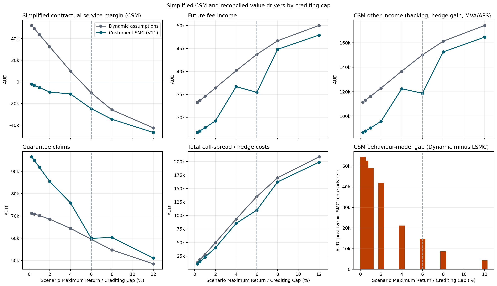
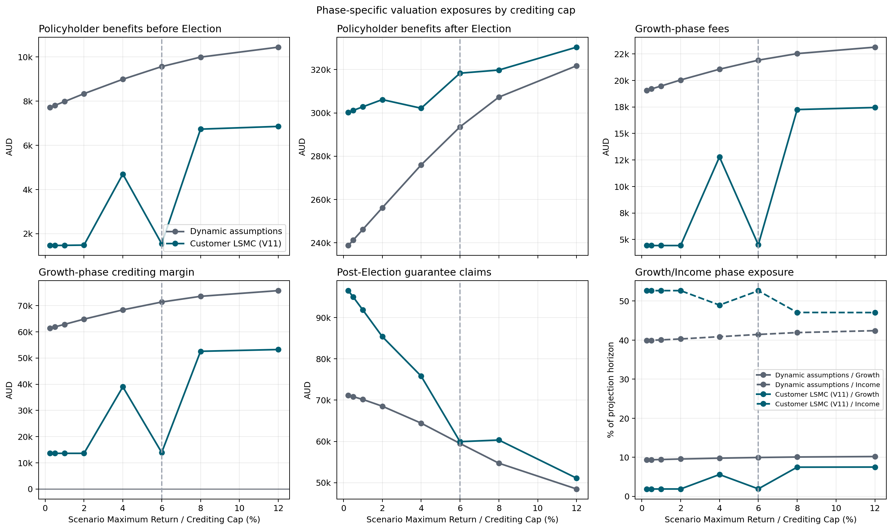
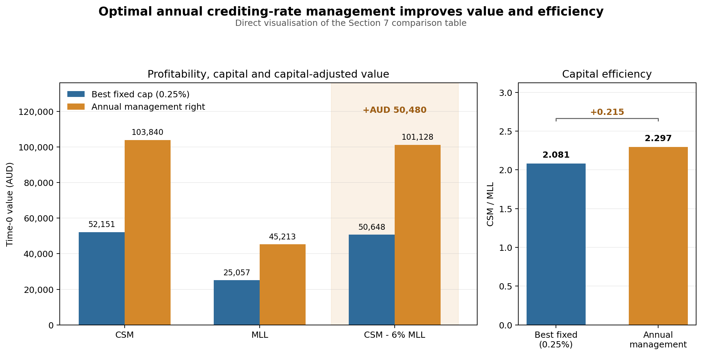

# Crediting-Cap Design for an Index-Linked Lifetime-Income Product

This repository is a research implementation of a generic Australian
index-linked guaranteed lifetime-income product. It connects contractual
cashflows, market-consistent valuation, policyholder behaviour and annual
management action in one reproducible portfolio workflow. The central research
question is whether an insurer can use an annually reset **crediting cap** to
improve the new-business CSM proxy while controlling market, longevity and
behaviour risk.

The product, mortality and behaviour bases are illustrative. The reported CSM,
risk and capital quantities are research proxies, not recognised IFRS 17
amounts, APRA capital, customer illustrations or financial advice.

## 1. Introduction

The case study starts with a single-premium Growth phase. The policyholder can
choose at an eligible policy anniversary when to enter the Income phase. At
that point a fixed nominal lifetime-income amount is locked in. The account
continues to receive annually protected reference-fund performance, but there
is no income ratchet in the base design.

Products of this kind give customers meaningful timing and liquidity choices,
while exposing the insurer to interacting longevity, lapse, withdrawal,
interest-rate and option-cost risks. Digital advice and optimisation tools may
also make value-sensitive behaviour more relevant than a purely static lapse
assumption would suggest. The repository therefore evaluates two deliberately
different policyholder models:

- transparent statistical dynamic functions, including moneyness and realised
  performance signals; and
- a fitted LSMC policy that maximises policyholder value over the admissible
  Growth and Income actions.

The customer receives the annual simple credit

$$
g_y = \min\left(\max\left(R_y^{\mathrm{fund}},0\right),C_y\right),
$$

where $R_y^{\mathrm{fund}}$ is the complete annual reference-fund return and $C_y$
is the Maximum Return announced by the insurer. In this repository, “crediting
rate” in workflow names normally means this annual cap, not a guaranteed flat
interest rate. The contractual case-study cap is 6%, with a guaranteed minimum
cap of 0.25%; alternative caps are design scenarios.

### Research problem

The cap affects the account value, fee base, guarantee moneyness, customer
actions and the price of the insurer's call spread. Its effect is phase
dependent:

| Phase | Typical customer channel | Typical insurer channel |
|---|---|---|
| Growth | A higher cap increases the potential value of waiting and can raise the income base at election | More fees and later election may help, but the hedge is more expensive |
| Income | A higher account value does not raise locked income without a ratchet; withdrawal can become the only way to realise gains | Claims may fall, while lapse, longevity exposure, fee duration and hedge cost can move in opposing directions |

There is therefore no universally optimal high or low cap. For the current
management question, $C_y$ is chosen from a predeclared admissible grid using
information available at each decision time. The contractual flexibility is
valued today with the primary capital-adjusted objective
$\mathrm{CSM}^{\mathrm{proxy}}-0.06K_{\mathrm{MLL}}$ and compared with the best
fixed cap on the same complete risk-neutral sample. CSM/MLL remains a
supplementary capital-efficiency diagnostic. This is not a deployment or OOS
exercise.

Management discretion may also matter to fulfilment-cashflow and service
assessments where it is substantive and recognised by the applicable accounting
policy. The model only estimates cashflows under an assumed rule; it does not
establish IFRS 17 recognition or a group-level CSM.

## 2. Product from the policyholder's perspective

The generic product is designed to retain the economically important features
of comparable lifetime-income contracts without reproducing a particular
current insurer offer.

| Feature | Case-study rule |
|---|---|
| Premium | Single premium in AUD |
| Reference fund | 30% Global Equity and 70% rolling five-year nominal Australian government-bond proxy |
| Rebalancing | Monthly, before the nonlinear annual credit is applied |
| Annual protection | Negative reference-fund returns credit 0%; positive returns are capped |
| Growth | No withdrawals; annual irreversible choice to wait or start income after the first full year |
| Income | Fixed monthly lifetime amount, paid in arrears; no base-case ratchet |
| Income withdrawals | Contractual excess/partial withdrawal or full surrender, with account and future-income consequences |
| Automatic start | First anniversary after the primary life reaches age 100 |
| Death and spouse | Single- or joint-life treatment with the elected spouse-death continuation rule |

The combined monthly fund return is

$$
R_m^{\mathrm{fund}}
= 0.30R_m^{\mathrm{global}}+0.70R_m^{\mathrm{bond}}.
$$

Equity and bond returns are combined first; only then is the annual floor/cap
payoff applied. A higher cap during Growth can benefit the policyholder through
a larger account and election-date income base. After Income starts, later
positive credits do not increase the locked payment in the base design.
Ratchet variants can be offered in practice, but commonly exchange that upside
for a lower initial conversion rate. Under illustrative product comparisons it
can take roughly 8–15 years for the ratcheted income to catch the initially
higher fixed payment; this range is design-dependent and is not modelled as a
universal market fact here.

Scheduled income first uses the account value. When that value is exhausted,
the insurer funds the covered shortfall for as long as an eligible life
survives. Growth-to-Income election, voluntary Income actions, spouse coverage
and the exact anniversary order are described in
[the product design](documents/product_design.md).

## 3. Product from the insurer's perspective

The account is an administrative customer benefit account; it is not assumed
to be invested directly in the reference fund. Customer money is instead held
in a money-market backing account and its pathwise return belongs to the
insurer. Customer index participation is manufactured separately with a
capital-market bull call spread:

$$
\min\left(\max(R,0),C\right)=\max(R,0)-\max(R-C,0).
$$

The insurer buys the lower call and sells the cap call **to the capital
market**, not to the customer. Raising the cap reduces the value received for
the sold upper call and therefore increases net hedge cost. The standard case
uses the complete sold call spread. A research alternative in which the upper
call is not sold must be labelled explicitly; only there can performance above
the customer cap become retained hedge income.

The standard profitability objective is the signed new-business CSM proxy

$$
\mathrm{CSM}^{\mathrm{proxy}}
=\mathrm{PV}_{\mathrm{fees}}+\mathrm{PV}_{\mathrm{other}}
-\mathrm{PV}_{\mathrm{claims}}-\mathrm{PV}_{\mathrm{costs}}.
$$

| Leg | Main modelled components |
|---|---|
| Fee Income | Product fee and lifetime-income premium |
| Other Income | Money-market backing return, MVA/other retained margins and, only where applicable, retained hedge gain |
| Claims | Guarantee shortfalls and separately identified insurer-funded benefits |
| Costs | Acquisition and maintenance expense plus the complete option package: fair value, purchase markup and hedge-reference management fee |

Customer payments funded by the account value are investment-component
cashflows and are not deducted a second time as insurer claims. Every material
report must reconcile the CSM proxy to these four legs. See
[crediting rate, profitability and risk](documents/crediting_rate_profitability_and_capital.md)
for the economic channels and accounting boundary.

Money-market backing can provide a natural partial offset to movements in the
discounting of customer cashflows, but it is neither a perfect interest-rate
hedge nor the return credited to the policyholder.

## 4. Modelling approach

### Portfolio and assumptions

The full illustrative portfolio contains 48 model points. A four-point proxy is
provided for faster development. Customer-LSMC runs deliberately require the
one-point proxy. The Time-0 Management-LSMC calculation in Section 7 also hard-
requires that same single modelpoint; no 4- or 48-point aggregation is used in
that calculation. A one-modelpoint output is a method/design sensitivity, not
portfolio evidence.
A model point represents an insured person; scalar portfolio results use
`contract_weight`, not an implicit count of CSV rows.
The [input reference](documents/input_data_reference.md) documents the portable
files under `input_data/`.

The base expense assumptions include acquisition and maintenance costs. The
insurer is also assumed to pay 0.50% of the fair option-package value as a
purchase markup and 0.30% per year of hedge-reference notional as a management
fee. The first is a relative markup on option value, not 50 basis points of
notional.

### Economic scenario generator

Regular market-consistent valuations use correlated Heston–Hull–White dynamics
under the risk-neutral measure. The Hull–White curve fits the Australian zero
curve at time zero; equities have stochastic variance and configured
equity/equity and rate/equity correlations. The Australian curve is the only
live market series. No volatility surface, credit-spread curve or separate
calibration history is required by the baseline.

All operative Q readers load exact, validated monthly paths and discount
factors from `results/cache/q_market_paths`. Conditional-MC prices for each new
annual call spread are loaded from the path-congruent
`results/cache/q_hedge_prices`. Only the dedicated precompute runner may write
those directories. The risk orchestrator and the installed crediting-cap
optimisation commands validate existing entries and ask that runner to create
only missing exact entries before their read-only children begin. A changed cap
grid or equity allocation creates a distinct hedge-cache identity but can reuse
the same exact market cache. An approximate cache match and an implicit
Black–Scholes substitution are prohibited; `moment_matched_bs` is available
only as an explicit, labelled proxy choice.

Simplified real-world projections use Black–Scholes–Hull–White under the
physical measure with the supplied equity risk premia, no bond term premium and
the same rate dynamics as Q. They are proxy projections, not forecasts. The
full conventions are in [modelling methodology](documents/modelling_methodology.md).

### Mortality and behaviour

The mortality basis is an illustrative Gompertz–Makeham table with annual
improvement, reconciled monthly decrement probabilities and explicit joint-life
states. It is not calibrated insured-life experience. See
[mortality modelling](documents/mortality_modelling.md).

Dynamic behaviour uses duration baselines and bounded hazard/link functions.
Moneyness, premium size, MVA and the gap between gross reference performance
and credited performance can alter Income take-up, lapse and excess withdrawal.
Customer LSMC instead treats the contract as one ordered, swing-option-like
problem and maximises the time-zero customer objective

$$
\mathbb{E}_0\!\left[\sum_t P^{\mathrm{AU}}(0,t)
\,CF_t^{\mathrm{customer}}\right],
$$

using the deterministic discount factors implied by today's Australian zero
curve. The mortality-free fit uses one exact Q-market sample and deploys the
fitted V11 policy directly, without an independent policy-selection sample or
replacement by a fixed rule. Complete-path fold cross-fitting remains inside
the continuation-value estimator; it estimates conditional expectations. At
annual Growth decisions the customer chooses `WAIT` or
`START_NORMAL_INCOME`; at annual Income decisions the choice is normal income
for the next period or `FULL_SURRENDER`. Partial withdrawal and mortality are
absent from the customer objective. At the finite projection horizon the
terminal payoff is the post-fee account-value closeout. Customer-LSMC runs
require exactly one model point. See
[policyholder behaviour](documents/policyholder_behaviour.md).

### Crediting-cap control and core scripts

The insurer chooses the next cap after old-year crediting, fees, mortality and
eligible Income election, but before the new hedge is purchased. Optimisation
uses only pre-action state. The Dynamic-customer management valuation uses one
complete Q sample both to fit conditional expectations and to determine today's
risk-neutral capital-adjusted CSM; it has no OOS test, forward roll or deployment
gate. CSM/MLL is reported alongside the primary AUD objective. This is distinct
from the separate Policyholder-LSMC/Stackelberg research route.

The small set of scripts that defines the operative research workflow is:

| Script | Role |
|---|---|
| [`run_portfolio_risk_analysis.py`](code/portfolio_simulations/run_portfolio_risk_analysis.py) | Recommended end-to-end fixed-cap, behaviour and optional shock-and-revalue orchestrator; it prepares exact caches before invoking readers |
| [`run_crediting_rate_capital_analysis.py`](code/portfolio_simulations/run_crediting_rate_capital_analysis.py) | Dynamic-only fixed-cap mortality/longevity/lapse capital and capital-adjusted profitability orchestrator; Policyholder LSMC is hard-blocked |
| [`run_crediting_rate_optimisation.py`](code/portfolio_simulations/run_crediting_rate_optimisation.py) | Console-command orchestrator for both optimisation families; prepares only missing exact caches, then starts a strict reader |
| [`optimize_crediting_rate_dynamic_behaviour_alt.py`](code/portfolio_simulations/optimize_crediting_rate_dynamic_behaviour_alt.py) | Strict cache-reader for the one-modelpoint, same-sample Time-0 capital-adjusted CSM value of annual cap flexibility under statistical Dynamic Policyholder behaviour; CSM/MLL is a secondary diagnostic |
| [`optimize_crediting_rate_bellman.py`](code/portfolio_simulations/optimize_crediting_rate_bellman.py) | Strict cache-reader LSMC-policyholder entry point; delegates to the combined Stackelberg implementation |
| [`precompute_q_market_and_hedge_cache.py`](code/portfolio_simulations/precompute_q_market_and_hedge_cache.py) | Sole authorised writer of exact Q-market and conditional-MC hedge caches |
| [`run_portfolio_valuation.py`](code/portfolio_simulations/run_portfolio_valuation.py) | Read-only dynamic-behaviour portfolio valuation |
| [`run_portfolio_valuation_lsmc.py`](code/portfolio_simulations/run_portfolio_valuation_lsmc.py) | Read-only one-modelpoint customer-LSMC valuation on one exact Q sample with direct V11 deployment |

The optimisation details are in
[crediting-rate optimisation](documents/crediting_rate_optimisation.md); the
orchestration and output contract are in
[portfolio valuation and risk workflows](documents/portfolio_valuation_and_risk_workflows.md).
A complete active-runner inventory is in the
[script reference](documents/script_reference.md).

## 5. Optimal versus dynamic policyholder behaviour

The fixed-cap comparison values two complete policies on the same exact cached
Q sample:

1. statistical dynamic Income election plus dynamic Income lapse/withdrawal;
2. the directly deployed V11 customer-LSMC policy.

The comparison reports CSM and its components, guarantee claims, election
timing, surrender diagnostics and risk sensitivities. V11 is the direct
single-sample policy once the structural regression checks succeed. Its
internal complete-path folds estimate continuation values.

The one-modelpoint diagnostic uses 20,000 common Heston–Hull–White paths for
`ALT4-01` and the discrete cap grid 0.25%, 0.5%, 1%, 2%, 4%, 6%, 8% and 12%.
V11 is valid and deployed directly in every displayed cell. Its customer fit
and the Dynamic arm use the same exact market sample. The base market model
provides the complete grid, so no alternative fixed-equity-volatility or
lower-rate-volatility sensitivity is used.

This is an illustrative result for one representative contract, not evidence
about a diversified portfolio. The full sample identities, method flags and
outputs are in the [curated source table](results/document_figures/source_data/customer_lsmc_crediting_cap_grid/portfolio_risk_by_crediting_cap.csv).

The optimal decisions change in annual steps rather than along a smooth cap
response. Mean V11 Income Election occurs in year 1 for caps from 0.25% through
2%, around year 3 at 4%, again around year 1 at 6%, and around year 4 at 8% and
12%. This non-monotone pattern reflects the pathwise trade-off between waiting
in Growth and starting normal Income at the permitted annual decision dates; it
must not be interpolated between cap scenarios. Full Surrender is zero to
displayed precision apart from negligible path mass at 12%. For this model
point, the value difference is therefore driven mainly by Income-Election
timing and the resulting normal-income cashflows rather than by surrender.

The customer-value comparison below puts both behaviour models on the same
pathwise Q valuation basis and uses the same contractual benefit definition.
The difference is therefore the paired increase in Policyholder-benefit PV from
the V11 customer rule relative to Dynamic behaviour.

| Cap | Dynamic customer benefit PV (AUD) | V11 customer benefit PV (AUD) | V11 increase (AUD) | V11 increase |
|---:|---:|---:|---:|---:|
| 0.25% | 246,411.57 | 301,761.23 | 55,349.65 | 22.46% |
| 0.5% | 248,964.57 | 302,608.32 | 53,643.75 | 21.55% |
| 1% | 254,137.13 | 304,296.09 | 50,158.96 | 19.74% |
| 2% | 264,492.22 | 307,636.96 | 43,144.75 | 16.31% |
| 4% | 284,955.98 | 306,866.85 | 21,910.87 | 7.69% |
| 6% | 303,121.48 | 319,908.63 | 16,787.15 | 5.54% |
| 8% | 317,300.20 | 326,555.95 | 9,255.76 | 2.92% |
| 12% | 332,245.38 | 337,256.46 | 5,011.08 | 1.51% |

The V11 customer rule increases the customer-benefit PV at every displayed cap.
The uplift is largest at low caps, where earlier Income Election avoids much of
the value loss under Dynamic behaviour, and narrows from 22.46% at 0.25% to
1.51% at 12% as the two realised benefit profiles converge. This is a
customer-benefit comparison, not the insurer CSM effect or the separate
optimisation objective used to fit V11.

## 6. Effect of the crediting rate

A controlled cap study varies only $C$, keeps common random numbers and
revalues both behaviour models. The key outputs are:

- CSM proxy and the four-leg reconciliation by cap;
- option fair value, markup, management fee and money-market income by cap;
- guarantee claims, election timing and voluntary-action rates by cap; and
- shock-and-revalue differences for market and non-market stresses.

A higher cap is expected to increase hedge cost, but the net CSM and risk
effects need not be monotone because account value, fee duration, claims and
behaviour all respond. Across the displayed one-modelpoint cap grid, the
observed values are:

| Cap | Dynamic CSM (AUD) | Direct V11 CSM (AUD) | Customer optionality uplift (AUD) | Mean V11 Income-start year |
|---:|---:|---:|---:|---:|
| 0.25% | 52,128.84 | -2,225.25 | 0.00 | 1.0000 |
| 0.5% | 49,350.86 | -3,274.68 | 0.00 | 1.0000 |
| 1% | 43,713.58 | -5,316.92 | 0.00 | 1.0000 |
| 2% | 32,394.84 | -9,412.17 | 0.00 | 1.0000 |
| 4% | 9,926.33 | -11,222.41 | 34.06 | 2.9819 |
| 6% | -10,170.40 | -24,811.80 | 3,684.45 | 1.0171 |
| 8% | -25,942.61 | -34,606.39 | 13,426.51 | 4.0001 |
| 12% | -42,571.89 | -46,840.27 | 66,949.93 | 4.0146 |



*Guarantee claims generally decline as the cap rises, while call-spread cost
grows from AUD 10,137 at 0.25% to AUD 198,614 at 12%; V11 CSM consequently falls
from AUD -2,225 to AUD -46,840.*

The optionality uplift is the increase in the deterministic-time-zero-curve
customer objective relative to the best fixed START-plus-CONTINUE reference.
It is neither an insurer CSM increment nor a separate-sample performance
estimate. These are discrete, base-only scenarios for `ALT4-01`, not
interpolated break-even estimates or portfolio-level evidence.



*The discrete V11 start-year changes at 4%, 6% and 8% shift value and exposure
between Growth and Income.*

The two figures in this section were rendered data-only from the unified,
validated result table. Figure hashes, cap-cell identities and exact source
hashes are recorded in the
[current figure provenance](results/document_figures/customer_lsmc_crediting_cap_grid.provenance.json).

Sections 5 and 6 are a separate Customer-LSMC diagnostic and are not inputs to
the Management-LSMC valuation below, which uses statistical Dynamic customers
and current-curve Time-0 cashflows.

## 7. Value of Optimal Management Decisions for the Crediting Rate

The question here is not how to deploy a cap strategy. It is the value today of
the insurer's contractual right to reset the annual crediting cap in future,
given the information available at each future anniversary. Future cashflows
are risk-neutral expected values discounted back to Time 0 using the current
Australian curve.

The illustrative Time-0 valuation uses exactly one modelpoint (`ALT4-01`),
4,200 common Heston-Hull-White Q paths with market seed 2026, and exact
path-congruent market and hedge caches. Policyholders follow the statistical
Dynamic behaviour model, including its moneyness-sensitive lapse and election
response. No Customer LSMC is fitted or called.

The fixed caps and the management LSMC are evaluated on the same complete Q
sample. There is deliberately no reserved path subset, different OOS seed,
forward roll, strategy replay, bootstrap acceptance test or deployment rule.
The output is a Time-0 valuation, not an estimate of live strategy performance.

For each complete management candidate $\pi$, the primary objective is the AUD
capital-adjusted value

$$
J_{\mathrm{adj}}(\pi)
=\mathrm{CSM}^{\mathrm{proxy}}(\pi)-0.06K_{\mathrm{MLL}}(\pi).
$$

Here $K_{\mathrm{MLL}}$ combines mortality, longevity and the largest adverse
lapse amount, including the separately disclosed 40% positive-CSM mass-lapse
proxy. It remains a partial research life-risk capital measure, not total SCR,
APRA capital or an IFRS 17 Risk Adjustment. The 6% factor is a one-year research
capital hurdle, not a projected Risk Margin. The lifetime efficiency ratio
$\mathrm{CSM}/K_{\mathrm{MLL}}$ is reported as a secondary diagnostic.

MLL and its stress maxima are not additive annual Bellman rewards. Management
LSMC therefore fits a predeclared class of 21 additive Base/Stress support
objectives,

$$
J_{\alpha,q}=(1-\alpha)\,\mathrm{CSM}_{\mathrm{base}}
+\alpha\sum_s q_s\,\mathrm{CSM}_{s},
\qquad \alpha\in\{0,0.25,0.50,0.75,1\},
$$

plus one conditional-ratio heuristic. The exact aggregate
$J_{\mathrm{adj}}$—not a support objective—ranks the candidate set. Each
fitted payload difference is anchored to the directly projected best fixed cap,
and best fixed remains an explicit zero-flexibility-value comparator.

The stored candidate table contains all 22 fitted candidates. Earlier
ratio-only reporting selected the balanced four-stress candidate with
$\alpha=0.50$; that result is retained only as a historical objective
sensitivity. Applying the current capital-adjusted objective to the complete
candidate table selects the pure `base_csm` candidate. This deterministic
re-ranking required neither a new market projection nor a regression refit.

| Time-0 alternative | CSM (AUD) | MLL (AUD) | CSM − 6% MLL (AUD) | CSM / MLL |
|---|---:|---:|---:|---:|
| Best fixed cap: 0.25% | 52,151.27 | 25,057.48 | 50,647.82 | 2.08127 |
| Annual adjustment right: `base_csm` | 103,840.38 | 45,213.13 | 101,127.59 | 2.29669 |
| Flexible minus fixed | +51,689.11 | +20,155.65 | **+50,479.77** | **+0.21542** |

The fitted candidate's first Time-0 action is also 0.25%. Its additional value
comes from the right to make later state-dependent resets, not from choosing a
different initial cap. No future deployment schedule is exported.



This single graphic is a direct visualisation of the table above; no additional
fixed-cap curves or risk-module charts are included. It shows that the primary
capital-adjusted value rises by AUD 50,479.77 and the supplementary CSM/MLL
ratio by 0.21542. Absolute MLL increases by AUD 20,155.65 because CSM increases
by AUD 51,689.11, but MLL per unit of CSM falls from 48.05% to 43.54%. The
observed benefit is therefore higher capital-adjusted value together with
better partial life-risk efficiency, not a reduction in absolute capital.

This evidence has important boundaries. It uses exactly one illustrative
modelpoint, and MLL covers mortality, longevity and lapse only. The 40%
positive-CSM mass-lapse proxy can materially shape both the AUD objective and
the ratio. The result is the best member of the declared fitted policy class,
not a global optimum over all management rules. It is in-sample by design, and
regression fitting, anchoring, path count and stress calibration remain model
risk. These limitations are consistent with a Time-0 valuation claim but rule
out interpreting the result as tested strategy performance.

All calculations in this section currently use statistical Dynamic
Policyholder behaviour only. Policyholder behaviour optimised by a separate
Customer LSMC has not been included in the Section 7 values. Repeating the
Time-0 management-flexibility analysis with an LSMC Policyholder response is an
interesting extension for future research, because optimal customer decisions
could change both CSM and the mortality, longevity and lapse capital profile.

Machine-readable settings, the full fixed-cap grid, the complete fitted
candidate table and regression diagnostics are stored with the
[supporting figure data](results/document_figures/).

## Quickstart

Python 3.10 or newer is required. The supported portable setup is a source
checkout with an editable install, because `input_data/` remains a
repository-relative data tree rather than wheel package data. From the cloned
repository root:

```powershell
python -m venv .venv
.venv\Scripts\Activate.ps1
python -m pip install -e ".[test]"
python -m pytest
```

The recommended end-to-end fixed-cap workflow is the risk orchestrator. Runs
that include customer LSMC default to and require exactly one model point. This
example creates or validates every exact required cache before the read-only
valuation children start:

```powershell
portfolio-risk-analysis --model-points input_data/model_points_policyholders/model_points_policyholders_1_point_proxy.csv --crediting-rates 0.25% 1% 6% 12% --require-market-cache --require-hedge-cache
```

Add the preselected market/longevity shock grid explicitly:

```powershell
portfolio-risk-analysis --model-points input_data/model_points_policyholders/model_points_policyholders_1_point_proxy.csv --crediting-rates 0.25% 1% 6% 12% --stress-analysis --stress-scenarios interest_up interest_down longevity --require-market-cache --require-hedge-cache
```

The two installed optimisation commands provide the same prepare-then-read
boundary. They derive the horizon, required path counts, seeds and complete cap
grid from the optimiser arguments, invoke the sole authorised cache writer for
missing exact entries, and only then start the strict reader. The Dynamic route
prepares one complete Time-0 Q sample and rejects anything other than one
modelpoint before cache preparation:

```powershell
optimise-crediting-dynamic --model-points input_data/model_points_policyholders/model_points_policyholders_1_point_proxy.csv --n-paths 4200 --seed 2026 --require-market-cache --require-hedge-cache
optimise-crediting-lsmc --model-points input_data/model_points_policyholders/model_points_policyholders_1_point_proxy.csv
```

These runs can be computationally and disk intensive. Direct execution of a
valuation or optimiser implementation file does not perform cache preparation
and requires exact pre-existing caches. If such a reader reports a cache miss,
run the installed orchestrated command or use its exact precompute specification
rather than changing the seed, horizon, path count, allocation or cap grid to
reach an approximately matching entry.

## Repository map

| Path | Purpose |
|---|---|
| `code/policy_engine/` | Reusable product, scenario, projection, valuation, mortality and behaviour engine |
| `code/portfolio_simulations/` | Sole cache writer, prepare-then-read orchestrators, strict valuation readers, risk analysis and cap optimisation |
| `code/code_from_papers/` | Reference implementations derived from research papers; not the production workflow |
| `input_data/` | Versioned portable market, cost, behaviour, allocation, Monte Carlo and model-point inputs |
| `documents/` | Current English product, method and workflow documentation |
| `tests/` | Unit, reconciliation, regression and orchestration tests |
| `results/cache/` | Generated exact Q-market and path-congruent hedge caches; only the precompute runner writes them |
| `results/runs/` | Generated run directories and manifests; ignored by Git |
| `results/document_figures/` | Reserved for reviewed, small, versioned documentation figures |
| `old/` | Historical AGILE-specific material and superseded research artefacts; not an execution surface |

Portable default paths are resolved by
[`repository_paths.py`](code/policy_engine/repository_paths.py); cloning the
repository does not require editing machine-specific paths. The architectural
dependency direction and provenance rules are documented in
[engine architecture](documents/engine_architecture.md).

## Selected literature

The references below were selected for their direct connection to this
repository rather than as a comprehensive survey. RILAs, variable annuities
and GMWB/GLWB contracts are the closest published analogues, but none is
identical to the generic case-study product. The accounting and prudential
standards define reporting boundaries; they do not validate the repository's
CSM or capital proxies.

### Index-linked lifetime income and policyholder behaviour

- Moenig, T. (2022). [*It's RILA Time: An Introduction to Registered
  Index-Linked Annuities*](https://doi.org/10.1111/jori.12357). *Journal of
  Risk and Insurance*, 89(2), 339–369. Closest reference for annually reset
  index-linked crediting, short-dated option replication and insurer hedging.
- Moenig, T., & Xu, C. (2023). [*Valuing Lifetime Withdrawal Guarantees in
  RILAs*](https://doi.org/10.1080/10920277.2023.2167835). *North American
  Actuarial Journal*, 27(4), 771–786. Connects an index-linked account to a
  lifetime withdrawal guarantee and its long-dated insurer risk.
- Huang, H., Milevsky, M. A., & Salisbury, T. S. (2014). [*Optimal Initiation
  of a GLWB in a Variable Annuity: No-Arbitrage
  Approach*](https://doi.org/10.1016/j.insmatheco.2014.04.002). *Insurance:
  Mathematics and Economics*, 56, 102–111. Direct treatment of the decision
  when to move from accumulation into lifetime income as a function of age,
  moneyness and product terms.
- Bauer, D., Kling, A., & Russ, J. (2008). [*A Universal Pricing Framework for
  Guaranteed Minimum Benefits in Variable
  Annuities*](https://doi.org/10.2143/AST.38.2.2033356). *ASTIN Bulletin*,
  38(2), 621–651. General valuation framework for living benefits with fixed
  or value-maximising policyholder actions.
- Milevsky, M. A., & Salisbury, T. S. (2006). [*Financial Valuation of
  Guaranteed Minimum Withdrawal
  Benefits*](https://doi.org/10.1016/j.insmatheco.2005.06.012). *Insurance:
  Mathematics and Economics*, 38(1), 21–38. Foundational treatment of the
  insurer cost and exercise value of withdrawal guarantees.
- Dai, M., Kwok, Y. K., & Zong, J. (2008). [*Guaranteed Minimum Withdrawal
  Benefit in Variable
  Annuities*](https://doi.org/10.1111/j.1467-9965.2008.00349.x).
  *Mathematical Finance*, 18(4), 595–611. Formulates excess withdrawal and
  surrender as an optimal stochastic-control problem.
- Chen, Z., Vetzal, K., & Forsyth, P. A. (2008). [*The Effect of Modelling
  Parameters on the Value of GMWB
  Guarantees*](https://doi.org/10.1016/j.insmatheco.2008.04.003). *Insurance:
  Mathematics and Economics*, 43(1), 165–173. Shows how valuation and optimal
  actions depend on assumptions and quantifies the effect of suboptimal
  policyholder behaviour.
- Moenig, T., & Bauer, D. (2016). [*Revisiting the Risk-Neutral Approach to
  Optimal Policyholder Behavior: A Study of Withdrawal Guarantees in Variable
  Annuities*](https://doi.org/10.1093/rof/rfv018). *Review of Finance*, 20(2),
  759–794. Explains why option-value-maximising behaviour can differ from
  observed behaviour and motivates practical moneyness-sensitive rules.
- Bauer, D., Gao, J., Moenig, T., Ulm, E. R., & Zhu, N. (2017).
  [*Policyholder Exercise Behavior in Life Insurance: The State of
  Affairs*](https://doi.org/10.1080/10920277.2017.1314816). *North American
  Actuarial Journal*, 21(4), 485–501. Survey and classification of structural,
  reduced-form and empirical exercise models.

### Valuation, market dynamics and hedging

- Longstaff, F. A., & Schwartz, E. S. (2001). [*Valuing American Options by
  Simulation: A Simple Least-Squares
  Approach*](https://doi.org/10.1093/rfs/14.1.113). *Review of Financial
  Studies*, 14(1), 113–147. Methodological basis for the repository's fitted
  continuation values and LSMC action policy.
- Huang, Y. T., & Kwok, Y. K. (2016). [*Regression-Based Monte Carlo Methods
  for Stochastic Control Models: Variable Annuities with Lifelong
  Guarantees*](https://doi.org/10.1080/14697688.2015.1088962). *Quantitative
  Finance*, 16(6), 905–928. Direct bridge from regression Monte Carlo to
  optimal stochastic control of lifelong withdrawal guarantees.
- Black, F., & Scholes, M. (1973). [*The Pricing of Options and Corporate
  Liabilities*](https://doi.org/10.1086/260062). *Journal of Political
  Economy*, 81(3), 637–654. Foundation for European-call replication, the
  annual bull call spread and the explicitly labelled Black–Scholes proxy.
- Heston, S. L. (1993). [*A Closed-Form Solution for Options with Stochastic
  Volatility with Applications to Bond and Currency
  Options*](https://doi.org/10.1093/rfs/6.2.327). *Review of Financial
  Studies*, 6(2), 327–343. Stochastic-volatility foundation for the equity
  component of the risk-neutral market model.
- Hull, J., & White, A. (1990). [*Pricing Interest-Rate-Derivative
  Securities*](https://doi.org/10.1093/rfs/3.4.573). *Review of Financial
  Studies*, 3(4), 573–592. Curve-consistent mean-reverting short-rate model
  underlying the rate and discount-factor component.
- Grzelak, L. A., & Oosterlee, C. W. (2011). [*On the Heston Model with
  Stochastic Interest Rates*](https://doi.org/10.1137/090756119). *SIAM
  Journal on Financial Mathematics*, 2, 255–286. Direct reference for hybrid
  Heston–Hull–White modelling with correlated equity and interest-rate risk.
- Kling, A., Ruez, F., & Russ, J. (2011). [*The Impact of Stochastic
  Volatility on Pricing, Hedging, and Hedge Efficiency of Withdrawal Benefit
  Guarantees in Variable
  Annuities*](https://doi.org/10.2143/AST.41.2.2136987). *ASTIN Bulletin*,
  41(2), 511–545. Links stochastic volatility and model risk specifically to
  the pricing and hedge performance of lifetime withdrawal guarantees.

### Mortality, longevity and reporting boundaries

- Gompertz, B. (1825). [*On the Nature of the Function Expressive of the Law
  of Human Mortality, and on a New Mode of Determining the Value of Life
  Contingencies*](https://doi.org/10.1098/rstl.1825.0026). *Philosophical
  Transactions of the Royal Society of London*, 115, 513–583. Origin of the
  exponential age pattern used in the illustrative mortality basis.
- Makeham, W. M. (1860). [*On the Law of Mortality and the Construction of
  Annuity Tables*](https://doi.org/10.1017/S204616580000126X). *Journal of the
  Institute of Actuaries*, 8(6), 301–310. Adds the age-independent component
  used by the Gompertz–Makeham proxy.
- Lee, R. D., & Carter, L. R. (1992). [*Modeling and Forecasting U.S.
  Mortality*](https://doi.org/10.1080/01621459.1992.10475265). *Journal of the
  American Statistical Association*, 87(419), 659–671. Classical reference
  for empirically estimated age and period effects; the repository's fixed
  improvement taper is deliberately simpler and is not a Lee–Carter fit.
- Frees, E. W., Carriere, J. F., & Valdez, E. A. (1996). [*Annuity Valuation
  with Dependent Mortality*](https://doi.org/10.2307/253744). *Journal of Risk
  and Insurance*, 63(2), 229–261. Reference for Joint-Life and last-survivor
  annuities and for the dependence omitted by the current independent-lives
  proxy.
- Cairns, A. J. G., Blake, D., & Dowd, K. (2006). [*A Two-Factor Model for
  Stochastic Mortality with Parameter Uncertainty: Theory and
  Calibration*](https://doi.org/10.1111/j.1539-6975.2006.00195.x). *Journal
  of Risk and Insurance*, 73(4), 687–718. Benchmark for longevity and
  parameter risk beyond the repository's deterministic improvement baseline.
- IFRS Foundation. [*IFRS 17 Insurance
  Contracts*](https://www.ifrs.org/issued-standards/list-of-standards/ifrs-17-insurance-contracts/).
  Authoritative reporting boundary for insurance-contract measurement and the
  contractual service margin; the repository's signed four-leg CSM remains a
  research proxy.
- Australian Prudential Regulation Authority. [*Prudential Standard LPS 110
  Capital Adequacy*](https://www.apra.gov.au/standards/lps-110). Australian
  life-insurance capital boundary, including specific treatment of variable
  annuity business; the repository's MLL measure is not APRA capital.
