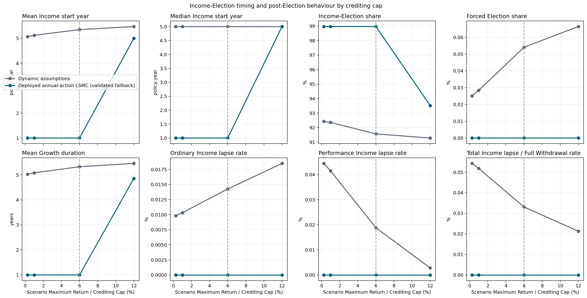
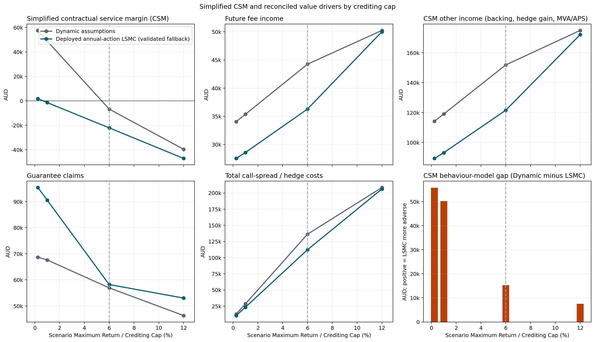
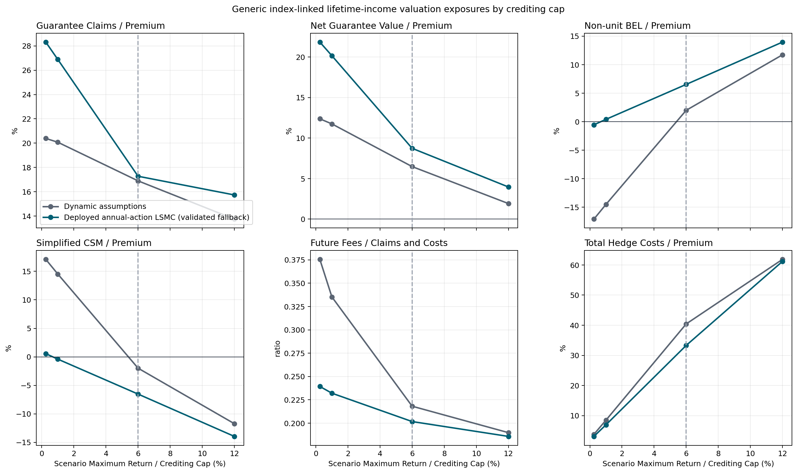
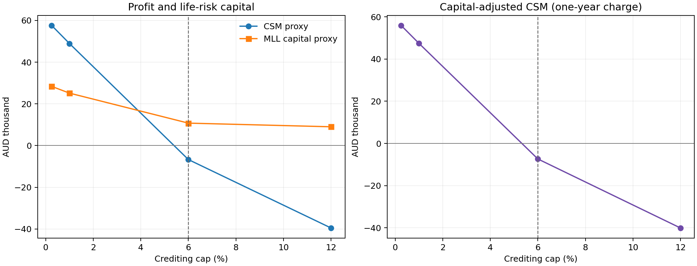
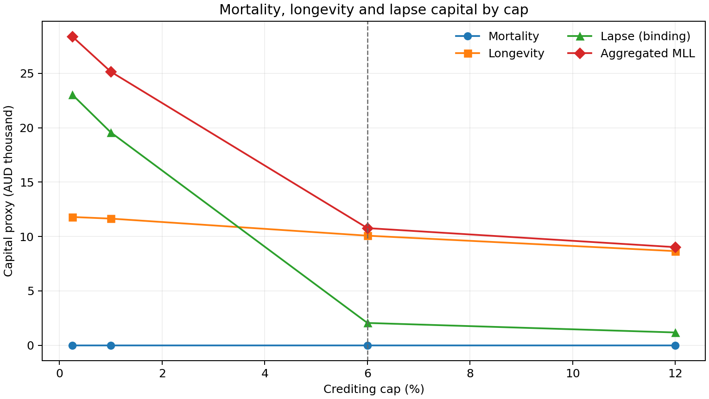
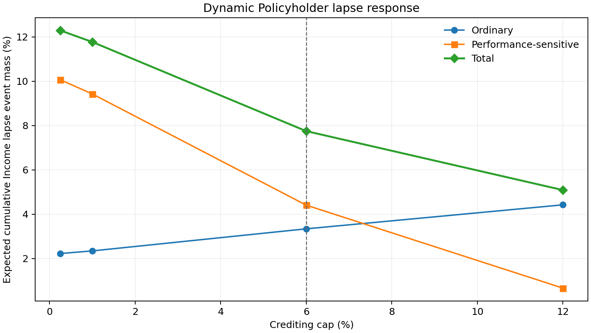

# Crediting-Cap Design for an Index-Linked Lifetime-Income Product

This repository is a research implementation of a generic Australian
index-linked guaranteed lifetime-income product. It connects contractual
cashflows, market-consistent valuation, policyholder behaviour and annual
management action in one reproducible portfolio workflow. The central research
question is whether an insurer can use an annually reset **crediting cap** to
improve the new-business CSM proxy while controlling market, longevity and
behaviour risk.

The product, mortality and behaviour bases are illustrative. The reported CSM,
risk and capital quantities are research proxies, not recognised IFRS 17
amounts, APRA capital, customer illustrations or financial advice.

## 1. Introduction

The case study starts with a single-premium Growth phase. The policyholder can
choose at an eligible policy anniversary when to enter the Income phase. At
that point a fixed nominal lifetime-income amount is locked in. The account
continues to receive annually protected reference-fund performance, but there
is no income ratchet in the base design.

Products of this kind give customers meaningful timing and liquidity choices,
while exposing the insurer to interacting longevity, lapse, withdrawal,
interest-rate and option-cost risks. Digital advice and optimisation tools may
also make value-sensitive behaviour more relevant than a purely static lapse
assumption would suggest. The repository therefore evaluates two deliberately
different policyholder models:

- transparent statistical dynamic functions, including moneyness and realised
  performance signals; and
- a fitted LSMC policy that maximises policyholder value over the admissible
  Growth and Income actions.

The customer receives the annual simple credit

$$
g_y = \min\left(\max\left(R_y^{\mathrm{fund}},0\right),C_y\right),
$$

where $R_y^{\mathrm{fund}}$ is the complete annual reference-fund return and $C_y$
is the Maximum Return announced by the insurer. In this repository, “crediting
rate” in workflow names normally means this annual cap, not a guaranteed flat
interest rate. The contractual case-study cap is 6%, with a guaranteed minimum
cap of 0.25%; alternative caps are design scenarios.

### Research problem

The cap affects the account value, fee base, guarantee moneyness, customer
actions and the price of the insurer's call spread. Its effect is phase
dependent:

| Phase | Typical customer channel | Typical insurer channel |
|---|---|---|
| Growth | A higher cap increases the potential value of waiting and can raise the income base at election | More fees and later election may help, but the hedge is more expensive |
| Income | A higher account value does not raise locked income without a ratchet; withdrawal can become the only way to realise gains | Claims may fall, while lapse, longevity exposure, fee duration and hedge cost can move in opposing directions |

There is therefore no universally optimal high or low cap. The objective is to
choose $C_y$ from a predeclared admissible grid using information available at
the decision time, then compare the deployed adaptive policy with a separately
selected best fixed cap out of sample.

Management discretion may also matter to fulfilment-cashflow and service
assessments where it is substantive and recognised by the applicable accounting
policy. The model only estimates cashflows under an assumed rule; it does not
establish IFRS 17 recognition or a group-level CSM.

## 2. Product from the policyholder's perspective

The generic product is designed to retain the economically important features
of comparable lifetime-income contracts without reproducing a particular
current insurer offer.

| Feature | Case-study rule |
|---|---|
| Premium | Single premium in AUD |
| Reference fund | 30% Global Equity and 70% rolling five-year nominal Australian government-bond proxy |
| Rebalancing | Monthly, before the nonlinear annual credit is applied |
| Annual protection | Negative reference-fund returns credit 0%; positive returns are capped |
| Growth | No withdrawals; annual irreversible choice to wait or start income after the first full year |
| Income | Fixed monthly lifetime amount, paid in arrears; no base-case ratchet |
| Income withdrawals | Contractual excess/partial withdrawal or full surrender, with account and future-income consequences |
| Automatic start | First anniversary after the primary life reaches age 100 |
| Death and spouse | Single- or joint-life treatment with the elected spouse-death continuation rule |

The combined monthly fund return is

$$
R_m^{\mathrm{fund}}
= 0.30R_m^{\mathrm{global}}+0.70R_m^{\mathrm{bond}}.
$$

Equity and bond returns are combined first; only then is the annual floor/cap
payoff applied. A higher cap during Growth can benefit the policyholder through
a larger account and election-date income base. After Income starts, later
positive credits do not increase the locked payment in the base design.
Ratchet variants can be offered in practice, but commonly exchange that upside
for a lower initial conversion rate. Under illustrative product comparisons it
can take roughly 8–15 years for the ratcheted income to catch the initially
higher fixed payment; this range is design-dependent and is not modelled as a
universal market fact here.

Scheduled income first uses the account value. When that value is exhausted,
the insurer funds the covered shortfall for as long as an eligible life
survives. Growth-to-Income election, voluntary Income actions, spouse coverage
and the exact anniversary order are described in
[the product design](documents/product_design.md).

## 3. Product from the insurer's perspective

The account is an administrative customer benefit account; it is not assumed
to be invested directly in the reference fund. Customer money is instead held
in a money-market backing account and its pathwise return belongs to the
insurer. Customer index participation is manufactured separately with a
capital-market bull call spread:

$$
\min\left(\max(R,0),C\right)=\max(R,0)-\max(R-C,0).
$$

The insurer buys the lower call and sells the cap call **to the capital
market**, not to the customer. Raising the cap reduces the value received for
the sold upper call and therefore increases net hedge cost. The standard case
uses the complete sold call spread. A research alternative in which the upper
call is not sold must be labelled explicitly; only there can performance above
the customer cap become retained hedge income.

The standard profitability objective is the signed new-business CSM proxy

$$
\mathrm{CSM}^{\mathrm{proxy}}
=\mathrm{PV}_{\mathrm{fees}}+\mathrm{PV}_{\mathrm{other}}
-\mathrm{PV}_{\mathrm{claims}}-\mathrm{PV}_{\mathrm{costs}}.
$$

| Leg | Main modelled components |
|---|---|
| Fee Income | Product fee and lifetime-income premium |
| Other Income | Money-market backing return, MVA/other retained margins and, only where applicable, retained hedge gain |
| Claims | Guarantee shortfalls and separately identified insurer-funded benefits |
| Costs | Acquisition and maintenance expense plus the complete option package: fair value, purchase markup and hedge-reference management fee |

Customer payments funded by the account value are investment-component
cashflows and are not deducted a second time as insurer claims. Every material
report must reconcile the CSM proxy to these four legs. See
[crediting rate, profitability and risk](documents/crediting_rate_profitability_and_capital.md)
for the economic channels and accounting boundary.

Money-market backing can provide a natural partial offset to movements in the
discounting of customer cashflows, but it is neither a perfect interest-rate
hedge nor the return credited to the policyholder.

## 4. Modelling approach

### Portfolio and assumptions

The full illustrative portfolio contains 48 model points. A four-point proxy is
provided for faster development, and a one-point proxy is restricted to smoke
and orchestration checks. A model point represents an insured person; scalar
portfolio results use `contract_weight`, not an implicit count of CSV rows.
The [input reference](documents/input_data_reference.md) documents the portable
files under `input_data/`.

The base expense assumptions include acquisition and maintenance costs. The
insurer is also assumed to pay 0.50% of the fair option-package value as a
purchase markup and 0.30% per year of hedge-reference notional as a management
fee. The first is a relative markup on option value, not 50 basis points of
notional.

### Economic scenario generator

Regular market-consistent valuations use correlated Heston–Hull–White dynamics
under the risk-neutral measure. The Hull–White curve fits the Australian zero
curve at time zero; equities have stochastic variance and configured
equity/equity and rate/equity correlations. The Australian curve is the only
live market series. No volatility surface, credit-spread curve or separate
calibration history is required by the baseline.

All operative Q readers load exact, validated monthly paths and discount
factors from `results/cache/q_market_paths`. Conditional-MC prices for each new
annual call spread are loaded from the path-congruent
`results/cache/q_hedge_prices`. Only the dedicated precompute runner may write
those directories. The risk orchestrator and the installed crediting-cap
optimisation commands validate existing entries and ask that runner to create
only missing exact entries before their read-only children begin. A changed cap
grid or equity allocation creates a distinct hedge-cache identity but can reuse
the same exact market cache. An approximate cache match and a silent
Black–Scholes fallback are prohibited; `moment_matched_bs` is available only as
an explicit, labelled proxy choice.

Simplified real-world projections use Black–Scholes–Hull–White under the
physical measure with the supplied equity risk premia, no bond term premium and
the same rate dynamics as Q. They are proxy projections, not forecasts. The
full conventions are in [modelling methodology](documents/modelling_methodology.md).

### Mortality and behaviour

The mortality basis is an illustrative Gompertz–Makeham table with annual
improvement, reconciled monthly decrement probabilities and explicit joint-life
states. It is not calibrated insured-life experience. See
[mortality modelling](documents/mortality_modelling.md).

Dynamic behaviour uses duration baselines and bounded hazard/link functions.
Moneyness, premium size, MVA and the gap between gross reference performance
and credited performance can alter Income take-up, lapse and excess withdrawal.
LSMC instead fits a policyholder-value policy on complete path folds. In the
validated portfolio workflow its current action set is annual `WAIT` versus
`START_INCOME_NOW` in Growth and annual `CONTINUE` versus
`FULL_WITHDRAWAL_NOW` in Income; partial withdrawal is not in that optimal
action set. The two phases form one ordered multiple-stopping, swing-option-like
problem because waiting changes the later Income choices. See
[policyholder behaviour](documents/policyholder_behaviour.md).

### Crediting-cap control and core scripts

The insurer chooses the next cap after old-year crediting, fees, mortality and
eligible Income election, but before the new hedge is purchased. Optimisation
uses only pre-action state. Separate samples are used for fitting, fixed-cap
selection, adaptive validation and final evaluation. A failed adaptive
candidate is replaced by the selected fixed cap; its deployed flexibility value
is then exactly zero.

The small set of scripts that defines the operative research workflow is:

| Script | Role |
|---|---|
| [`run_portfolio_risk_analysis.py`](code/portfolio_simulations/run_portfolio_risk_analysis.py) | Recommended end-to-end fixed-cap, behaviour and optional shock-and-revalue orchestrator; it prepares exact caches before invoking readers |
| [`run_crediting_rate_capital_analysis.py`](code/portfolio_simulations/run_crediting_rate_capital_analysis.py) | Dynamic-only fixed-cap mortality/longevity/lapse capital and capital-adjusted profitability orchestrator; Policyholder LSMC is hard-blocked |
| [`run_crediting_rate_optimisation.py`](code/portfolio_simulations/run_crediting_rate_optimisation.py) | Console-command orchestrator for both optimisation families; prepares only missing exact caches, then starts a strict reader |
| [`optimize_crediting_rate_dynamic_behaviour_alt.py`](code/portfolio_simulations/optimize_crediting_rate_dynamic_behaviour_alt.py) | Strict cache-reader implementation of gas-storage-style annual cap optimisation with statistical dynamic policyholder behaviour |
| [`optimize_crediting_rate_bellman.py`](code/portfolio_simulations/optimize_crediting_rate_bellman.py) | Strict cache-reader LSMC-policyholder entry point; delegates to the combined Stackelberg implementation |
| [`precompute_q_market_and_hedge_cache.py`](code/portfolio_simulations/precompute_q_market_and_hedge_cache.py) | Sole authorised writer of exact Q-market and conditional-MC hedge caches |
| [`run_portfolio_valuation.py`](code/portfolio_simulations/run_portfolio_valuation.py) | Read-only dynamic-behaviour portfolio valuation |
| [`run_portfolio_valuation_lsmc.py`](code/portfolio_simulations/run_portfolio_valuation_lsmc.py) | Read-only combined policyholder-LSMC valuation with held-out validation and deployed fallback |

The optimisation details are in
[crediting-rate optimisation](documents/crediting_rate_optimisation.md); the
orchestration and output contract are in
[portfolio valuation and risk workflows](documents/portfolio_valuation_and_risk_workflows.md).
A complete active-runner inventory is in the
[script reference](documents/script_reference.md).

## 5. Optimal versus dynamic policyholder behaviour

The first empirical comparison holds the cap fixed and values two complete
policies on common final-evaluation market paths:

1. statistical dynamic Income election plus dynamic Income lapse/withdrawal;
2. the actually deployed LSMC policy, which may be the fitted candidate or its
   recorded validation fallback.

The comparison should report CSM and its components, guarantee claims, election
timing, lapse/withdrawal diagnostics and risk sensitivities. A raw fitted
candidate must never be compared with Dynamic behaviour under the label
“optimal” if validation deployed a fallback.

**Current four-point proxy evidence.** Completed base-only run
`20260714T002637.233689Z` used the same 1,000 final-evaluation Q paths for both
behaviour arms at each cap. Every fitted V11 candidate failed its independent
validation gate, so the comparison is deliberately labelled Dynamic versus the
*deployed validated LSMC fallback*, not Dynamic versus optimal behaviour. The
0.25%, 1% and 6% cells deploy `earliest|continue_only`; the 12% cell deploys
`V00_model_point_fixed_continue` after the annual Full-Withdrawal fit lacked
material regression coverage.

At the contractual 6% reference cap, Dynamic behaviour produced CSM
AUD -6,696.55 versus AUD -22,010.84 for the deployed fallback, a difference of
AUD 15,314.28. Mean Income start was 5.35 years under Dynamic behaviour and
1.00 year under the fallback. This is evidence about the two *deployed model
policies* in this small study; it is not evidence that the rejected LSMC
candidate was optimal.



*Dynamic statistical behaviour versus the validated LSMC fallback. The
fallback has no voluntary Full-Withdrawal rate by construction in these
cells. The dashed line marks the 6% contractual reference cap.*

Hashes, cache/sample controls and the compact source tables are listed in the
[risk-run provenance record](results/document_figures/risk_run_20260714T002637.233689Z.provenance.json).

## 6. Effect of the crediting rate

A controlled cap study varies only $C$, keeps common random numbers and
revalues both behaviour models. The key outputs are:

- CSM proxy and the four-leg reconciliation by cap;
- option fair value, markup, management fee and money-market income by cap;
- guarantee claims, election timing and voluntary-action rates by cap; and
- shock-and-revalue differences for market and non-market stresses.

A higher cap is expected to increase hedge cost, but the net CSM and risk
effects need not be monotone because account value, fee duration, claims and
behaviour all respond. In the completed four-point study the observed CSMs were:

| Cap | Dynamic CSM (AUD) | Deployed LSMC-fallback CSM (AUD) | Dynamic hedge cost (AUD) | Dynamic claims (AUD) |
|---:|---:|---:|---:|---:|
| 0.25% | 57,630.46 | 1,882.38 | 12,755.27 | 68,698.33 |
| 1% | 48,944.23 | -1,357.94 | 28,583.82 | 67,639.43 |
| 6% | -6,696.55 | -22,010.84 | 136,241.21 | 56,928.72 |
| 12% | -39,516.63 | -47,030.50 | 208,453.78 | 46,317.15 |

Claims fell as the cap increased, but rising conditional-MC call-spread costs
more than offset higher fees and Money-Market backing income. CSM turned
negative between the sampled 1% and 6% caps for Dynamic behaviour and between
0.25% and 1% for the deployed fallback. These are discrete scenario results,
not interpolated break-even estimates.



*Selected CSM value drivers; the four canonical legs remain fully reconciled in
the source table. The LSMC series is the validated fallback in every cell.*



*Cap, guarantee, BEL, fee-coverage and hedge-cost exposure indicators. This was
a base-only development run with no market, longevity or expense shock grid;
the ratios are not regulatory capital or pathwise VaR/CTE.*

## 7. Capital-aware crediting-rate choice

The crediting cap does change the risk profile under statistical Dynamic
Policyholder Behaviour. Completed Dynamic-only run
`20260714T054131.308036Z` revalued the four caps from Section 6 under the same
1,000 Q paths and the following non-market stresses:

- mortality rates $q_x$ permanently increased by 15%;
- mortality rates $q_x$ permanently reduced by 20% (longevity);
- ordinary lapse baselines and the performance-sensitive excess-hazard cap
  permanently multiplied by 1.5 and 0.5; and
- a separately disclosed 40% mass-lapse proxy applied to positive CSM by model
  point before aggregation.

No Policyholder LSMC was fitted or called. Every valuation manifest records
`lsmc_used=false`; all five revaluations per cap use the same exact market and
path-congruent hedge caches. For each revalued module the adverse amount is

$$
K_i=\max\left(0,\mathrm{CSM}^{\mathrm{proxy}}_{\mathrm{base}}
-\mathrm{CSM}^{\mathrm{proxy}}_{\mathrm{stress},i}\right).
$$

Lapse capital is the largest of lapse-up, lapse-down and the disclosed
mass-lapse proxy. Mortality, longevity and lapse are then combined with the
repository's existing research correlation submatrix. The result is an **MLL
life-risk capital proxy**, not total SCR, APRA capital or an IFRS 17 Risk
Adjustment.

The primary ranking is no longer mean CSM alone. It uses the robust AUD measure

$$
\mathrm{CSM}^{\mathrm{capital-adjusted}}(C)
=\mathrm{CSM}^{\mathrm{proxy}}(C)-0.06\times K_{\mathrm{MLL}}(C),
$$

with $\mathrm{CSM}/K_{\mathrm{MLL}}$ reported only as a secondary lifetime
efficiency ratio.
The 6% deduction is a one-year capital hurdle, not a full projected Risk Margin.

| Cap | CSM proxy (AUD) | MLL capital proxy (AUD) | Capital-adjusted CSM (AUD) | CSM / capital | Cumulative Dynamic Income lapse |
|---:|---:|---:|---:|---:|---:|
| 0.25% | 57,630 | 28,399 | 55,927 | 2.03 | 12.30% |
| 1% | 48,944 | 25,158 | 47,435 | 1.95 | 11.77% |
| 6% | -6,697 | 10,772 | -7,343 | -0.62 | 7.75% |
| 12% | -39,517 | 9,020 | -40,058 | -4.38 | 5.09% |



The risk trade-off is material. Higher caps reduce the MLL proxy from AUD
28,399 at 0.25% to AUD 9,020 at 12% and materially reduce performance-sensitive
lapse. Mortality-up is favourable to the insurer in every cell and therefore
has zero stand-alone capital; longevity remains adverse but its loss falls from
AUD 11,795 to AUD 8,655. At 0.25% and 1% the approximate mass-lapse component
binds; at 6% and 12% lapse-down binds. Without the mass proxy, the 0.25% MLL
amount is AUD 13,237, so the limitation is visible rather than hidden.





On this discrete grid, capital adjustment does **not** reverse the CSM ranking:
0.25% remains selected. Relative to the contractual 6% cap it adds AUD 64,327
of CSM but also requires AUD 17,626 more MLL capital. After the one-year 6%
capital charge, the estimated value of fixed-design cap choice is therefore
AUD 63,269 per representative contract. This is value from choosing a different
fixed product cap, not evidence that annual state-contingent cap management has
positive value. The result is also a lower-grid-boundary result, not proof of a
continuous optimum below 0.25%.

### Annual adaptive cap remains unproven

The earlier independent adaptive-policy run `20260713T233802.157326Z` still
matters for the narrower question of annual discretion. Its candidate failed
held-out validation by AUD 4,934.47 and the untouched final sample by AUD
5,079.89, so deployment remained the fixed 0.25% comparator and recognised
annual flexibility value remained zero. That candidate was trained on CSM, not
the new non-additive capital measure; a future capital-aware adaptive study must
freeze each candidate, stress-revalue it on separate selection/validation
samples and only then evaluate it once out of sample.

Exact settings and limitations are in the
[capital-run provenance record](results/document_figures/capital_run_20260714T054131.308036Z.provenance.json),
with compact source tables under
[`source_data/capital_run_20260714T054131.308036Z`](results/document_figures/source_data/capital_run_20260714T054131.308036Z/).

## Quickstart

Python 3.10 or newer is required. The supported portable setup is a source
checkout with an editable install, because `input_data/` remains a
repository-relative data tree rather than wheel package data. From the cloned
repository root:

```powershell
python -m venv .venv
.venv\Scripts\Activate.ps1
python -m pip install -e ".[test]"
python -m pytest
```

The recommended end-to-end fixed-cap workflow is the risk orchestrator. This
four-point example creates or validates every exact required cache before the
read-only valuation children start:

```powershell
portfolio-risk-analysis --model-points input_data/model_points_policyholders/model_points_policyholders_4_point_proxy.csv --crediting-rates 4% 6% 12% 15% --require-market-cache --require-hedge-cache
```

Add the preselected market/longevity shock grid explicitly:

```powershell
portfolio-risk-analysis --model-points input_data/model_points_policyholders/model_points_policyholders_4_point_proxy.csv --crediting-rates 4% 6% 12% 15% --stress-analysis --stress-scenarios interest_up interest_down longevity --require-market-cache --require-hedge-cache
```

The two installed optimisation commands provide the same prepare-then-read
boundary. They derive the horizon, sample roles, path counts, seeds and complete
cap grid from the optimiser arguments, invoke the sole authorised cache writer
for missing exact entries, and only then start the strict reader:

```powershell
optimise-crediting-dynamic --model-points input_data/model_points_policyholders/model_points_policyholders_4_point_proxy.csv
optimise-crediting-lsmc --model-points input_data/model_points_policyholders/model_points_policyholders_4_point_proxy.csv
```

These runs can be computationally and disk intensive. Direct execution of a
valuation or optimiser implementation file does not perform cache preparation
and requires exact pre-existing caches. If such a reader reports a cache miss,
run the installed orchestrated command or use its exact precompute specification
rather than changing the seed, horizon, path count, allocation or cap grid to
reach an approximately matching entry.

## Repository map

| Path | Purpose |
|---|---|
| `code/policy_engine/` | Reusable product, scenario, projection, valuation, mortality and behaviour engine |
| `code/portfolio_simulations/` | Sole cache writer, prepare-then-read orchestrators, strict valuation readers, risk analysis and cap optimisation |
| `code/code_from_papers/` | Reference implementations derived from research papers; not the production workflow |
| `input_data/` | Versioned portable market, cost, behaviour, allocation, Monte Carlo and model-point inputs |
| `documents/` | Current English product, method and workflow documentation |
| `tests/` | Unit, reconciliation, regression and orchestration tests |
| `results/cache/` | Generated exact Q-market and path-congruent hedge caches; only the precompute runner writes them |
| `results/runs/` | Generated run directories and manifests; ignored by Git |
| `results/document_figures/` | Reserved for reviewed, small, versioned documentation figures |
| `old/` | Historical AGILE-specific material and superseded research artefacts; not an execution surface |

Portable default paths are resolved by
[`repository_paths.py`](code/policy_engine/repository_paths.py); cloning the
repository does not require editing machine-specific paths. The architectural
dependency direction and provenance rules are documented in
[engine architecture](documents/engine_architecture.md).

## Selected literature

The references below were selected for their direct connection to this
repository rather than as a comprehensive survey. RILAs, variable annuities
and GMWB/GLWB contracts are the closest published analogues, but none is
identical to the generic case-study product. The accounting and prudential
standards define reporting boundaries; they do not validate the repository's
CSM or capital proxies.

### Index-linked lifetime income and policyholder behaviour

- Moenig, T. (2022). [*It's RILA Time: An Introduction to Registered
  Index-Linked Annuities*](https://doi.org/10.1111/jori.12357). *Journal of
  Risk and Insurance*, 89(2), 339–369. Closest reference for annually reset
  index-linked crediting, short-dated option replication and insurer hedging.
- Moenig, T., & Xu, C. (2023). [*Valuing Lifetime Withdrawal Guarantees in
  RILAs*](https://doi.org/10.1080/10920277.2023.2167835). *North American
  Actuarial Journal*, 27(4), 771–786. Connects an index-linked account to a
  lifetime withdrawal guarantee and its long-dated insurer risk.
- Huang, H., Milevsky, M. A., & Salisbury, T. S. (2014). [*Optimal Initiation
  of a GLWB in a Variable Annuity: No-Arbitrage
  Approach*](https://doi.org/10.1016/j.insmatheco.2014.04.002). *Insurance:
  Mathematics and Economics*, 56, 102–111. Direct treatment of the decision
  when to move from accumulation into lifetime income as a function of age,
  moneyness and product terms.
- Bauer, D., Kling, A., & Russ, J. (2008). [*A Universal Pricing Framework for
  Guaranteed Minimum Benefits in Variable
  Annuities*](https://doi.org/10.2143/AST.38.2.2033356). *ASTIN Bulletin*,
  38(2), 621–651. General valuation framework for living benefits with fixed
  or value-maximising policyholder actions.
- Milevsky, M. A., & Salisbury, T. S. (2006). [*Financial Valuation of
  Guaranteed Minimum Withdrawal
  Benefits*](https://doi.org/10.1016/j.insmatheco.2005.06.012). *Insurance:
  Mathematics and Economics*, 38(1), 21–38. Foundational treatment of the
  insurer cost and exercise value of withdrawal guarantees.
- Dai, M., Kwok, Y. K., & Zong, J. (2008). [*Guaranteed Minimum Withdrawal
  Benefit in Variable
  Annuities*](https://doi.org/10.1111/j.1467-9965.2008.00349.x).
  *Mathematical Finance*, 18(4), 595–611. Formulates excess withdrawal and
  surrender as an optimal stochastic-control problem.
- Chen, Z., Vetzal, K., & Forsyth, P. A. (2008). [*The Effect of Modelling
  Parameters on the Value of GMWB
  Guarantees*](https://doi.org/10.1016/j.insmatheco.2008.04.003). *Insurance:
  Mathematics and Economics*, 43(1), 165–173. Shows how valuation and optimal
  actions depend on assumptions and quantifies the effect of suboptimal
  policyholder behaviour.
- Moenig, T., & Bauer, D. (2016). [*Revisiting the Risk-Neutral Approach to
  Optimal Policyholder Behavior: A Study of Withdrawal Guarantees in Variable
  Annuities*](https://doi.org/10.1093/rof/rfv018). *Review of Finance*, 20(2),
  759–794. Explains why option-value-maximising behaviour can differ from
  observed behaviour and motivates practical moneyness-sensitive rules.
- Bauer, D., Gao, J., Moenig, T., Ulm, E. R., & Zhu, N. (2017).
  [*Policyholder Exercise Behavior in Life Insurance: The State of
  Affairs*](https://doi.org/10.1080/10920277.2017.1314816). *North American
  Actuarial Journal*, 21(4), 485–501. Survey and classification of structural,
  reduced-form and empirical exercise models.

### Valuation, market dynamics and hedging

- Longstaff, F. A., & Schwartz, E. S. (2001). [*Valuing American Options by
  Simulation: A Simple Least-Squares
  Approach*](https://doi.org/10.1093/rfs/14.1.113). *Review of Financial
  Studies*, 14(1), 113–147. Methodological basis for the repository's fitted
  continuation values and LSMC action policy.
- Huang, Y. T., & Kwok, Y. K. (2016). [*Regression-Based Monte Carlo Methods
  for Stochastic Control Models: Variable Annuities with Lifelong
  Guarantees*](https://doi.org/10.1080/14697688.2015.1088962). *Quantitative
  Finance*, 16(6), 905–928. Direct bridge from regression Monte Carlo to
  optimal stochastic control of lifelong withdrawal guarantees.
- Black, F., & Scholes, M. (1973). [*The Pricing of Options and Corporate
  Liabilities*](https://doi.org/10.1086/260062). *Journal of Political
  Economy*, 81(3), 637–654. Foundation for European-call replication, the
  annual bull call spread and the explicitly labelled Black–Scholes proxy.
- Heston, S. L. (1993). [*A Closed-Form Solution for Options with Stochastic
  Volatility with Applications to Bond and Currency
  Options*](https://doi.org/10.1093/rfs/6.2.327). *Review of Financial
  Studies*, 6(2), 327–343. Stochastic-volatility foundation for the equity
  component of the risk-neutral market model.
- Hull, J., & White, A. (1990). [*Pricing Interest-Rate-Derivative
  Securities*](https://doi.org/10.1093/rfs/3.4.573). *Review of Financial
  Studies*, 3(4), 573–592. Curve-consistent mean-reverting short-rate model
  underlying the rate and discount-factor component.
- Grzelak, L. A., & Oosterlee, C. W. (2011). [*On the Heston Model with
  Stochastic Interest Rates*](https://doi.org/10.1137/090756119). *SIAM
  Journal on Financial Mathematics*, 2, 255–286. Direct reference for hybrid
  Heston–Hull–White modelling with correlated equity and interest-rate risk.
- Kling, A., Ruez, F., & Russ, J. (2011). [*The Impact of Stochastic
  Volatility on Pricing, Hedging, and Hedge Efficiency of Withdrawal Benefit
  Guarantees in Variable
  Annuities*](https://doi.org/10.2143/AST.41.2.2136987). *ASTIN Bulletin*,
  41(2), 511–545. Links stochastic volatility and model risk specifically to
  the pricing and hedge performance of lifetime withdrawal guarantees.

### Mortality, longevity and reporting boundaries

- Gompertz, B. (1825). [*On the Nature of the Function Expressive of the Law
  of Human Mortality, and on a New Mode of Determining the Value of Life
  Contingencies*](https://doi.org/10.1098/rstl.1825.0026). *Philosophical
  Transactions of the Royal Society of London*, 115, 513–583. Origin of the
  exponential age pattern used in the illustrative mortality basis.
- Makeham, W. M. (1860). [*On the Law of Mortality and the Construction of
  Annuity Tables*](https://doi.org/10.1017/S204616580000126X). *Journal of the
  Institute of Actuaries*, 8(6), 301–310. Adds the age-independent component
  used by the Gompertz–Makeham proxy.
- Lee, R. D., & Carter, L. R. (1992). [*Modeling and Forecasting U.S.
  Mortality*](https://doi.org/10.1080/01621459.1992.10475265). *Journal of the
  American Statistical Association*, 87(419), 659–671. Classical reference
  for empirically estimated age and period effects; the repository's fixed
  improvement taper is deliberately simpler and is not a Lee–Carter fit.
- Frees, E. W., Carriere, J. F., & Valdez, E. A. (1996). [*Annuity Valuation
  with Dependent Mortality*](https://doi.org/10.2307/253744). *Journal of Risk
  and Insurance*, 63(2), 229–261. Reference for Joint-Life and last-survivor
  annuities and for the dependence omitted by the current independent-lives
  proxy.
- Cairns, A. J. G., Blake, D., & Dowd, K. (2006). [*A Two-Factor Model for
  Stochastic Mortality with Parameter Uncertainty: Theory and
  Calibration*](https://doi.org/10.1111/j.1539-6975.2006.00195.x). *Journal
  of Risk and Insurance*, 73(4), 687–718. Benchmark for longevity and
  parameter risk beyond the repository's deterministic improvement baseline.
- IFRS Foundation. [*IFRS 17 Insurance
  Contracts*](https://www.ifrs.org/issued-standards/list-of-standards/ifrs-17-insurance-contracts/).
  Authoritative reporting boundary for insurance-contract measurement and the
  contractual service margin; the repository's signed four-leg CSM remains a
  research proxy.
- Australian Prudential Regulation Authority. [*Prudential Standard LPS 110
  Capital Adequacy*](https://www.apra.gov.au/standards/lps-110). Australian
  life-insurance capital boundary, including specific treatment of variable
  annuity business; the repository's MLL measure is not APRA capital.
