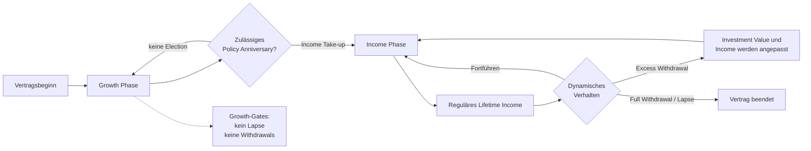
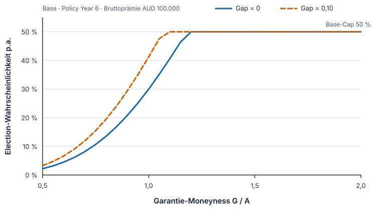
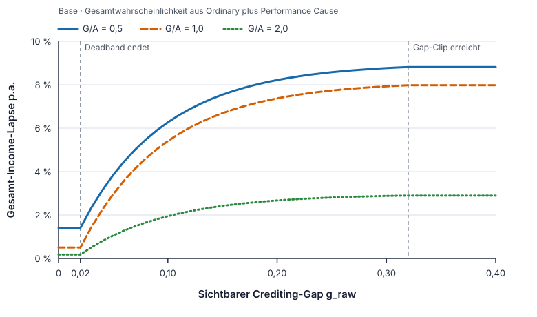
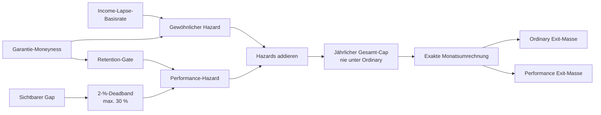
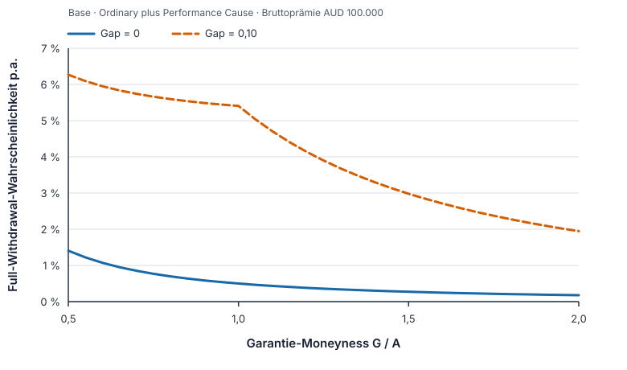
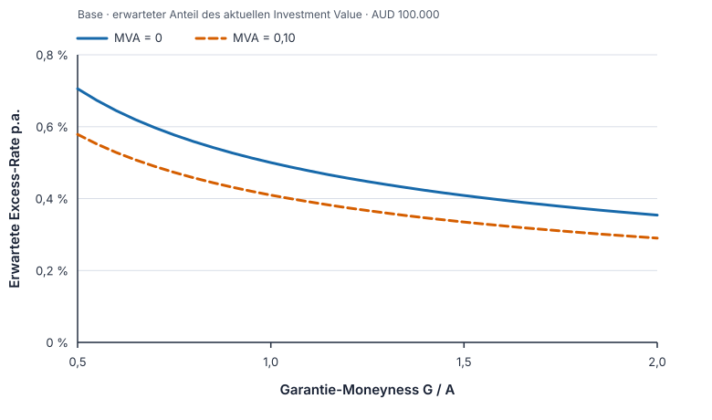
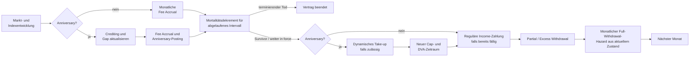

# Dynamische Policyholder-Verhaltensfunktionen

> **Stand:** 13. Juli 2026
>
> **Aktiver Annahmensatz:** `dynamic_proxy_2026-07-13_v2`
>
> **Status:** vereinfachtes statistisches Dynamic Behaviour; Mischung aus
> vertraglichen Restriktionen (`contractual_constraint`) und nicht kalibrierten
> Proxy-Annahmen (`uncalibrated_proxy`)

Dieses Dokument erklärt die im Repository verwendeten **dynamischen**
Verhaltensfunktionen fachlich und schematisch. Die exakten, maschinenlesbaren
Werte stehen in den beiden CSV-Dateien unter
[`input_dynamic_behaviour`](../input_dynamic_behaviour/README.md). Die CSVs sind
für Parameterwerte, der strikte Loader für deren Validierung und Behaviour-
sowie Projektionscode für Algorithmus und Timing maßgeblich. Dieses Dokument
fasst diese drei Ebenen verständlich zusammen.

`Policyholder` bezeichnet hier die versicherte Person. Ein `Modelpoint` ist ein
konkretes Beispiel für eine solche Person oder einen Joint-Life-Vertrag.

## 1. Zweck und Abgrenzung

Das statistische Modell beantwortet drei Fragen:

1. Beginnt die versicherte Person an einem zulässigen Anniversary freiwillig
   die Income Phase?
2. Nimmt sie in der Income Phase mehr als das reguläre Einkommen heraus?
3. Beendet sie den Vertrag in der Income Phase durch Full Withdrawal/Lapse?

Nicht Gegenstand dieser Funktionen sind Tod, Gebühren, Crediting, MVA- oder
Income-Reduktionsformeln. Diese Größen beeinflussen jedoch den beobachtbaren
Vertragszustand, auf den das Behaviour reagiert.

Eine freiwillige Entnahme **unterhalb** des regulär vorgesehenen Income ist im
aktuellen statistischen Modell keine eigene Handlung. Das vertragliche Income
wird ausgezahlt; eine Excess Withdrawal kann das künftige Income anschließend
mechanisch reduzieren. „Weniger entnehmen“ ist damit derzeit eine
Modellierungslücke, keine stillschweigend angenommene Behaviour-Funktion.

Ebenfalls getrennt ist **optimales Verhalten mit LSMC**. Dynamic Behaviour
verwendet feste statistische Proxy-Funktionen. LSMC lernt dagegen auf separaten
Trainingspfaden eine wertmaximierende Entscheidungsregel und reicht diese als
externe Policy an denselben Projektor. Es ist kein `BehaviourModel`-Regime.

Im generischen Portfolio-Runner sind dynamische Income Election und dynamisches
Post-Income-Behaviour die Defaults. Ein deterministischer Income-Start und
`continue` nach Election sind ausdrücklich gekennzeichnete Benchmarks.

## 2. Das Modell in einer Minute

Die wichtigste Vertragsregel steht **vor** jeder statistischen Funktion: Im
aktuellen generischen Produkt sind Growth-Lapse sowie Free-, Partial- und
Excess-Withdrawals in der Growth Phase nicht zulässig. Ordinary Growth-Lapse
und Growth-Free-Utilisation sind in den v2-Eingaben null. Die gemeinsame
Excess-Baseline und der generische Performance-Hazard sind dagegen nicht
phasenexklusiv; erst die Produkt-Gates im Projektor garantieren auch für diese
Kanäle den Growth-Output null.



Für die Interpretation sind drei Ebenen auseinanderzuhalten:

| Ebene | Frage | Beispiel |
|---|---|---|
| Vertrag | Ist die Handlung überhaupt zulässig? | Growth-Lapse ist gesperrt. |
| Behaviour-Funktion | Wie reagiert die Rate auf den aktuellen Zustand? | Wertvollere Garantie senkt Income-Lapse. |
| Projektions-Timing | Wann werden Zustand und Handlung ausgewertet? | Income-Lapse wird monatlich neu berechnet. |

Income Election ist eine pfadweise Ja/Nein-Entscheidung mit reproduzierbaren
Zufallsziehungen. Income-Lapse wird dagegen als erwartungswertgewichtetes
Decrement und Excess Withdrawal als erwartete Rate modelliert. Die beiden
letzten Größen sind daher keine simulierten individuellen Kundenhistorien.

## 3. Gemeinsame Zustandssignale

### 3.1 Garantie-Moneyness

Das zentrale Signal ist die signierte logarithmische Garantie-Moneyness

```text
m_raw = log(G / A)
m_std = clip(m_raw, -log(2), log(2))
```

mit dem Barwert `G` des relevanten künftigen Garantieeinkommens und einem zur
Handlung passenden Vergleichswert `A`.

| Funktion | Zähler `G` | Nenner `A` |
|---|---|---|
| Income Election | PV des Einkommens bei sofortigem Start | aktuelles Investment Value |
| Income Full Withdrawal/Lapse | PV des bereits gelockten restlichen Einkommens | aktueller Surrender Value |
| Income Excess Withdrawal | PV des bereits gelockten restlichen Einkommens | aktuelles Investment Value |

Der Garantie-PV ist das prospektive beziehungsweise gelockte Jahreseinkommen
mal pfadweisem Annuitätenfaktor. Aktuelle Mortalitäts- und Joint-Life-Zustände
wirken deshalb mittelbar auf die Moneyness, obwohl Mortalität kein eigener
CSV-Regressionskoeffizient ist.

Die Leseregel lautet:

| Verhältnis `G/A` | `m_std` | Bedeutung |
|---:|---:|---|
| 0,5 oder kleiner | `-log(2)` | Garantie relativ wenig wertvoll |
| 1,0 | `0` | at the money (ATM) |
| 2,0 oder größer | `+log(2)` | Garantie relativ wertvoll |

Der Standard-Clip verhindert, dass extreme oder nahezu null werdende
Vergleichswerte die Proxy-Funktion dominieren. Die Standardfunktionen verwenden
`m_std`. Nur das Retention-Gate des Performance-Lapse nutzt separat `m_raw` und
clippt dessen positiven Teil erst bei `log(4)`.

### 3.2 Sichtbarer Crediting-Gap

Nach jedem abgeschlossenen Crediting Year wird ausschließlich aus der für den
Kunden sichtbaren Entwicklung berechnet:

```text
g_raw = max(log(1 + R_reference) - log(1 + R_credited), 0)
```

Unter Total Protection ist dies vor allem ein **Cap-Gap**: Der Reference Fund
ist stärker gestiegen als die vertragliche Gutschrift. Das Signal ist nicht
gleichbedeutend mit allgemein schlechter Marktperformance. Backing Assets,
Hedge-P&L und zukünftige Information gehen nicht ein. Zwischen zwei
Anniversaries bleibt der zuletzt beobachtete Gap unverändert.

### 3.3 MVA-Biss und Bruttoprämie

Der Projektor stellt für Excess Withdrawals einen aktuellen MVA-Biss `v` im
Intervall `[0, 1]` bereit. Eine höhere mögliche MVA-Belastung soll eine
Mehrentnahme weniger attraktiv machen. Der MVA-freie Free-Withdrawal-Kanal
erhält dieses Signal bewusst nicht.

Die technische Modellform unterstützt außerdem

```text
z = clip(log(P / 100000), -2, 2)
```

mit der eingezahlten **Bruttoprämie** `P`. Im aktiven v2-Satz sind jedoch alle
Premium- und Moneyness-mal-Premium-Koeffizienten null. Die Prämienhöhe ist
damit derzeit kein aktiver Behaviour-Treiber.

### 3.4 Welche Signale wirken wo?

Kurz gelesen:

- Eine wertvollere Garantie erhöht Take-up, senkt gewöhnlichen Lapse und senkt
  Excess Withdrawal.
- Ein größerer sichtbarer Crediting-Gap erhöht Take-up und Performance-Lapse.
- Ein höherer MVA-Biss senkt Excess Withdrawal.

Die x/y-Grafiken in den folgenden Abschnitten zeigen die **tatsächlich aus dem
geladenen Base-Modell berechneten** Funktionsverläufe. Auf der x-Achse steht bei
Moneyness-Grafiken das anschauliche Verhältnis `G/A`; intern wird daraus
`m_raw` beziehungsweise `m_std` gebildet.

## 4. Gemeinsame mathematische Bausteine

### 4.1 Proportionaler Hazard für Ereigniswahrscheinlichkeiten

Income Take-up und gewöhnlicher Income-Lapse verwenden eine Cox-/complementary-
log-log-artige Transformation. Aus einer jährlichen Basiswahrscheinlichkeit
`p0` wird zunächst der integrierte Basishazard

```text
mu0 = -log(1 - p0)
eta = beta_m * m_std + beta_p * z + beta_mp * m_std * z + beta_mva * v
q   = clip(exp(eta), multiplier_floor, multiplier_cap)
p_a = clip(1 - exp(-mu0 * q), annual_floor, annual_cap)
```

Eine strukturelle Basis von `0` bleibt exakt `0`, eine Basis von `1` exakt
`1`. Für einen Zeitschritt der Länge `dt` Jahre gilt anschließend

```text
p_dt = 1 - (1 - p_a)^dt
```

Zwölf identische Monatswahrscheinlichkeiten reproduzieren dadurch exakt die
Jahreswahrscheinlichkeit; eine bloße Division durch zwölf wird vermieden.

### 4.2 Fractional Logit für erwartete Entnahmeraten

Excess Withdrawal ist keine Ereigniswahrscheinlichkeit, sondern ein erwarteter
Anteil des Investment Value. Dafür gilt

```text
logit(u) = logit(u0)
           + beta_m * m_std
           + beta_p * z
           + beta_mp * m_std * z
           + beta_mva * v
```

Danach wird mit der inversen Logit-Funktion in `[0, 1]` zurücktransformiert.
Strukturelle Endpunkte `u0 = 0` und `u0 = 1` bleiben exakt erhalten.

## 5. Dynamischer Start der Income Phase

### 5.1 Basisraten

Die freiwillige Election wird nur an einem zulässigen Anniversary in der
Growth Phase geprüft. Die Baseline hängt vom Policy Year ab:

| Policy Year | Low | Base | High |
|---:|---:|---:|---:|
| 1 | 0 % | 0 % | 0 % |
| 2 | 5 % | 10 % | 15 % |
| 3 | 7,5 % | 15 % | 22,5 % |
| 4 | 10 % | 20 % | 30 % |
| 5 | 12,5 % | 25 % | 37,5 % |
| 6–7 | 15 % | 30 % | 45 % |
| 8+ | 15 % | 30 % | 45 % |

Das Band bleibt ab Policy Year 8 offen. Es gibt **keinen** Behaviour-bedingten
Force-Year. Vertragliche automatische Starts, insbesondere am ersten
Anniversary nach Erreichen von Alter 100, sind separate Produktlogik und
überschreiben die freiwillige Entscheidung. Der im generischen Produkt nicht
zulässige Age-Pension+-Pfad bleibt außerhalb dieses Dokuments.

### 5.2 Zustandsreaktion

Im v2-Satz ist der aktive lineare Predictor

```text
g_takeup = clip(g_raw, 0, 1)
eta_takeup = 4 * m_std + 4 * g_takeup
```

Der gemeinsame relative Hazard-Multiplikator ist auf `[0,05; 25]` begrenzt.
Die jährliche Ausgabewahrscheinlichkeit ist in Low/Base/High auf
`35 % / 50 % / 65 %` begrenzt. Technisch verfügbare Effekte für Account Value,
prospektive Income Ratio, einzelne Returns, Prämie und Interaktionen sind in v2
alle null.



*Abbildung 1: Base-Funktionsverlauf in Policy Year 6. Der horizontale Abschnitt
ist der jährliche Base-Cap von 50 %.*

Beispiel für Base, Policy Year 6 und AUD 100.000 Bruttoprämie:

| `G/A` | ohne Gap | mit `g_raw = 0,10` |
|---:|---:|---:|
| 0,5 | 2,20 % | 3,27 % |
| 1,0 | 30,00 % | 41,26 % |
| 2,0 | 50,00 % Cap | 50,00 % Cap |

Die Zufallszahl wird reproduzierbar je Pfad und Policy Year erzeugt. Die
Wahrscheinlichkeit selbst entsteht erst am aktuellen Anniversary aus dem dann
beobachtbaren Zustand; es gibt keinen Look-ahead.

## 6. Dynamischer Full Withdrawal/Lapse in der Income Phase

Income-Lapse besteht aus zwei **konkurrierenden Exit-Ursachen**. Sie werden auf
Hazard-Ebene kombiniert, damit dieselbe Exit-Masse nicht doppelt gezählt wird.

### 6.1 Gewöhnlicher Income-Lapse

Die jährliche Basis beträgt Low/Base/High
`0,25 % / 0,50 % / 0,75 %`. Aktiv ist nur

```text
eta_ordinary = -1.5 * m_std
```

Der relative Hazard-Multiplikator ist auf `[0,20; 3,00]` begrenzt. Der
gewöhnliche jährliche Output-Cap beträgt `20 % / 30 % / 40 %`. Die negative
Steigung bedeutet: Je wertvoller das verbleibende garantierte Einkommen im
Verhältnis zum aktuellen Surrender Value ist, desto geringer ist der Anreiz
zum Full Withdrawal.

### 6.2 Zusätzlicher Performance-Lapse

Der zweite Hazard reagiert auf den sichtbaren Gap, ohne diesen in denselben
linearen Predictor wie die Garantie-Moneyness zu pressen:

```text
g_eff = clip(max(g_raw - 0.02, 0), 0, 0.30)
m_ret = clip(max(m_raw, 0), 0, log(4))
retention = max(0.20, exp(-1.5 * m_ret))
mu_perf = retention * mu_max * (1 - exp(-g_eff / 0.08))
```

`mu_max` ist in Low `0 %` und in Base/High `8 %`. Der Deadband ignoriert die
ersten `0,02` logarithmischen Gap-Einheiten, bei kleinen Returns näherungsweise
zwei Prozentpunkte. Positive Garantie-Moneyness reduziert den Performance-
Hazard bis zu einem Retention-Floor von 20 %. Negative Moneyness verstärkt ihn
nicht zusätzlich.



*Abbildung 2: Der 2-%-Deadband, der anschließende Anstieg und die Retention bei
wertvoller Garantie sind im Base-Verlauf direkt sichtbar.*

### 6.3 Competing-Risk-Zusammenführung

Mit `mu_ord = -log(1 - p_ordinary)` gilt zunächst

```text
p_raw = 1 - exp(-(mu_ord + mu_perf))
p_total = max(p_ordinary, min(p_raw, combined_annual_cap))
```

Der gemeinsame Jahres-Cap beträgt Low/Base/High `20 % / 30 % / 40 %`. Er
begrenzt nur das **inkrementelle** kombinierte Risiko und darf eine bereits
höhere gewöhnliche Wahrscheinlichkeit niemals reduzieren. Danach wird
`p_total` exakt auf den Monat umgerechnet und im Verhältnis der ursprünglichen
cause-specific Hazards auf Ordinary und Performance verteilt.





*Abbildung 3: Gesamt-Lapse aus Ordinary und Performance Cause. Ohne Gap bleibt
nur der fallende Ordinary-Hazard; mit Gap liegt die Kurve deutlich höher.*

Beispiel für Base und AUD 100.000 Bruttoprämie:

| `G/A` | kein Gap | `g_raw = 0,10` |
|---:|---:|---:|
| 0,5 | 1,4078 % p.a. | 6,2696 % p.a. |
| 1,0 | 0,5000 % p.a. | 5,4066 % p.a. |
| 2,0 | 0,1771 % p.a. | 1,9459 % p.a. |

ATM entsprechen `0,5 %` p.a. rund `0,04176 %` pro Monat. Mit `g_raw = 0,10` sind
es rund `0,46211 %` pro Monat. Die Performance-Komponente ist damit im Base-
Satz materiell und ausdrücklich ein unkalibriertes Modellrisiko.

### 6.4 Anwendung und Vertrags-Gates

Der Income-Lapse wird an **jedem monatlichen Full-Withdrawal-Zeitpunkt** mit
aktuellem, post-payment und post-withdrawal ermitteltem Surrender Value neu
berechnet. Er wird nicht einmal jährlich berechnet und anschließend zwölf
Monate konstant gehalten.

Full Withdrawal ist nicht zulässig

- in der Growth Phase,
- im selben Ereigniszeitpunkt wie eine neue Income Election,
- nach Tod beziehungsweise außerhalb des In-force-Bestands oder
- wenn der Surrender Value materiell null ist. Eine positive verbleibende
  Einkommensgarantie kann nicht gegen eine Auszahlung von null aufgegeben
  werden.

## 7. Dynamische Excess Withdrawals

### 7.1 Basis und Reaktion

Die erwartete jährliche Excess-Withdrawal-Rate als Anteil des aktuellen
Investment Value beträgt Low/Base/High `0 % / 0,50 % / 2,00 %`. Im v2-Satz gilt

```text
logit(u_excess) = logit(u0) - 0.5 * m_std - 2 * v
```

Die Moneyness wird **signiert** verwendet. Eine wenig wertvolle Garantie erhöht
die erwartete Mehrentnahme; eine wertvolle Garantie und ein höherer MVA-Biss
senken sie. Premium und Interaktion sind null. Die Low-Basis von null bleibt
exakt null.



*Abbildung 4: Sowohl eine wertvollere Garantie als auch ein höherer MVA-Biss
senken die erwartete Mehrentnahme.*

Beispiel für Base und AUD 100.000 Bruttoprämie:

| `G/A` | ohne MVA-Biss | bei `v = 0,10` |
|---:|---:|---:|
| 0,5 | 0,7056 % | 0,5785 % |
| 1,0 | 0,5000 % | 0,4097 % |
| 2,0 | 0,3541 % | 0,2901 % |

### 7.2 Anwendung im Projektor

Der v2-Satz verwendet die Frequenz `annual`. Die Rate wird am tatsächlichen
Anniversary-Aktionspunkt aus dem aktuellen Zustand **nach** einer dort fälligen
regulären Income-Zahlung berechnet und einmal angewandt. Danach greifen die
vertraglichen Mindestbeträge, der Mindest-Restwert, MVA und die
Income-Reduktion. Der Legacy-kompatible CAS-/Age-Pension+-Pfad ist im aktuellen
generischen Produkt nicht zulässig.

Der technisch verfügbare Monatsmodus würde die Zustandsrate monatlich neu
berechnen und `u/12` auf das jeweils aktuelle, im Jahresverlauf sinkende
Investment Value anwenden. Er rekonstruiert deshalb nicht exakt eine einmalige
Entnahme von `u` auf dem Jahresanfangswert und ist nicht der v2-Default.

Growth-Free-Utilisation ist in der CSV strukturell null. Die gemeinsame Excess-
Baseline ist es nicht; das Produkt-Gate setzt sie in der Growth Phase auf null.
Das generische Produkt hat keine alte 5-%-Free-Allowance in der Growth Phase.

## 8. Ereignisreihenfolge im Monatsmotor

Die Verhaltensfunktion sieht immer nur Information, die am jeweiligen
Entscheidungspunkt bereits verfügbar ist.



Wichtige Timing-Folgen:

- Die erste reguläre Income-Zahlung erfolgt einen Monat nach Election.
- Eine neue Election sperrt Full Withdrawal am selben Zeitstempel. Die
  annualisierte Partial-/Excess-Mechanik ist davon nicht gesperrt.
- Scheduled Partial/Excess Withdrawal wird vor Full Withdrawal verarbeitet;
  der anschließende Lapse sieht deshalb den aktualisierten Surrender Value.
- Der sichtbare Gap wird nur am Anniversary erneuert; Moneyness und MVA-Signal
  werden am tatsächlichen Aktionspunkt erneuert.

Bei dynamischen Portfolio-Läufen werden Primary- und Spouse-Status pfadweise
getrennt geführt. Election, Garantie-PV, Lapse und Withdrawal sehen damit den
tatsächlichen Joint-Life-Zustand. Mortalität selbst bleibt eine eigene
Projektionsannahme und keine vierte Behaviour-Funktion.

## 9. Aktueller Parametersatz im Überblick

| Funktion | Low | Base | High | Aktive Formparameter |
|---|---:|---:|---:|---|
| Growth Full Withdrawal/Lapse | 0 % | 0 % | 0 % | Produktoutput null; Ordinary-Basis null, Performance Cause gegated |
| Income Full Withdrawal/Lapse | 0,25 % | 0,50 % | 0,75 % | `beta_m=-1,5`; Performance-Hazard separat |
| Income Election, PY 8+ | 15 % | 30 % | 45 % | `beta_m=+4`, `beta_gap=+4` |
| Growth Free Withdrawal | 0 % | 0 % | 0 % | strukturelle Vertragsnull |
| Income Excess Withdrawal | 0 % | 0,50 % | 2,00 % | `beta_m=-0,5`, `beta_mva=-2` |

Low/Base/High sind gerichtete Sensitivitätslevel, keine Konfidenzintervalle und
keine unterschiedlichen empirischen Kalibrierungen. In v2 variieren Baselines
und dafür freigegebene Caps; die signierten Slopes und Shape-Parameter bleiben
zwischen den Levels gleich.

## 10. Sanity-Invarianten

Die Implementierung und ihre Tests sichern insbesondere folgende Eigenschaften:

- Alle Wahrscheinlichkeiten und erwarteten Utilisationen bleiben in `[0, 1]`.
- Strukturelle Baselines von `0` beziehungsweise `1` bleiben exakt erhalten.
- Bei ATM, Referenzprämie, Gap null und MVA null wird die Baseline reproduziert.
- Eine höhere Garantie-Moneyness erhöht Take-up und senkt Ordinary Lapse sowie
  Excess Withdrawal.
- Ein größerer Gap senkt niemals den Performance-Hazard.
- Der kombinierte Lapse-Cap reduziert niemals eine bereits höhere Ordinary-
  Wahrscheinlichkeit.
- Ordinary- und Performance-Exit-Masse addieren sich exakt zur gesamten
  Lapse-Masse; es gibt keine Doppelzählung.
- Monats- und Jahreswahrscheinlichkeit sind über
  `1 - (1 - p_a)^dt` konsistent.
- Growth-Lapse und Growth-Withdrawals bleiben in der Produktprojektion null.
- Die Funktionen verwenden keine zukünftigen Szenariowerte.

Wichtig: Die generischen Low-Level-Funktionen kennen die Produkt-Gates nicht
selbst. `DynamicLapseParams.growth_probability()` kann über die gemeinsame
Performance Cause einen positiven Wert liefern, und die gemeinsame Excess-
Response hat keine eigene Growth-Sperre. Solche Direktaufrufe testen die
mathematische Funktion, nicht die zulässige Handlung des generischen Produkts.
Maßgeblich für Produktcashflows ist der Projektor.

Auch ein nackter `BehaviourModel()`-Konstruktor lädt v2 nicht automatisch; sein
absichtlich statischer Default dient isolierten Tests und Kompatibilität.
Produktive Entrypoints müssen den versionierten CSV-Loader verwenden.

## 11. Modellgrenzen und Governance

Die nicht vertraglichen Parameter sind literatur- und praxisinformierte
Startwerte, aber **keine australische Experience-Kalibrierung**. Insbesondere
der zusätzliche Performance-Hazard kann das Ergebnis materiell verändern.
Vor Produktionsverwendung sind interne Bestandsdaten, Segmentierung,
Credibility, Backtesting, Stabilitätsanalyse und Governance-Freigabe notwendig.

Weitere Grenzen:

- Es gibt noch kein getrenntes Incidence-/Severity-Modell für Partial oder
  Excess Withdrawals; modelliert wird eine erwartete Rate.
- Eine freiwillige Unterentnahme des regulären Income ist nicht modelliert;
  nur Mehrentnahme und die daraus folgende mechanische Income-Reduktion.
- Die Prämiengröße ist technisch vorhanden, aber in v2 bewusst neutral.
- Der Performance-Gap ist ein einfacher kundenbezogener Cap-Gap-Proxy.
- Lapse wird als Kohortendecrement, nicht als diskreter Kundendraw simuliert.
- Low/Base/High ersetzen keine Parameterschätzunsicherheit oder
  Experience-Studie.
- Die Behaviour-Funktion ist unter Real World und risikoneutralem Maß formal
  dieselbe; unterschiedlich ist die Verteilung der Markt- und Vertragszustände.

Ergebnisse sind daher als **vereinfachte dynamische Policyholder-Projektionen
mit festen Proxy-Annahmen** zu kennzeichnen.

## 12. Abgrenzung zum optimalen LSMC-Verhalten

| Dynamic Behaviour | Optimales Behaviour mit LSMC |
|---|---|
| feste, versionierte Proxy-Funktionen | aus Trainingspfaden gelernte Policy |
| Election als Zufallsentscheidung | wertmaximierendes `WAIT` oder `START` |
| Lapse/Withdrawal als erwartete Rate | pfadweise Aktion `CONTINUE`, `PARTIAL_WITHDRAWAL` oder `FULL_WITHDRAWAL` |
| geeignet als transparente Baseline | separater Research-/Stress-Benchmark |

Nur das alte Modul `agile_engine/lsmc.py` ist Legacy. Die aktuelle
Implementierung in `optimal_behaviour_lsmc.py` sowie ihr eigener Portfolio-
Runner sind aktiv. Beide Ansätze verwenden dieselben Vertrags-Gates und
Ereigniszeitpunkte, dürfen aber nicht innerhalb eines Behaviour-Regimes
vermischt werden.

## 13. Methodische Quellen

Die Quellen begründen Modellklassen und Reaktionsrichtungen, nicht die konkrete
Höhe der CSV-Parameter:

- Cox, *Regression Models and Life-Tables* (1972): Grundlage proportionaler
  Hazard-Modelle. [JSTOR](https://www.jstor.org/stable/2985181),
  [DOI](https://doi.org/10.1111/j.2517-6161.1972.tb00899.x)
- Papke/Wooldridge, *Econometric Methods for Fractional Response Variables*:
  methodischer Anker für Fractional-Logit-Antworten im Einheitsintervall.
  [NBER](https://www.nber.org/papers/t0147)
- Knoller/Kraut/Schoenmaekers, *On the Propensity to Surrender a Variable
  Annuity Contract*: empirische Einordnung von Garantie-Moneyness.
  [Journal of Risk and Insurance](https://onlinelibrary.wiley.com/doi/10.1111/jori.12076)
- NAIC, *Variable Annuity Statutory Reserve and Capital Reform – QIS II Public
  Report* (2018), insbesondere Abschnitt 7: beobachtete Behaviour-Richtungen.
  [NAIC-PDF](https://content.naic.org/sites/default/files/committee_related_documents/cmte_e_va_issues_wg_related_qis_ii_public_report.pdf)
- SOA/LIMRA, *Variable Annuity Guaranteed Living Benefits Utilization – 2015
  Experience*: Nutzung von Living-Benefit-Garantien.
  [SOA-PDF](https://www.soa.org/globalassets/assets/files/resources/research-report/2018/variable-annuity-guaranteed-utilization.pdf)

## 14. Zentrale Fundstellen

- [Technisches Input-README](../input_dynamic_behaviour/README.md)
- [Basisraten und Utilisationen](../input_dynamic_behaviour/dynamic_behaviour_baselines.csv)
- [Koeffizienten und Grenzen](../input_dynamic_behaviour/dynamic_behaviour_coefficients.csv)
- [Mathematische Behaviour-Funktionen](../AGILE_Modelling_Engine/agile_engine/behavior.py)
- [Strikter CSV-Loader](../AGILE_Modelling_Engine/agile_engine/dynamic_behaviour_assumptions.py)
- [Projektionsintegration und Ereignisreihenfolge](../AGILE_Modelling_Engine/agile_engine/projection.py)
- [Generischer Portfolio-Runner](../AGILE_Modelling_Engine/portfolio_simulations/run_portfolio_valuation.py)
- [Aktuelles optimales LSMC-Verhalten](../AGILE_Modelling_Engine/agile_engine/optimal_behaviour_lsmc.py)
- [Separater LSMC-Portfolio-Runner](../AGILE_Modelling_Engine/portfolio_simulations/run_portfolio_valuation_lsmc.py)
- [Generisches Produktdesign](Produktdesign_Index_Linked_Lifetime_Income_Fallbeispiel.md)
- [Relevante Tests](../AGILE_Modelling_Engine/tests/test_dynamic_behaviour_assumptions.py)
