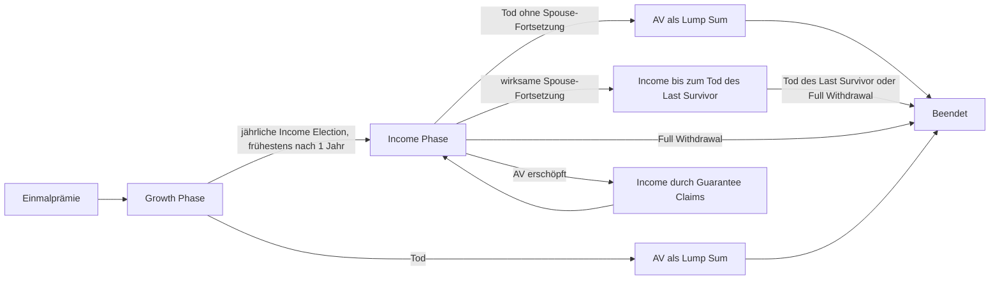

> **Dokumentstatus.** Dieses Dokument beschreibt ein eigenständiges,
> marktinspiriertes Fallbeispiel. Es ist weder die Beschreibung eines konkret
> angebotenen Versicherungsprodukts noch Produkt-, Rechts-, Steuer- oder
> Anlageberatung. Vertragliche Produktregel, Modellierungsproxy und
> Versicherer-Cashflow werden jeweils getrennt ausgewiesen. Geldbeträge sind,
> sofern nicht anders angegeben, in australischen Dollar (AUD) angegeben.

# 1. Zweck, Perspektive und Begriffe

Das Fallprodukt verbindet einen indexgebundenen Vermögensaufbau mit einem
später aktivierbaren lebenslangen festen Einkommen. Es wird durch eine einzige
Prämie finanziert und besitzt zwei Phasen:

1. die **Growth Phase**, in der das Account Value durch eine jährlich
   begrenzte und gegen negative Jahresrenditen geschützte Gutschrift wächst;
2. die **Income Phase**, in der ein bei Phasenbeginn festgelegtes Einkommen
   monatlich nachschüssig gezahlt wird.

In diesem Dokument gelten folgende Begriffe:

- **Policyholder (PH)** und **Versicherungsnehmer (VN)** bezeichnen die
  versicherte Person und werden synonym verwendet.
- **Primary Life** ist der PH als primär versichertes Leben.
- **Spouse** ist das gegebenenfalls zusätzlich für die
  Einkommensfortzahlung versicherte Leben.
- **Account Value (AV)** ist der positive Vertragskontowert. Für diese Größe
  wird durchgängig ausschließlich diese Bezeichnung verwendet.
- **Reference Fund** ist der synthetische Referenzfonds, dessen vollständige
  Rendite die jährliche Indexgutschrift bestimmt. Das AV ist kein direktes
  Depot aus Fondsanteilen; das Produkt ist index-linked und nicht unit-linked.
- **Versicherer-Backing** ist davon getrennt. Für Kosten-, Performance- und
  Profitabilitätsrechnungen wird der administrative Crediting-Frame in einem
  Money-Market-Konto gehalten, das ausschließlich den stochastisch simulierten
  AUD-Overnight-Zins täglich beziehungsweise kontinuierlich rollierend
  akkumuliert. Der unterjährige DVA-Optionswert bleibt eine Liability-Größe und
  ist kein Backing-Asset. Reference-Fund-Performance ist kein Backing-Ertrag.
- **Policy Anniversary** ist jeder Jahrestag des Vertragsbeginns.

# 2. Produktübersicht

| Merkmal | Spezifikation des Fallprodukts |
|---|---|
| Produktart | Index-linked Single-Premium Lifetime-Income-Produkt |
| Eintrittsalter Primary Life | 50 bis einschließlich 80 Jahre |
| Eintrittsalter Spouse | bei Spouse-Option ebenfalls 50 bis einschließlich 80 Jahre |
| Einmalprämie | mindestens AUD 20.000, höchstens AUD 5.000.000 |
| Weitere Prämien | keine Top-ups oder sonstigen zusätzlichen Einzahlungen |
| Startwert | Einmalprämie; weder Upfront Adviser Fee noch Commencement Bonus |
| Growth Phase | ab Vertragsbeginn, mindestens ein vollständiges Vertragsjahr |
| Income Election | einmal je Vertragsjahr am Policy Anniversary; irreversibel |
| Spätester Income-Start | Fallstudienkonvention: erster Policy Anniversary nach Vollendung des 100. Lebensjahrs |
| Income | ausschließlich Fixed Lifetime Income |
| Zahlungsweise | monatlich nachschüssig; erste Rate einen Monat nach Income Election |
| Investment Exposure | ein einziger fester Reference Fund |
| Reference Fund | 30 % Global Equity und 70 % nominale australische Staatsanleihen |
| Rebalancing | monatlich auf 30/70 zurückgesetzt |
| Bond-Sleeve | monatlich rollierendes Portfolio mit konstanter Restlaufzeit von fünf Jahren |
| Schutz | ausschließlich Total Protection auf den vollständigen Reference-Fund-Return |
| Maximum Return | für die vorliegende Modellimplementierung konstant 6,00 % p. a. |
| Guaranteed Minimum Cap | 0,25 % p. a.; Untergrenze des künftig gesetzten Caps, keine Mindestjahresrendite |
| Alternativer Fixed-Return-Zweig | nicht vorgesehen |
| Wechsel der Investmentoption | nicht zulässig; der 30/70-Reference-Fund bleibt auch in der Income Phase maßgeblich |
| Withdrawals in Growth | nicht zulässig, einschließlich Partial, Excess und Full Withdrawal |
| Withdrawals in Income | Partial/Excess und Full Withdrawal nach den Regeln in Abschnitt 10 |
| Todesfallleistung | positives AV ohne MVA; bei Spouse Income alternativ Einkommensfortzahlung |
| Laufende Kundenfees | Product Fee 0,30 % p. a. plus Lifetime Income Premium 1,15 % p. a.; tägliche Abgrenzung, Belastung am Policy Anniversary beziehungsweise bei definierten Beendigungsereignissen |
| Adviser Service Fee | im Fallprodukt weder upfront noch laufend angeboten |
| Pension+-Option | nicht angeboten |

Der numerische Cap des neuen 30/70-Reference-Funds darf nicht aus einem Cap
für eine reine Aktienoption übernommen werden. Für die vorliegende
Modellimplementierung ist er als eigenständige Produkteigenschaft konstant auf
6,00 % p. a. festgelegt. Eine spätere variable Cap Schedule oder faire
Hedge-Budget-Festsetzung wäre eine bewusste Produktänderung.

# 3. Vertragszustände

Die Zustände sind:

- **Growth:** jährliches Crediting, tägliche Fee-Abgrenzung, kein freiwilliger
  Kapitalzugriff;
- **Income:** jährliches Crediting auf denselben Reference Fund, tägliche
  Fee-Abgrenzung, monatliches Fixed Income und mögliche Withdrawals;
- **Beendet:** keine weiteren Vertragsleistungen;
- **Income bei AV = 0:** kein eigener Endzustand. Das AV bleibt null, das
  versicherte Einkommen läuft aber für das maßgebliche Leben weiter und wird
  vollständig zum Guarantee Claim.

Der Wechsel von Growth zu Income ist endgültig. Ein Wechsel zurück in Growth,
ein Wechsel des Reference Funds oder eine Änderung des 30/70-Exposures ist
nicht möglich.

# 4. Reference Fund

## 4.1 Global-Equity-Sleeve

Der Equity-Sleeve bildet einen bereits in AUD ausgedrückten beziehungsweise
AUD-abgesicherten globalen Total-Return-Index ab. Ausschüttungen sind bereits
im Index enthalten und werden nicht nochmals separat addiert. Für Monat \(m\)
lautet der einfache Equity Return

\[
R^{G}_m=\frac{S^G_m}{S^G_{m-1}}-1.
\]

Es werden keine separaten FX-Renditen, FX-Volatilitäten oder Hedgekosten für
den Kundenfonds modelliert.

## 4.2 Australian-Government-Bond-Sleeve

Der Bond-Sleeve ist ein monatlich rollierendes Portfolio nominaler
australischer Staatsanleihen mit konstanter Restlaufzeit von fünf Jahren. Im
Basismodell wird hierfür ein Zero-Coupon-Bond-Proxy verwendet. Zu Monatsbeginn
\(t_m\) wird ein Bond mit Fälligkeit \(T_m=t_m+5\) betrachtet. Sein
Monatsreturn ist

\[
R^B_m
=\frac{P(t_m,T_{m-1})}{P(t_{m-1},T_{m-1})}-1,
\qquad T_{m-1}=t_{m-1}+5.
\]

Nach der Monatsbewertung wird zum dann geltenden Preis in einen neuen Bond mit
Fälligkeit \(t_m+5\) gerollt. Dadurch enthält der Return gemeinsam:

- laufenden Ertrag;
- Preisänderungen infolge von Zinsbewegungen; und
- Roll-down entlang der simulierten Zinskurve.

Es werden keine Credit Spreads, Ausfälle, Ratingmigrationen oder
Inflationsanleihen modelliert. Sollte die technische Bond-Total-Return-Funktion
in einer Implementierungsstufe noch fehlen, darf ausschließlich als klar
gekennzeichneter temporärer Fallback die pfadweise Short-Rate-Verzinsung
verwendet werden.

## 4.3 Monatliche Fondsbildung und Rebalancing

Der einfache Monatsreturn des vollständigen Reference Funds ist

\[
R^F_m=0{,}5R^G_m+0{,}5R^B_m.
\]

Mit einem normierten Fondsindex \(F_0=1\) gilt

\[
F_m=F_{m-1}(1+R^F_m).
\]

Am Ende jedes Monats wird auf 30 % Global Equity und 70 % Australian Bonds
zurückgesetzt. Die Gewichte driften daher innerhalb des Monats, werden aber
nicht kontinuierlich gehalten. Transaktionskosten und taktische
Allokationsentscheidungen werden nicht angesetzt.

Über ein Crediting Year von \(T_{y-1}\) bis \(T_y\) folgt

\[
R^F_y
=\frac{F_{T_y}}{F_{T_{y-1}}}-1
=\prod_{m\in y}(1+R^F_m)-1.
\]

# 5. Total-Protection-Crediting

## 5.1 Jährlicher Point-to-Point-Credit

Auf den vollständigen Reference-Fund-Return wird am Policy Anniversary die
Total-Protection-Funktion angewandt:

\[
c_y=\min\!\left\{\max(R^F_y,0),C_y\right\}.
\]

Damit gilt immer

\[
0\le c_y\le C_y.
\]

Der Return wird zuerst auf Fondsebene gebildet und erst danach gefloort und
gecappt. Insbesondere ist folgende abweichende Berechnung nicht zulässig:

\[
0{,}5\,c(R^G_y)+0{,}5\,c(R^B_y).
\]

Die nichtlineare Protection darf also nicht separat auf Equity und Bonds
angewandt werden.

## 5.2 Maximum Return und Guaranteed Minimum Cap

Der Cap \(C_y\) ist im Fallmodell für sämtliche Crediting Years konstant auf
6,00 % festgelegt. Er liegt damit oberhalb des Guaranteed Minimum Cap

\[
C_{\min}=0{,}25\% 
\]

fallen. Diese Garantie betrifft den Cap und nicht den tatsächlichen Credit.
Bei einem negativen Reference-Fund-Return ist der Credit trotz
\(C_y\ge C_{\min}\) gleich null.

Für die vorliegende Modellimplementierung gilt in jedem Crediting Year

\[
C_y=6{,}00\%.
\]

Die folgende Tabelle zeigt daher die verbindliche Modellwirkung dieses Caps:

| Reference-Fund-Return | Credit bei festem Cap 6 % |
|---:|---:|
| +9 % | +6 % |
| +3 % | +3 % |
| 0 % | 0 % |
| -8 % | 0 % |

## 5.3 Account-Value-Credit am Anniversary

Sei \(AV^{frame}_{T_y^-}\) die für das Crediting gehaltene AV-Basis vor dem
Jahrescredit. Dann gilt

\[
AV^{credit}_{T_y}
=AV^{frame}_{T_y^-}(1+c_y).
\]

Anschließend werden die seit dem letzten Belastungsereignis aufgelaufenen Fees
abgezogen. Erst auf dieser Post-Fee-Basis kann Income gestartet werden.

## 5.4 Unterjähriger Wert

Tod kann zwischen zwei Policy Anniversaries eintreten. Für den unterjährigen
AV-Wert wird deshalb in der Modellierung ein Hedgewert-Proxy verwendet. Mit
\(T_y\) als nächstem Anniversary gilt

\[
p_y(t)=P(t,T_y)+V^{TP}_{pkg}(t),
\]

\[
V^{TP}_{pkg}(t)
=Call_t(K=1)-Call_t(K=1+C_y),
\]

\[
AV_t=AV^{frame}_t\,p_y(t).
\]

Der Proxy konvergiert am Anniversary zu \(1+c_y\). Er ist ein
marktwertorientierter Modellierungsansatz, keine behauptete administrative
Produktionsformel. Da in Growth keine Withdrawals möglich sind und die Income
Election nur am Anniversary stattfindet, ist dieser Zwischenwert im
Fallprodukt vor allem für unterjährige Todesfallleistungen relevant.

Die Calls beziehen sich auf den normierten **vollständigen** Reference Fund.
Ihr Wert muss daher unter dem gemeinsamen Equity-/Zinsmodell bestimmt werden;
er darf nicht als Summe separat bewerteter Equity- und Bondoptionen angesetzt
werden. Ein budgetneutral gesetzter Cap erfüllt am Periodenbeginn

\[
p_y(T_{y-1})=1.
\]

Bei einem abweichenden Cap entsteht für den markt-konsistenten
Kunden-Cashflow-Identity-Check die signierte technische
Contract-Financing-Margin

\[
CM_y=AV^{frame}_{T_{y-1}}
\left[1-p_y(T_{y-1})\right].
\]

Ein positiver Wert bedeutet, dass der Kundenvertrag unter dieser
Replikationssicht unter der verfügbaren Basis liegt; ein negativer Wert
bedeutet, dass das gewählte Paket mehr kostet. Diese technische Größe wird
nicht zusätzlich als Versichererprofit gebucht. Für Versicherer-P&L gelten die
expliziten Money-Market- und Hedge-Cashflows aus Abschnitt 13.2.

## 5.5 Versicherer-Hedge und Cap-Leg

Zu Beginn jedes Crediting Years kauft der Versicherer eine positive
Reference-Fund-Return-Option. In Return-Strike-Notation ist die
Standardreplikation

\[
Call(R;K=0)-Call(R;K=C_y),
\]

äquivalent zu Gross-Return-Strikes 1 und \(1+C_y\). Die zweite, verkaufte Leg
ist ökonomisch eine **Cap-Call-Leg**. Ein verkaufter Put am Cap würde einen
anderen Downside-Payoff erzeugen und die Performance oberhalb des Caps nicht
entfernen; die technische Bezeichnung folgt deshalb der tatsächlich benötigten
Payoff-Wirkung.

Im Standardmodus `sold` steht dem Versicherer oberhalb des Kundencaps kein
Reference-Fund-Gewinn zu. Im ausdrücklichen Alternativmodus `not_sold` wird die
Cap-Call-Leg nicht verkauft. Der Versicherer zahlt dann den höheren fairen Wert
des uncapped Calls und erfasst am Settlement

\[
HG_y=AV^{frame}_{T_y^-}\max(R^F_y-C_y,0)
\]

als separaten Hedge-Gewinn. Kundengutschrift, AV und Claims bleiben in beiden
Modi identisch.

Der verwendete faire Paketwert ist mangels ausführbarer Preisfläche ein
Moment-Matching-/Black-Scholes-Proxy auf den vollständigen 30/70-Reference-
Fund und keine exakte Heston-Hull-White-Bewertung oder Marktquote.

# 6. Account Value, Fee-Subledger und Ereignisreihenfolge

## 6.1 Beginn

Im Fallprodukt bestehen weder ein Commencement Bonus noch eine upfront oder
laufende Adviser Service Fee. Daher ist

\[
AV_0=SP,
\]

wobei \(SP\) die Einmalprämie ist. Nach Vertragsbeginn sind keine weiteren
Prämienzuflüsse zulässig.

## 6.2 Verbindliche Ereignisreihenfolge

Das Markt- und Leistungsmodell arbeitet auf einem Monatsraster; Product Fee und
Lifetime Income Premium werden davon getrennt in einem täglichen
Fee-Subledger geführt. An einem monatlichen Bewertungs- oder Ereignistag gilt:

1. Marktbewegung des Reference Funds und Aktualisierung des unterjährigen AV
   bis zum Ereignistag;
2. tägliche Abgrenzung der beiden Kundenfees bis zu diesem Tag;
3. am Anniversary: Ermittlung des Jahresreturns und Total-Protection-Credit;
4. am Anniversary: Belastung aller seit dem letzten Fee-Event aufgelaufenen
   Product Fees und Lifetime Income Premiums;
5. am zulässigen Anniversary: Income Election auf dem Post-Fee-AV;
6. Todesfallereignis; wird eine Todesfallleistung fällig und der Vertrag damit
   beendet, werden die bis zum maßgeblichen Tag aufgelaufenen Fees unmittelbar
   vor der Todesfallleistung belastet;
7. nachschüssige monatliche Income-Zahlung an das am Zahlungstag gedeckte
   Leben; im Election-Monat noch keine Zahlung;
8. in der Income Phase: gegebenenfalls Partial/Excess Withdrawal; diese löst
   im Fallprodukt keine vorzeitige Belastung des Fee-Subledgers aus;
9. in der Income Phase: gegebenenfalls Full Withdrawal; unmittelbar davor
   werden die aufgelaufenen Fees belastet, anschließend folgen MVA,
   Auszahlung und Vertragsbeendigung.

Gewöhnliche monatliche Income-Zahlungen und Partial/Excess Withdrawals sind
keine Fee-Deduction-Events. Die Reihenfolge ist Teil der Spezifikation. Am
Anniversary gilt insbesondere Credit, dann Fee-Belastung, dann Income Election.
Die Ereignisliste Policy Anniversary, Full Withdrawal und beendende
Todesfallleistung wird für das Fallprodukt abschließend aus dem Quellprodukt
übernommen; sie ist vor einer realen Administration zusammen mit den genauen
Ereignistagsgrenzen zu bestätigen.
Death Benefit und Full-Withdrawal-Basis werden nach der jeweils erforderlichen
Fee-Belastung bestimmt. Der Guarantee Claim einer gewöhnlichen Monatszahlung
wird dagegen aus dem zu diesem Zeitpunkt verfügbaren AV bestimmt; eine bloß
aufgelaufene, noch nicht belastete Fee wird dabei nicht vorgezogen.

**Expected-Decrement-Rasterkonvention.** Die obige Liste bleibt die
vertragliche Reihenfolge für Ereignisse am selben administrativen Zeitpunkt.
In der monatlichen Erwartungswertprojektion repräsentiert das am Anniversary
angewandte Mortalitätsdekrement jedoch Todesfälle aus dem gerade abgelaufenen
offenen Monatsintervall. Diese werden nach Anniversary-Credit und regulärem
Fee-Posting, aber unmittelbar vor einem neuen Income-Wahlrecht eingeordnet.
Nur der überlebende Teilbestand electet Income und finanziert die neue
DVA-/Crediting-Periode. Ein Tod nach wirksamer Election gehört zum folgenden
Intervall. Diese Rasterzuordnung verhindert eine Mischung aus
Pre-Election-Mortalität und Post-Election-Spouse-/DVA-State; sie ist keine
Änderung der administrativen Same-Day-Regel und bleibt ein zu bestätigender
Monatsproxy.

## 6.3 Tägliche Fee-Abgrenzung und ereignisbezogene Belastung

Der CSV-Begriff *Investment Value* wird für die beiden laufenden Kundenfees auf
eine eigene administrative Größe \(AV^{fee}_d\) abgebildet. Sie ist das positive
AV am täglichen Bewertungszeitpunkt ohne aktuellen DVA-/unterjährigen
Hedgewertanteil sowie ohne aufgelaufene Product Fees und Lifetime Income
Premiums. Sie ist damit weder der unterjährige marktwertorientierte
Death-Benefit-Wert aus Abschnitt 5.4 noch eine Versicherer-Assetgröße. Im
Fallmodell wird \(AV^{frame}_d\) als Proxy für diese administrative Basis
verwendet; diese Zuordnung ist vor einer Produktionsverwendung gegen die
tatsächliche Administrationsdefinition abzugleichen.

Seien \(A^{prod}_d\) und \(A^{LIP}_d\) die seit dem letzten
Fee-Deduction-Event aufgelaufenen, noch nicht belasteten Beträge. Für jeden
Kalendertag \(d\) gilt

\[
\Delta A^{prod}_d
=\mathbf 1^{prod}_d f^{prod}_d AV^{fee}_d\,\delta_d,
\qquad
\Delta A^{LIP}_d
=\mathbf 1^{LIP}_d f^{LIP}_d AV^{fee}_d\,\delta_d,
\]

\[
A^j_d=A^j_{d-1}+\Delta A^j_d,
\qquad j\in\{prod,LIP\}.
\]

Im Basisfall sind \(f^{prod}=0{,}003\) und \(f^{LIP}=0{,}0115\). Die
Fallstudienkonvention für den Tagesbruch ist ACT/365F, also
\(\delta_d=1/365\); sie ist als Administrationsannahme zu bestätigen. Eine
spätere Satzänderung wirkt ausschließlich prospektiv über die am jeweiligen
Tag gültige, versionierte Fee Schedule.

Die Indikatoren sind nur eins, solange der Vertrag für die jeweilige Fee aktiv
und das AV positiv ist. Da das Fallprodukt keine Pension+-Option anbietet,
existiert kein besonderer LIP-Waiver. Bei wirksamer Spouse-Fortsetzung laufen
beide Fees nach dem ersten Tod weiter, solange AV und Vertrag fortbestehen. Die
Product Fee endet spätestens mit Full Withdrawal, AV-Erreichen von null oder
Zahlung der beendenden Todesfallleistung. Die Lifetime Income Premium endet
spätestens mit Full Withdrawal, AV-Erreichen von null oder dem Tod des letzten
gedeckten Lebens. Im Fallmodell fallen Todeszeitpunkt und Zahlungstag der
Todesfallleistung zusammen; bei einem modellierten administrativen
Zahlungsverzug wäre die Product Fee bis zum Zahlungstag, die Lifetime Income
Premium dagegen nur bis zum maßgeblichen Todestag abzugrenzen.

Sei \(e\) ein Policy Anniversary, der Zahlungstag eines Full Withdrawal oder
der Zahlungstag einer beendenden Todesfallleistung und \(AV^{pre}_e\) das vor
Fee-Belastung verfügbare AV. Dann ist der tatsächlich einbringliche Betrag

\[
F_e=\min\!\left(AV^{pre}_e,A^{prod}_e+A^{LIP}_e\right),
\qquad
AV^{postfee}_e=AV^{pre}_e-F_e.
\]

Reicht das AV nicht für beide aufgelaufenen Beträge, verteilt das Fallmodell
den tatsächlich einbringlichen Betrag proportional:

\[
F^j_e=
\begin{cases}
F_e\dfrac{A^j_e}{A^{prod}_e+A^{LIP}_e},
&A^{prod}_e+A^{LIP}_e>0,\\[6pt]
0,&\text{sonst}.
\end{cases}
\]

Nur \(F^{prod}_e\) und \(F^{LIP}_e\), nicht die ungekürzten Accruals, sind
Versichererinflows. Ein nicht durch AV gedeckter Rest wird nicht als negative
Kundenposition oder externe Forderung fortgeführt. Pro-rata-Allokation und
No-Arrears-Regel sind Fallstudienkonventionen, bis eine administrative
Prioritätsregel bestätigt ist. Nach dem Event werden beide Accrual-Balances auf
null gesetzt. Bloß aufgelaufene Fees reduzieren \(AV^{frame}\) und den
Jahrescredit nicht vorzeitig; erst die tatsächliche Belastung reduziert AV und
Crediting-Basis.

Erreicht das AV zwischen zwei Fee-Deduction-Events erstmals null, insbesondere
durch eine reguläre Income-Zahlung, stoppen nicht nur neue Accruals: Sämtliche
zu diesem Zeitpunkt noch offenen und damit uneinbringlichen
\(A^{prod}\)- und \(A^{LIP}\)-Balances werden nach der No-Arrears-Konvention
sofort ohne Versichererinflow abgeschrieben und auf null gesetzt. Sie bleiben
nicht bis zum nächsten Anniversary als Forderung stehen.

## 6.4 Anpassung der Crediting-Basis bei Cash-Abzügen

Tatsächlich belastete Fees, aus AV finanzierte Income-Zahlungen und Excess
Withdrawals dürfen nicht bis zum nächsten Anniversary weiter an der
Fondsperformance partizipieren. Noch nicht belastete Fee-Accruals sind ein
separater Subledger und lösen diese Reduktion noch nicht aus.
Bei einem gesamten AV-Abzug \(X_m\le AV_{m^-}\) wird deshalb neben dem
aktuellen AV auch die Crediting-Basis proportional reduziert:

\[
\kappa_m
=\frac{AV_{m^-}-X_m}{AV_{m^-}},
\]

\[
AV^{frame}_{m^+}
=\kappa_m AV^{frame}_{m^-}.
\]

Für \(AV_{m^-}=0\) wird \(\kappa_m=0\) gesetzt. Ein Guarantee Claim ist kein
Abzug vom AV und reduziert die Crediting-Basis daher nicht nochmals.

# 7. Growth Phase und Income Election

## 7.1 Growth Phase

Die Growth Phase beginnt unmittelbar nach Eingang der Einmalprämie. Sie dauert
mindestens ein vollständiges Vertragsjahr. Während dieser Phase sind
sämtliche freiwilligen Kapitalentnahmen ausgeschlossen:

- keine Free Withdrawals;
- keine Partial Withdrawals;
- keine Excess Withdrawals; und
- kein Full Withdrawal beziehungsweise Surrender.

Damit existiert im Fallprodukt auch keine jährliche 5-%-Free-Withdrawal-
Allowance.

## 7.2 Jährliches Wahlrecht

Der PH kann die Income Phase erstmals am ersten Policy Anniversary und danach
einmal an jedem weiteren Policy Anniversary starten. Eine unterjährige
Election ist nicht vorgesehen. Wird das Wahlrecht nicht ausgeübt, bleibt die
Police bis zum nächsten Anniversary in Growth.

Der Phasenwechsel erfolgt am Anniversary nach

1. dem Jahrescredit und
2. der Belastung der seit dem letzten Fee-Event aufgelaufenen Gebühren.

Er ist unwiderruflich. Die Höhe des Reference-Fund-Exposures ändert sich durch
die Election nicht.

Zur Schließung der Laufzeit gilt im Fallbeispiel ein automatischer Start am
ersten Policy Anniversary nach Vollendung des 100. Lebensjahrs. Da nur Fixed
Income angeboten wird, ist kein Income-Type-Default erforderlich. Eine
Spouse-Election muss bis zu diesem Zeitpunkt wirksam dokumentiert sein;
andernfalls startet Single-Life Income.

# 8. Fixed Lifetime Income

## 8.1 Income Rate

Die Income Rate ist die Summe aus einer alters-, geschlechts- und
Single-/Spouse-abhängigen Base Rate und einem additiven Escalator für jedes
vollständige Growth-Jahr:

\[
g(n)=b(x_0,s,j)+n\,e(x_0,s),
\]

wobei

- \(x_0\) das Alter am Vertragsbeginn ist;
- \(s\) das bei Geburt registrierte Geschlecht des ratenbestimmenden Lebens
  ist;
- \(j\in\{Single,Spouse\}\) die Deckungsform ist; und
- \(n\) die Zahl vollständiger Growth-Jahre ist.

Die Erhöhung ist **additiv in Prozentpunkten**, nicht geometrisch. Alter und
Geschlecht am Income-Start sind für die Tabellenzeile nicht maßgeblich.

Bei Spouse Income bestimmt das bei Vertragsbeginn jüngere Leben sowohl Alter
als auch Geschlecht der Tabellenzeile; anschließend wird die Spouse-Spalte
verwendet. Bei exakt gleichem Alter verwendet das Fallmodell das Primary Life
als Tie-Break-Konvention. Nicht ganzzahlige Eintrittsalter werden im Modell
linear zwischen den benachbarten Alterszeilen interpoliert. Beide Regeln sind
Modellkonventionen und sollten in einer finalen Vertragsspezifikation explizit
bestätigt werden.

## 8.2 Ratecard für Fixed Income

Alle Werte sind Prozent des AV bei Income Election. Der Escalator ist die
additive Erhöhung in Prozentpunkten je vollständigem Growth-Jahr.

| Alter | Single männlich | Spouse männlich | Single weiblich | Spouse weiblich | Escalator Fixed |
|---:|---:|---:|---:|---:|---:|
| 50 | 6,00 | 5,45 | 5,85 | 5,40 | 0,20 |
| 51 | 6,05 | 5,50 | 5,90 | 5,45 | 0,20 |
| 52 | 6,10 | 5,55 | 5,95 | 5,50 | 0,20 |
| 53 | 6,15 | 5,60 | 6,00 | 5,55 | 0,20 |
| 54 | 6,20 | 5,65 | 6,05 | 5,60 | 0,20 |
| 55 | 6,25 | 5,70 | 6,10 | 5,65 | 0,25 |
| 56 | 6,30 | 5,75 | 6,15 | 5,70 | 0,25 |
| 57 | 6,40 | 5,80 | 6,25 | 5,75 | 0,25 |
| 58 | 6,45 | 5,85 | 6,30 | 5,80 | 0,25 |
| 59 | 6,50 | 5,90 | 6,35 | 5,85 | 0,25 |
| 60 | 6,55 | 5,95 | 6,40 | 5,90 | 0,30 |
| 61 | 6,65 | 6,05 | 6,50 | 6,00 | 0,30 |
| 62 | 6,75 | 6,15 | 6,55 | 6,10 | 0,30 |
| 63 | 6,85 | 6,25 | 6,65 | 6,20 | 0,30 |
| 64 | 6,95 | 6,30 | 6,75 | 6,25 | 0,30 |
| 65 | 7,05 | 6,35 | 6,80 | 6,30 | 0,35 |
| 66 | 7,15 | 6,40 | 6,85 | 6,35 | 0,35 |
| 67 | 7,30 | 6,55 | 7,00 | 6,50 | 0,35 |
| 68 | 7,45 | 6,70 | 7,10 | 6,65 | 0,35 |
| 69 | 7,50 | 6,75 | 7,20 | 6,70 | 0,35 |
| 70 | 7,55 | 6,80 | 7,25 | 6,75 | 0,40 |
| 71 | 7,75 | 7,00 | 7,45 | 6,95 | 0,40 |
| 72 | 7,95 | 7,20 | 7,60 | 7,15 | 0,40 |
| 73 | 8,20 | 7,45 | 7,80 | 7,40 | 0,40 |
| 74 | 8,40 | 7,65 | 8,00 | 7,60 | 0,40 |
| 75 | 8,55 | 7,80 | 8,20 | 7,70 | 0,45 |
| 76 | 8,65 | 7,90 | 8,35 | 7,80 | 0,45 |
| 77 | 8,90 | 8,15 | 8,60 | 8,05 | 0,45 |
| 78 | 9,15 | 8,40 | 8,85 | 8,25 | 0,45 |
| 79 | 9,30 | 8,60 | 9,00 | 8,50 | 0,45 |
| 80 | 9,45 | 8,80 | 9,15 | 8,70 | 0,50 |

Die Ratecard wird bei Vertragsbeginn nach ihrem Vintage fixiert. Die hier
verwendete Tabelle entspricht dem Vintage Juli 2026.

## 8.3 Berechnung des Anfangseinkommens

Mit dem Post-Fee-AV am Election Anniversary \(\tau\) gilt

\[
I^{ann}_0=AV^{postfee}_{\tau}\,g(n),
\]

\[
I^{month}_0=\frac{I^{ann}_0}{12}.
\]

Beispiel: Ein männlicher Single-PH tritt mit Alter 65 ein und startet Income
nach fünf vollständigen Growth-Jahren. Dann ist

\[
g=7{,}05\%+5\times0{,}35\%=8{,}80\%.
\]

Bei einem Post-Fee-AV von AUD 100.000 ergibt sich

\[
I^{ann}_0=8.800,
\qquad
I^{month}_0=733{,}33.
\]

Die Income Rate ist keine Anlagerendite auf die Einmalprämie. Sie wird nur
einmal auf das AV bei Income Election angewandt.

## 8.4 Fortführung des Fixed Income

Das jährliche Locked Income bleibt nominal konstant, solange kein Excess
Withdrawal erfolgt:

\[
I^{ann}_{m+1}=I^{ann}_m.
\]

Es gibt weder einen Rising-Income-Ratchet noch eine CPI-Indexierung. Positive
Credits erhöhen weiterhin das AV, aber nicht das bereits festgelegte Income.

Die erste Monatsrate ist einen Monat nach Income Election fällig. Eine Zahlung
im Election-Monat findet nicht statt.

## 8.5 Finanzierung aus AV und Garantie

Sei \(I_m=I^{ann}_m/12\) die fällige Monatsrate und \(AV^{pay}_m\) das AV vor
der Zahlung. Dann gilt

\[
I^{AV}_m=\min(AV^{pay}_m,I_m),
\]

\[
Claim_m=\max(I_m-AV^{pay}_m,0),
\]

\[
AV^{after\ income}_m
=AV^{pay}_m-I^{AV}_m.
\]

Der PH erhält stets die gesamte fällige Rate \(I_m\), solange das maßgebliche
Leben gedeckt und der Vertrag nicht durch Full Withdrawal beendet ist. Nur
der nicht mehr aus AV finanzierbare Teil ist ein Versicherer-Guarantee-Claim.

# 9. Spouse Income

## 9.1 Election und Rating

Ein verheirateter PH kann bei Income-Start eine Spouse-Option wählen. Für die
Option gelten folgende Regeln:

- Beide Leben müssen am Vertragsbeginn zwischen 50 und 80 Jahre alt sein.
- Beide Leben müssen bei der Spouse-Election noch leben.
- Der Spouse muss bei Tod des Primary Life weiterhin die maßgebliche
  Spouse-Definition erfüllen.
- Bei einer direkt vom PH gehaltenen Police muss der Surviving Spouse für die
  Fortsetzung als alleinige bezugsberechtigte Person dokumentiert sein;
  Trustee- und Plattformstrukturen können zusätzliche Bedingungen vorsehen.
- Die Spouse-Election ist grundsätzlich unwiderruflich.
- Der nominierte Spouse kann später entfernt, aber nicht durch eine andere
  Person ersetzt werden.
- Eine spätere Entfernung erhöht das bereits festgelegte Income nicht.
- Die niedrigere Spouse-Rate wird bereits bei Income Election angewandt.

## 9.2 Tod des Primary Life

Beim Tod des Primary Life in der Income Phase sind zwei Pfade alternativ
möglich:

1. **Continue Income:** Das unveränderte Fixed Income läuft für den
   berechtigten Surviving Spouse bis zu dessen Tod weiter. Beim ersten Tod wird
   kein AV-Lump-Sum zusätzlich ausgezahlt.
2. **Lump Sum:** Das positive AV wird als Einmalbetrag ausgezahlt; Income und
   Vertrag enden sofort.

Ohne rechtzeitige Instruktion ist Continue Income der Default. Fortzahlung und
Lump Sum sind ausdrücklich nicht kumulativ.

Stirbt der Spouse zuerst, läuft das Fixed Income für das Primary Life
unverändert weiter. Stirbt bei aktiver Fortsetzung später der Last Survivor,
wird das dann noch positive AV als Death Benefit ausgezahlt und der Vertrag
endet.

## 9.3 Last-Survivor-Modellierung

Bei unabhängigen Mortalitätsereignissen und Einzellebens-
Überlebenswahrscheinlichkeiten \({}_tp_1\) und \({}_tp_2\) gilt für die
Last-Survivor-Deckung

\[
{}_tp_{LS}={}_tp_1+{}_tp_2-{}_tp_1{}_tp_2.
\]

Bei abhängiger Mortalität muss der gemeinsame Überlebensanteil durch ein
geeignetes Joint-Life-Modell ersetzt werden.

# 10. Partial, Excess und Full Withdrawals

## 10.1 Abgrenzung nach Phase

In Growth sind sämtliche Withdrawals verboten. In Income ist jede freiwillige
Entnahme zusätzlich zum regulären Fixed Income wirtschaftlich eine **Excess
Withdrawal**. *Partial Withdrawal* bezeichnet dabei den Transaktionstyp, wenn
nicht das gesamte AV entnommen wird.

Es gelten:

- Mindestbetrag der Partial Withdrawal einschließlich MVA: AUD 100;
- nach einer Partial Withdrawal verbleibendes AV: mindestens AUD 2.000;
- kein Übertrag und keine Anwendung einer Free-Withdrawal-Allowance;
- kein eigenständiges 95-%-Limit in Income; maßgeblich ist der
  Mindestrestwert;
- mögliche MVA für Partial/Excess und Full Withdrawals innerhalb der ersten
  zehn Vertragsjahre.

## 10.2 MVA-Proxy

Für die Modellierung wird innerhalb des Zehnjahresfensters der Faktor

\[
q^{MVA}_t
=\mathbf 1_{\{0\le t<10\}}
\min\!\left\{1,
\max\!\left[0,
1-
\left(
\frac{1+z^{issue}(\tau)+s}
     {1+z_t(\tau)+s}
\right)^{\tau}
+\lambda_0+\lambda_1\tau
\right]\right\}
\]

verwendet, mit

\[
\tau=10-t>0.
\]

Dabei ist \(t\) die seit Vertragsbeginn exakt verstrichene Zeit in Jahren;
angebrochene Restjahre gehen daher zeitanteilig in \(\tau\) ein. Im Basisfall
gelten

\[
s=0,
\qquad
\lambda_0=0,
\qquad
\lambda_1=0{,}0061744444.
\]

Der Basiswert von \(\lambda_1\) ist illustrationsimpliziert: Er entspricht
5,557 % geteilt durch neun verbleibende Jahre im No-Rate-Move-Beispiel des
Quell-PDS. Er ist ausdrücklich keine offengelegte Produktionsformel.
\(\lambda_0\) ist im Basisfall null, weil der illustrative Run-off bereits in
\(\lambda_1\) enthalten ist; ein zusätzlicher fixer Basis-Loading würde diese
Komponente doppelt zählen.

Für Sensitivitäten werden \(\lambda_0\) und \(\lambda_1\) jeweils einzeln
ersetzt, nicht zusätzlich auf ihren Basiswert aufgeschlagen. Für
\(\lambda_0\) lauten Low/Base/High 0/0/0,01; dabei bleibt \(\lambda_1\) auf
seinem Basiswert. Für \(\lambda_1\) lauten Low/Base/High
0,004/0,0061744444/0,008; dabei bleibt \(\lambda_0\) auf seinem Basiswert. Nur
ein ausdrücklich benanntes kombiniertes MVA-Szenario darf beide Parameter
gleichzeitig verändern. Die äußere Begrenzung stellt sicher, dass die MVA
ausschließlich reduziert und die jeweilige Withdrawal Base nicht übersteigt.
Der Indikator setzt auch eine positive fixe Loading-Sensitivität ab Ende des
Zehnjahresfensters zwingend auf null.

Diese Zins-/Termination-Cost-Formel ist ein Modellproxy. Für eine reale
Produktadministration müsste sie durch die tatsächlich genehmigte
Transaktionsformel ersetzt oder gegen Transaktionsquotes kalibriert werden.

## 10.3 Partial/Excess Withdrawal

Sei

- \(G_t\) der Bruttoabzug vom AV;
- \(M_t\) die MVA; und
- \(W_t\) der an den PH ausgezahlte Cash-Betrag.

Für eine Partial/Excess Withdrawal ist \(G_t\) zugleich die MVA-pflichtige
Withdrawal Base. Das Fee-Subledger wird durch dieses Ereignis nicht vorzeitig
belastet; die Withdrawal reduziert aber sofort das aktuelle AV und damit die
künftige Fee- und Crediting-Basis.

Dann gilt

\[
M_t=\min(q^{MVA}_tG_t,G_t),
\]

\[
W_t=G_t-M_t,
\]

\[
AV_{t^+}=AV_{t^-}-G_t.
\]

Das künftige Locked Income wird im Verhältnis des vollständigen AV-Abzugs
reduziert:

\[
\alpha_t=\frac{G_t}{AV_{t^-}}
=\frac{W_t+M_t}{AV_{t^-}},
\]

\[
I^{ann}_{t^+}=I^{ann}_{t^-}(1-\alpha_t).
\]

Die MVA reduziert somit den Cash-Betrag, zählt aber zugleich zum AV-Abzug und
zur proportionalen Income-Reduktion.

Beispiel: Bei \(AV=100.000\), \(G=10.000\) und einem MVA-Faktor von 2 % gilt

\[
M=200,\qquad W=9.800,\qquad AV^+=90.000,
\]

und das künftige Fixed Income sinkt um 10 %.

## 10.4 Full Withdrawal

Bei einem Full Withdrawal werden zunächst die bis zum Zahlungstag
aufgelaufenen Fees gemäß Abschnitt 6.3 belastet. Sei
\(AV^{wd}_t=AV^{postfee}_t\) das danach verbleibende AV; dieses ist die gesamte
MVA-pflichtige Withdrawal Base. Dann gilt

\[
M^{full}_t=\min(q^{MVA}_tAV^{wd}_t,AV^{wd}_t),
\]

\[
S_t=AV^{wd}_t-M^{full}_t.
\]

Der PH erhält den Surrender Benefit \(S_t\). Anschließend gilt

\[
AV_{t^+}=0,
\qquad
I^{ann}_{t^+}=0,
\]

und der Vertrag einschließlich der lebenslangen Garantie endet. Ein Full
Withdrawal ist daher nicht mit der bloßen Erschöpfung des AV durch reguläre
Income-Zahlungen gleichzusetzen: Bei regulärer Erschöpfung bleibt die Garantie
bestehen; beim Full Withdrawal wird sie aufgegeben.

# 11. Todesfallleistungen

## 11.1 Allgemeine Formel

Ohne besondere Kapitalzugriffsoption ist die Todesfallleistung

\[
DB_t=\max(AV^{postfee}_t,0),
\]

wobei \(AV^{postfee}_t\) bei einem beendenden Todesfall das unterjährig
bestimmte AV nach Belastung der bis zum maßgeblichen Tag aufgelaufenen Fees ist.
Auf den Death Benefit wird keine MVA erhoben.

## 11.2 Growth Phase

Beim Tod des Primary Life in Growth wird das unterjährig bestimmte positive AV
als Lump Sum an die berechtigte Person beziehungsweise den Nachlass ausgezahlt.
Der Vertrag endet. Eine spätere Spouse-Income-Fortzahlung besteht nicht, weil
die Spouse-Option erst bei Income Election wirksam wird.

## 11.3 Income Phase

Ohne wirksame Spouse-Fortsetzung wird beim Tod des Primary Life das noch
positive AV als Lump Sum ausgezahlt; danach enden Income und Vertrag. Ist das
AV bereits null, beträgt der Lump Sum null.

Bei wirksamer Spouse-Fortsetzung gelten die alternativen Pfade aus Abschnitt
9.2. Das AV wird beim ersten Tod nicht zusätzlich ausgezahlt, wenn Continue
Income gewählt wird.

## 11.4 Timing im Todesmonat

Wird durch den Tod eine Todesfallleistung fällig und der Vertrag beendet, wird
der Death Benefit nach Belastung der bis zum maßgeblichen Tag aufgelaufenen
Fees, aber vor der nachschüssigen Income-Zahlung bestimmt. Nur ein am
Zahlungstag gedecktes Leben erhält die Monatsrate. Beim
Continue-Income-Pfad bleibt die Zahlung geschuldet, wenn der Surviving Spouse am
Zahlungstag lebt; der erste Tod löst in diesem Pfad weder eine
Todesfallleistung noch eine vorgezogene Fee-Belastung aus.

# 12. Kosten und Cashflow-Schichten

Verbindliche numerische Quelle für diesen Abschnitt ist
`input_cost_assumptions/cost_assumptions.csv`, Annahmensatz
`realistic_base_2026-07-12`. Der 12. Juli 2026 ist das Versionsdatum des
gesamten Annahmensatzes, nicht ein einheitliches Wirksamkeitsdatum jeder Zeile.
Die aus dem AGILE-PDS übernommenen Kundenfees sowie einzelne PDS-bezogene
Referenzen tragen den Quellenstand 19. Januar 2026; interne Expense-, Kapital-
und Profitabilitätsannahmen tragen grundsätzlich den 12. Juli 2026.

Die CSV-Status sowie ihre Provenienz-/Support-Kennzeichen sind fachlich
bindend zu unterscheiden:

- `contractual_current` bezeichnet eine aktuelle Kondition des Quellprodukts,
  die für das generische Fallprodukt als Designparameter übernommen wird;
- `expert_assumption`, `research_convention`,
  `simplified_current_assumption`, `proxy`, `direct_proxy` und
  `pds_illustration_implied` kennzeichnen Modellannahmen beziehungsweise
  Proxys, keine beobachteten Vertragsbedingungen des generischen Produkts;
- `user_specific`, `data_required` und `include_in_base_case=false` bedeuten,
  dass die Position ohne zusätzliche Festlegung nicht in den Basisfall gehört.

Damit sind insbesondere 0,30 %, 1,15 %, das zehnjährige MVA-Fenster und der
Adviser-Fee-Quellwert nicht als bestätigte Konditionen eines tatsächlich
angebotenen generischen Produkts auszugeben. Für Basisläufe wird jeweils
`base_value` verwendet. Low und High sind, sofern kein kombiniertes Szenario
ausdrücklich definiert wird, Einfaktor-Sensitivitäten und keine gemeinsam
anzuwendenden Stresspakete.

## 12.1 Kundenfees und persönliche Abzüge

| Kosten | Basisfall | Timing | Behandlung |
|---|---:|---|---|
| Product Fee | 0,30 % p. a. der administrativen Fee-Basis | tägliches Accrual; Belastung am Anniversary, bei Full Withdrawal oder beendender Todesfallleistung | Kunden-AV-Abzug; tatsächlich vereinnahmter Betrag ist Versichererinflow |
| Lifetime Income Premium | 1,15 % p. a. derselben Fee-Basis | tägliches Accrual; Belastung am Anniversary, bei Full Withdrawal oder beendender Todesfallleistung | Kunden-AV-Abzug; tatsächlich vereinnahmter Betrag ist Versichererinflow; kein Pension+-Waiver im Fallprodukt |
| Laufende Adviser Service Fee | 0; nicht im Basisfall enthalten | nicht anwendbar | im Fallprodukt nicht angeboten; der Quellwert bis 2,20 % p. a. ist keine Sensitivität des neuen Produkts |
| Persönliche Steuer/Withholding | neutral 0 im Basisfall | policenspezifisches steuerbares Ereignis | nicht im Basisfall enthalten; Null ist keine Aussage über persönliche Steuerfreiheit |

Die beiden Fee-Sätze sind aktuelle, aus dem Quellprodukt übernommene Werte und
schließen eine gegebenenfalls anfallende GST bereits ein; GST darf daher nicht
nochmals aufgeschlagen werden. Sie werden im Basislauf über die Projektion
konstant gehalten. Diese Konstanz ist
eine Projektionsannahme, keine langfristige Gebührengarantie: Im Quellprodukt
können beide Sätze einschließlich der Belastungsfrequenz nach ordnungsgemäßer
Mitteilung prospektiv geändert werden. Im Fallprodukt wird eine solche Änderung
nur über eine explizite Fee Schedule wirksam; ohne Schedule bleiben die
Basiswerte konstant. Eine Änderung darf niemals rückwirkend auf bereits
vergangene Accrual-Tage wirken und ist mit Wirksamkeitsdatum zu versionieren.
Die vollständige Accrual-, Belastungs- und Endelogik steht in Abschnitt 6.3.

Der in der Quelldatei erwähnte mögliche Age-Pension+-Waiver der Lifetime
Income Premium ist nicht anwendbar, weil dieses Fallprodukt keine
Pension+-Option anbietet. Das ist keine allgemeine Aussage über das
Quellprodukt. Nur Product Fee und Lifetime Income Premium werden im Basisfall
vom AV abgezogen. Versichereraufwendungen, Kapitalkosten und
Shareholder-Parameter sind keine zusätzlichen Kundenfees.

In Growth mindert eine tatsächliche Fee-Belastung das AV und damit die spätere
Income-Election-Basis. In Income mindert sie das AV und die künftige
Crediting-Basis, aber nicht das bereits gelockte Brutto-Income; ohne Excess
Withdrawal bleibt \(I^{ann}\) unverändert. Erreicht das AV null, enden weitere
Fee-Accruals, während das garantierte Income als Guarantee Claim fortlaufen
kann.

Die laufende Adviser Service Fee ist ein optionaler, vom Kunden autorisierter
Zahlungsstrom an den Adviser und keine Versichererfee. Für das vorliegende
Fallprodukt ist sie ausgeschlossen: Der CSV-Basiswert null zusammen mit
`include_in_base_case=false` bedeutet nicht, dass eine kostenlose Option
angeboten wird. Der Quellwert von 2,20 % einschließlich GST betrifft eine
Growth-Regel des AGILE-Quellprodukts und kollidiert mit dem vollständigen
Growth-Withdrawal-Verbot dieses Fallprodukts. Soll eine solche Option später
eingeführt werden, sind Autorisierung, Empfänger, Growth-Ausnahme,
phasenabhängige Basis AV versus Income, monatliche Rundung, MVA-Wirkung sowie
Auswirkung auf AV, Crediting-Basis und Locked Income als eigenes Produktmodul
zu spezifizieren. Persönliche Steuern oder Withholding sind ebenfalls erst mit
Funding Source, Anlegerstruktur, Steuerstatus und steuerbarem Ereignis zu
bestimmen.

## 12.2 Versichereraufwendungen

| Annahme | Basis | Low | High | Behandlung |
|---|---:|---:|---:|---|
| Abschlusskosten | 2,00 % der Einmalprämie | 1,50 % | 3,50 % | Versichereroutflow bei Vertragsbeginn |
| Fixe Verwaltungskosten | AUD 80 je Police p. a. | 60 | 120 | monatlich solange in force |
| Variable Verwaltungskosten | 0,05 % des AV p. a. | 0,025 % | 0,10 % | monatlich solange in force |
| Kosteninflation | 2,50 % p. a. | 2,00 % | 4,00 % | auf fixe Verwaltungskosten |
| Provision | 0 % der Einmalprämie | 0 % | 1,00 % | Versichereroutflow bei Beginn |

Sei \(\omega_m\in[0,1]\) der Anteil des Monats, in dem der Vertrag in force
ist, \(N_m\) die Zahl vollständiger jährlicher Inflationsstichtage seit dem
Kostenbasisdatum 12. Juli 2026 und \(\overline{AV}^{exp}_m\) das zeitgewichtete
positive AV über den In-force-Anteil des Monats. Dieses AV ist die aktuelle
kundenseitige Vertragsgröße nach tatsächlich gebuchten Fees und Cashflows;
Versichereraufwendungen selbst mindern sie nicht. Dann ist der monatliche
Verwaltungsaufwand im Basisfall

\[
E^{maint}_m
=\omega_m\left[
\frac{80(1{,}025)^{N_m}}{12}
+\frac{0{,}0005}{12}\overline{AV}^{exp}_m
\right].
\]

Die Kosteninflation wird nur auf die fixe Komponente und diskret an den
jährlichen Inflationsstichtagen angewandt; es gibt keine unterjährige
fraktionale Glättung. Bei einer untermonatigen Beendigung wirkt
\(\omega_m\) als zeitanteilige Exponierung. Ein Garantie-only-Vertrag mit
\(AV=0\) sowie eine wirksame Spouse-Fortsetzung bleiben in force und tragen die
fixe Verwaltungskostenkomponente. Nach Full Withdrawal oder endgültigem Tod
entstehen keine weiteren Maintenance Expenses. Vor einer Produktionsverwendung
ist die allgemeine 2,50-%-Annahme durch eine interne Expense Study
beziehungsweise eine geeignete Wage-/Insurer-Expense-Inflationsbasis zu
ersetzen.

Abschlussaufwand und versicherergezahlte Provision lauten

\[
E^{acq}_0=0{,}02\,SP,
\qquad
E^{comm}_0=c^{comm}SP,
\]

wobei \(SP\) die volle eingegangene Einmalprämie ist und
\(c^{comm}=0\) im Basisfall gilt. Die Abschlusskosten umfassen den in der CSV
beschriebenen Setup-, Onboarding-, Issue-, Legal- und Distribution-Support;
eine positive Provisionssensitivität ist ein zusätzlicher Versichereroutflow
und auf mögliche Überschneidung mit kalibrierten Distributionskosten zu
prüfen. Provision und Adviser Service Fee sind verschiedene Cashflows: Erstere
trägt der Versicherer, Letztere gegebenenfalls der Kunde. Keine dieser
Versichereraufwendungen mindert das AV nochmals.

## 12.3 Hedge- und Termination-Cost-Proxys

| Annahme | Basis | Low | High | Einordnung |
|---|---:|---:|---:|---|
| Optionskaufmarge | 0,005 (0,50 %) des fairen Paketwerts | 0,005 | 0,005 | zusätzlicher Versichereroutflow beim jährlichen Optionskauf |
| Management-Fee-Drag | 0,003 (0,30 %) p.a. des Hedge-Notionals | 0,003 | 0,003 | zusätzlicher Versichereroutflow; kein Abzug vom Kunden-AV |
| Legacy Hedge-Execution-/Basis-Proxy | 0 absolute Volatilität | 0 | 0 | aus Kompatibilitätsgründen vorhanden, im Standard deaktiviert |
| MVA-Loading je Restjahr | 0,0061744444 (0,61744444 %) | 0,004 (0,40 %) | 0,008 (0,80 %) | Bestandteil des MVA-Faktors |
| Zusätzliches fixes MVA-Loading | 0 | 0 | 0,01 (1,00 %) | nur Sensitivität |

Sei \(V^{hedge}_y\) der faire Wert des gemäß Abschnitt 5.5 gewählten
Optionspakets je Einheit Hedge-Notional. Die expliziten Hedgekosten am Beginn
des Crediting Years sind

\[
HC_y=AV^{frame}_{T_{y-1}}
\left[V^{hedge}_y(1+0{,}005)+0{,}003\right].
\]

Der erste Summand ist der volle faire Paketwert; 0,005 ist ein relativer
Aufschlag auf diesen fairen Wert, nicht 50 bp des AV. Der zweite Summand ist der
jährliche Fee-Drag auf Hedge-Notional. Beide sind reine Versichererkosten und
ändern weder Reference-Fund-Return noch Kundengutschrift, AV, Benefits oder
Claims. Der frühere Volatilitäts-Repricing-Proxy \(h\) bleibt technisch
verfügbar, ist im Standardinput jedoch null, damit dieselbe Ausführungsfriktion
nicht doppelt erfasst wird. Die MVA-Loadings werden nicht hier als laufender
Aufwand, sondern ausschließlich über den MVA-Faktor aus Abschnitt 10.2
wirksam.

## 12.4 Kapital- und Profitabilitätsannahmen

| Annahme | Basis | Low | High | Verwendung |
|---|---:|---:|---:|---|
| Cost of Capital | 6 % p. a. | 4 % | 8 % | Risk-Margin-Proxy |
| Shareholder Hurdle Rate | 8 % p. a. | 6 % | 10 % | PVFP-Diskontierung |
| Corporate Tax Rate | 30 % | 25 % | 30 % | vereinfachte sofortige symmetrische Steuer |
| Capital Earning Spread | 0 bp über Cash | -25 bp | +25 bp | Ertrag auf erforderliches Kapital |

Sei \(K^{NH}_t\) das projizierte nicht hedgefähige Kapital. Ein vereinfachter
Risk Margin lautet

\[
RM=c^{CoC}\sum_t K^{NH}_tP(0,t+1),
\qquad c^{CoC}=0{,}06.
\]

Dies ist eine Research-Konvention und keine APRA-LAGIC-Kalibrierung. Sie ist
auch kein zusätzlicher Aufwandssatz auf das AV. Cost of Capital und
Shareholder Hurdle Rate beantworten unterschiedliche Fragen und dürfen nicht
als zwei additive Kunden- oder Policenkostensätze behandelt werden.

Seien \(K^{req}_y\) das erforderliche Shareholder-Kapital,
\(r^{cash}_y\) dessen projizierter Cash-Ertrag und \(s^{cap}\) der Capital
Earning Spread. Der gesamte Kapitalertrag und sein inkrementeller Spread-Anteil
sind

\[
CI_y=(r^{cash}_y+s^{cap})K^{req}_y,
\qquad
CE_y=s^{cap}K^{req}_y.
\]

Im Basisfall ist \(s^{cap}=0\): Das Kapital verdient dann weiterhin den
projizierten Cash-Ertrag, nur keinen zusätzlichen Spread. Ist der Cash-Ertrag
bereits an anderer Stelle im Jahresgewinn enthalten, darf dort nur \(CE_y\)
ergänzt werden.

Für den jährlichen Vorsteuergewinn \(\Pi^{pre}_y\) gilt unter der vereinfachten
sofortigen symmetrischen Steuerannahme

\[
Tax_y=\tau^{corp}\Pi^{pre}_y,
\qquad \tau^{corp}=0{,}30.
\]

Bei \(\Pi^{pre}_y<0\) entsteht damit sofort ein negativer Steuerbetrag, also
ein gleichzeitiger Tax Credit. Das ist ausdrücklich eine Vereinfachung ohne
Tax-Loss-Carry-Forward und ohne Legal-Entity-Beschränkung.

Der PVFP wird mit der Shareholder Hurdle Rate diskontiert:

\[
PVFP=\sum_y\frac{DE_y}{(1+0{,}08)^y},
\]

wobei \(DE_y\) der nach vereinfachter Steuer und Kapitalfinanzierung
verbleibende ausschüttbare Jahresgewinn ist. Die Hurdle Rate ist ausschließlich
ein Shareholder-Diskontsatz; sie ersetzt weder die risikofreie
Bewertungskurve noch erzeugt sie einen eigenen Policencashflow.

## 12.5 Rückversicherung und Ausschlussdisziplin

Rückversicherungskosten und -recoveries sind mangels Treaty-Daten weder
kalibriert noch modelliert. Die Nullen in der CSV sind technische Platzhalter
bei `include_in_base_case=false` und `data_required`; sie dürfen weder als
wirtschaftliche Kosten von null noch als bereits vollständig im Produktpreis
enthalten interpretiert werden. Sämtliche BEL-, Kapital- und
Profitabilitätsgrößen dieses Dokuments sind deshalb **gross of reinsurance**.
Ein späteres Reinsurance-Modul muss Prämien, Recoveries, Counterparty Risk und
Vertragsgrenzen gemeinsam ergänzen und darf nicht nur einen pauschalen
Kostensatz vom Kunden-AV abziehen.

# 13. Cashflow-System

## 13.1 Cashflows zum PH

| Cashflow | Zeitpunkt | Formel beziehungsweise Basis |
|---|---|---|
| Einmalprämie | \(t=0\) | Kundenoutflow \(SP\), Start des AV |
| Monthly Income | monatlich nachschüssig in Income | \(I^{ann}/12\) |
| Partial Withdrawal | nur Income | Cash \(W=G-MVA\) |
| Surrender Benefit | bei Full Withdrawal in Income | \(S=AV^{postfee}-MVA\) |
| Death Benefit | Tod ohne Fortsetzung beziehungsweise Last-Survivor-Tod | positives Post-Fee-AV, keine MVA |

Tatsächlich belastete Product Fees und Lifetime Income Premiums werden aus dem
AV entnommen. Sie sind daher keine zusätzliche externe Zahlung des PH und
dürfen in einer Kundencashflow-Rechnung nicht doppelt angesetzt werden. Bloße
Fee-Accruals ohne Posting sind noch kein Kunden-Cashflow.

Der Basis-Kundencashflow auf dem Monatsraster, netto nach den im AV bereits
berücksichtigten Produktfees, aber vor persönlichen optionalen Kosten, kann als

\[
CF^{PH,base}_m
=I_m+W_m+S_m+DB_m-\mathbf{1}_{m=0}SP
\]

geschrieben werden, wobei in einem konkreten Pfad nur die jeweils zulässigen
Transaktionscashflows ungleich null sind. Werden später policenspezifische
Adviser-Zahlungen \(ASF_m\) oder Tax/Withholding \(T^{PH}_m\) ergänzt, gilt

\[
CF^{PH,net}_m
=CF^{PH,base}_m-ASF_m-T^{PH}_m.
\]

Diese Abzüge dürfen nur separat erscheinen, wenn \(I_m,W_m,S_m\) und \(DB_m\)
noch Bruttobeträge vor ihnen sind. Werden sie bereits netto ausgewiesen, ist
kein zweiter Abzug zulässig.

## 13.2 Versicherer-Cashflows

| Cashflow | Perspektive des Versicherers |
|---|---|
| Product Fee | tatsächlich bei einem Fee-Event vereinnahmter Inflow \(F^{prod}_e\) |
| Lifetime Income Premium | tatsächlich bei einem Fee-Event vereinnahmter Inflow \(F^{LIP}_e\) |
| MVA-Retention | Inflow beziehungsweise Reduktion des Kundenoutflows |
| Money-Market-Income | Inflow aus dem pfadweisen AUD-Overnight-Return auf den administrativen Crediting-Frame am Monatsanfang; der DVA-Optionswert ist kein Backing-Asset, keine Reference-Fund-Performance |
| Retained Excess Hedge Gain | nur im Modus `not_sold`; \(\max(R^F-C,0)\) auf das verbleibende Hedge-Notional |
| Guarantee Claim | Outflow |
| Abschluss- und Verwaltungskosten | Outflow |
| Fairer Optionspaketwert | Hedge-Outflow zu Beginn jedes Crediting Years |
| Optionskaufmarge | zusätzlicher Hedge-Outflow von 0,50 % des fairen Paketwerts |
| Management-Fee-Drag | zusätzlicher Hedge-Outflow von 0,30 % p.a. des Hedge-Notionals |
| Legacy Hedge-Execution-/Basis-Proxy | optionaler Outflow; im Standardinput null |
| Provision | Outflow, im Basisfall null |
| Adviser Service Fee | kein Versicherercashflow; gegebenenfalls Kundenoutflow an Adviser |
| Persönliche Steuer/Withholding | kein Produktmargen-Cashflow; policenspezifisch abzuführen |
| Rückversicherung | nicht modelliert; weder Kosten noch Recoveries als null interpretieren |

Das gesamte an den PH gezahlte Income und der Guarantee Claim dürfen nicht
gleichgesetzt werden. Nur der Teil oberhalb des verfügbaren AV ist ein
Versichererclaim. Ebenso sind Fee-Accrual und Fee-Cash-Inflow zu trennen: Nur
der bei einem Deduction Event tatsächlich aus dem AV vereinnahmte Betrag geht
als Cash-Inflow ein.

Für MVA-Cashflows ist genau eine von zwei äquivalenten Darstellungen zu
verwenden:

1. **Bruttodarstellung:** Auszahlung vor MVA als Outflow und \(MVA\) separat
   als Offset/Inflow; oder
2. **Nettodarstellung:** nur \(W=G-MVA\) beziehungsweise
   \(S=AV^{postfee}-MVA\) als Outflow und kein zusätzlicher MVA-Inflow.

Eine Kombination aus Nettoauszahlung und nochmaligem Abzug von \(MVA\) würde
die Termination Margin doppelt zählen. Dasselbe Genau-einmal-Prinzip gilt für
die Hedgekomponenten. Der aggregierte `HedgeCosts`-Cashflow ist exakt die Summe
aus fairem Paketwert, Kaufmarge, Management-Fee-Drag und optionalem
Legacy-Execution-Proxy. Die aggregierte `CreditingMargin` ist aus
Kompatibilitätsgründen die Summe aus Money-Market-Income und optionalem
Retained Excess Hedge Gain. Detailkomponenten dürfen nicht zusätzlich zum
Aggregat in NPV, BEL oder Profitabilität addiert werden.

Der Payoff des Standard-Call-Spreads bis zum Cap ist kein zusätzlicher
Versicherergewinn: Er finanziert genau die entsprechende Kundengutschrift und
füllt damit das Money-Market-Backing auf das erhöhte AV auf. Asset-Payoff und
AV-Erhöhung heben sich in dieser Margendarstellung auf. Nur ein im Modus
`not_sold` tatsächlich nicht an den Kunden gebundener Payoff oberhalb des Caps
wird separat als Hedge-Gewinn erfasst.

Die jährlichen Optionsanschaffungskosten werden nach Kauf als versunkene
Kosten behandelt. Bei Tod, Lapse oder Withdrawal innerhalb des Crediting Years
wird kein Options-Unwind und keine Recovery beziehungsweise frei werdende
Cap-Leg-Marktwertposition gebucht. Im Modus `not_sold` wird der Above-Cap-Gewinn
nur auf dem am Settlement noch aktiven Restnotional erfasst. Dies ist eine
konservative Hedge-P&L-Proxyannahme, keine vollständige Hedge-Asset-Bilanz.

Der separate technische `contract_financing_margin` dient ausschließlich dem
marktkonsistenten Kunden-Cashflow-Identity-Check. Er ist kein zusätzlicher
Versichererprofit und wird weder in BEL noch CSM-/NPV-Proxys ein zweites Mal
berücksichtigt.

Ein vereinfachter Non-Unit-Best-Estimate-Liability-Ausdruck unter dem
risikoneutralen Maß ist

\[
BEL_{NU}
=PV_Q(Claims)+PV_Q(Expenses)+PV_Q(HedgeCosts)
-PV_Q(ProductFees)-PV_Q(LIP)
-PV_Q(CreditingMargin)-PV_Q(MVA).
\]

Dieser Ausdruck verwendet die Bruttodarstellung und tatsächlich einbringliche
Fee-Cashflows. Wird in den zugrunde liegenden Cashflows bereits die
Nettodarstellung für Withdrawals verwendet, entfällt der separate
\(PV_Q(MVA)\)-Term. Die Größe ist gross of reinsurance; Corporate Tax,
Shareholder Hurdle Rate, Capital Earning Spread und Cost of Capital sind keine
zusätzlichen Terme dieser Kunden-/Non-Unit-Cashflow-Identität, sondern gehören
in die jeweils bezeichnete Kapital- oder Profitabilitätsschicht.

# 14. Marktmodelle und Bewertungsmaße

## 14.1 Marktinputs

Die australische Zero Curve ist die einzige laufend einzulesende
Marktdatenquelle. Alle weiteren Parameter stammen aus dem bestehenden,
zum 30. Juni 2026 datierten Modellparametersatz. Es werden keine zusätzlichen
Volatilitätsflächen, Credit-Spread-Kurven oder physischen Kalibrierungsdateien
verlangt.

## 14.2 Real-World-Projektion

Für transparente Kunden- und Profitabilitätsprojektionen wird standardmäßig
Black-Scholes-Hull-White unter dem Real-World-Maß verwendet. Für Global Equity
gilt

\[
\frac{dS^G_t}{S^G_t}
=(r_t+\pi_G)dt+\sigma_GdW^G_t,
\]

mit

\[
\pi_G=4{,}5\%\text{ p. a.},
\qquad
\sigma_G=15\%\text{ p. a.}^{1/2}.
\]

Der Index ist ein Total-Return-Index; ein separater Dividend Yield wird nicht
addiert. Das Hull-White-Zinsmodell lautet

\[
dr_t=(\theta(t)-a r_t)dt+\sigma_r dW^r_t,
\]

mit

\[
a=0{,}10,
\qquad
\sigma_r=0{,}008,
\qquad
\rho_{r,G}=-0{,}20.
\]

Die deterministische Funktion \(\theta(t)\) wird so gewählt, dass die
simulierte Zinsstruktur bei \(t=0\) exakt an die eingelesene australische
Zinskurve anschließt. Im vereinfachten Basismodell gibt es weder eine Bond
Term Premium noch einen separaten Marktpreis des Zinsrisikos; die
Zinsdynamik unter Real World und Risk Neutral unterscheidet sich daher nicht.

## 14.3 Marktkonsistente Bewertung

Für die marktkonsistente Bewertung wird standardmäßig Heston-Hull-White unter
dem risikoneutralen Maß verwendet:

\[
\frac{dS^G_t}{S^G_t}=r_tdt+\sqrt{v_t}\,dW^G_t,
\]

\[
dv_t=\kappa(\bar v-v_t)dt+\xi\sqrt{v_t}\,dW^v_t.
\]

Für Global Equity gelten im Basissatz

\[
v_0=\bar v=0{,}0225,
\quad
\kappa=2{,}0,
\quad
\xi=0{,}28,
\quad
\rho_{G,v}=-0{,}65.
\]

Die Hull-White-Parameter bleiben \(a=0{,}10\) und \(\sigma_r=0{,}008\), mit
\(\rho_{r,G}=-0{,}20\). Die pfadweisen Diskontfaktoren sind

\[
D(0,t)=\exp\!\left(-\int_0^t r_sds\right).
\]

Im Einfaktor-Hull-White-Modell kann der Zero-Coupon-Preis als

\[
P(t,T)=A(t,T)\exp[-B(t,T)r_t],
\]

\[
B(t,T)=\frac{1-e^{-a(T-t)}}{a}
\]

geschrieben werden. Diese Preise treiben den Total Return des
Fünfjahres-Bond-Sleeves.

# 15. Mortalität, Verhalten und Erwartungs-Cashflows

Mortalität kann pfadweise oder über Überlebensgewichte abgebildet werden. Bei
monatlicher Sterbewahrscheinlichkeit \(q_m\) und In-force-Gewicht \(w_m\) ist

\[
DeathCF_m=w_mq_mDB_m,
\qquad
w_{m+1}=w_m(1-q_m),
\]

bevor weitere Stornoeffekte berücksichtigt werden.

Der Zeitpunkt der freiwilligen Income Election ist ein jährliches Wahlrecht
und kann entweder als vorgegebener Modelpoint-Input, als exogenes
Take-up-Verhalten oder in einer gesonderten Optimal-Behaviour-Bewertung
modelliert werden. Keine dieser Modellvarianten darf das vertragliche
Ausübungsraster auf unterjährige Termine erweitern.

In Growth gibt es wegen des vollständigen Withdrawal-Verbots weder eine
Withdrawal-Utilisation noch freiwilliges Surrender-Verhalten. In Income können
Partial/Excess und Full Withdrawals als vorgegebene Ereignisse,
verhaltensabhängige Hazards oder optimale Wahlrechte modelliert werden.

# 16. Abgrenzungen und Modellgrenzen

Die Ergebnisse sind als **vereinfachte Real-World-Projektionen mit festen
Proxy-Annahmen** beziehungsweise als modellbasierte marktkonsistente Werte zu
kennzeichnen. Insbesondere gelten folgende Grenzen:

1. Der konstante Maximum Return von 6 % ist eine festgelegte
   Produkteigenschaft des Fallmodells und keine aus einem reinen Equity-Cap
   beobachtete oder aus einem Hedge-Budget kalibrierte Größe.
2. Die Fünfjahreslaufzeit des Bond-Sleeves ist eine feste Proxy-Annahme.
3. Der Reference Fund wird monatlich, nicht kontinuierlich, rebalanced.
4. Die Real-World-Zinsdynamik enthält keine Bond Term Premium und keinen
   separaten Marktpreis des Zinsrisikos.
5. Global Equity wird als AUD-Return-Index beziehungsweise als vollständig
   AUD-abgesichert behandelt; FX-Risiko und FX-Hedgekosten fehlen.
6. Credit Spreads, Defaults, Ratingmigrationen, Inflation-Linked Bonds,
   Transaktionskosten, taktische Allokation und kundenbezogene fondsinterne
   Gebühren fehlen. Die 0,30%-Fee auf das Hedge-Notional ist als separate fixe
   Versichererkosten-Proxyannahme enthalten.
7. DVA und MVA sind Modellproxies und müssen für eine reale Administration
   vertraglich spezifiziert beziehungsweise kalibriert werden.
8. Die Ratecard-Regeln für exakt gleich alte Ehegatten und nicht ganzzahlige
   Eintrittsalter sind Modellkonventionen.
9. Der automatische Income-Start nach Alter 100 ist eine
   Fallstudienkonvention und muss bestätigt werden, falls das Produkt bewusst
   eine andere Höchstgrenze erhalten soll.
10. Die Spouse-Fortsetzung setzt fortbestehende Eligibility und korrekte
    Beneficiary-Dokumentation voraus; vollständige Trustee-/Platform-
    Rechtswege liegen außerhalb des Fallmodells.
11. Persönliche Steuern und Rückversicherung werden im Basisfall nicht als
    kalibrierte Produktcashflows modelliert; eine Adviser Service Fee wird im
    Fallprodukt nicht angeboten.
12. Es gibt keine Pension+-Option, keine Capital Access Schedule, keinen
    Maximum Withdrawal Value, keinen besonderen Death Cap und keinen
    Fee-Waiver aus einer solchen Option.
13. Die Kundenfee-Sätze sind aktuelle, aus dem AGILE-Quellprodukt übernommene
    Designparameter. Ihre Konstanz über die Projektion ist eine
    Modellannahme; ein prospektives Änderungsrecht wird durch eine versionierte
    Fee Schedule abgebildet.
14. Die tägliche Fee-Basis, ACT/365F, die proportionale Aufteilung bei knapper
    Deckung und der Verzicht auf Fee-Arrears sind Fallstudienkonventionen, die
    vor administrativer Verwendung zu bestätigen sind.
15. Acquisition, Maintenance, Commission, Optionskaufmarge,
    Hedge-Management-Fee, Hedge Execution, Kapital und
    Profitabilität beruhen auf Expert-, Research- oder Proxy-Annahmen und sind
    nicht auf interne Bestands-, Treaty- oder Expense-Study-Daten kalibriert.
16. Der faire Hedgepaketwert ist ein Whole-Fund-Moment-Matching-Proxy ohne
    ausführbare gemischte Fondsoptionsfläche. Intra-year Hedge-Unwinds,
    Recoveries und freigesetzte Cap-Leg-Marktwerte nach Vertragsbeendigung sind
    nicht modelliert; jährliche Optionskosten gelten nach Kauf als versunken.

# 17. Technische Umsetzungsanforderungen

Für die Umsetzung in einer bestehenden Research Engine sind insbesondere
folgende Anpassungen erforderlich:

1. Einführung eines Australian-Government-Bond-Sleeves mit monatlichem
   Fünfjahres-Rolling;
2. Bildung des vollständigen 30/70-Fund-Returns vor Anwendung von Floor und
   Cap;
3. Fortführung desselben Reference Funds in Growth und Income ohne
   automatischen Optionswechsel;
4. Deaktivierung sämtlicher Withdrawals und Lapses in Growth;
5. Beschränkung der Income Election auf Policy Anniversaries;
6. Ausschluss sämtlicher Rising-Income- und Pension+-Zustände;
7. Umbenennung aller kundenseitigen Zustände und Reports auf Account Value;
8. täglicher Fee-Subledger für Product Fee und Lifetime Income Premium mit
   exakter Tageszahl sowie Belastung am Anniversary, vor Full Withdrawal und
   vor einer beendenden Todesfallleistung; eine pauschale Monatsfee ist keine
   Produktregel;
9. explizite, gegenseitig ausschließende Spouse-Death-Pfade Continue Income
   und Lump Sum;
10. getrennte Cashflow-Schichten für Kunden-AV, tatsächlich vereinnahmte Fees,
    Versichereraufwendungen sowie Kapital-/Shareholder-Größen; und
11. versionierte Speicherung der Ratecard, der konstanten Cap-Spezifikation,
    der Fee Schedule,
    zeilenbezogenen Kostenannahmen und Marktparameter.

# 18. Kompakte Notation

| Symbol | Bedeutung |
|---|---|
| \(SP\) | Einmalprämie |
| \(AV_t\) | Account Value |
| \(AV^{frame}_t\) | Crediting-Basis ohne aktuellen unterjährigen Wertanteil; Fallmodellproxy für die administrative Fee-Basis |
| \(AV^{fee}_d\) | tägliche administrative Fee-Basis ohne aktuellen DVA-Anteil und aufgelaufene Fees/Premiums |
| \(A^{prod}_d,A^{LIP}_d\) | seit dem letzten Fee-Event aufgelaufene, noch nicht belastete Kundenfees |
| \(F^{prod}_e,F^{LIP}_e\) | bei Fee-Event \(e\) tatsächlich aus dem AV vereinnahmte Beträge |
| \(S^G_t\) | Global-Equity-Total-Return-Index |
| \(P(t,T)\) | Zero-Coupon-Bondpreis |
| \(F_t\) | Reference-Fund-Index |
| \(R^G_m,R^B_m,R^F_m\) | Monatsreturns von Equity, Bonds und Reference Fund |
| \(R^F_y\) | Reference-Fund-Return des Crediting Years |
| \(C_y\) | Maximum Return/Cap des Crediting Years |
| \(c_y\) | gutgeschriebener Total-Protection-Return |
| \(g(n)\) | Lifetime Income Rate nach \(n\) vollständigen Growth-Jahren |
| \(I^{ann},I^{month}\) | jährliches beziehungsweise monatliches Fixed Income |
| \(Claim_m\) | nicht durch AV finanzierter Teil des Monthly Income |
| \(G_t\) | Brutto-AV-Abzug einer Excess Withdrawal |
| \(M_t\) | Market Value Adjustment |
| \(W_t\) | ausgezahlter Partial-Withdrawal-Cashflow |
| \(S_t\) | Surrender Benefit bei Full Withdrawal |
| \(DB_t\) | Death Benefit |
| \(D(0,t)\) | pfadweiser Diskontfaktor |
| \(K^{NH}_t,K^{req}_t\) | nicht hedgefähiges beziehungsweise erforderliches Shareholder-Kapital |

# 19. Vor numerischer Verwendung zu bestätigende Punkte

Die Produktmechanik ist bis auf folgende noch zu bestätigende Punkte vollständig
spezifiziert:

1. Bestätigung des automatischen Income-Starts nach Alter 100;
2. administrative DVA-Formel für unterjährige Death Benefits;
3. finale MVA-Formel statt des dokumentierten Research-Proxys;
4. administrative Bestätigung der täglichen Fee-Basis, Day-count-Konvention,
   Ereignistagsgrenzen, Priorität bei knapper AV-Deckung und No-Arrears-Regel;
5. eine künftige Fee Schedule, falls die aktuell übernommenen Sätze nicht als
   konstante Projektionsannahme verwendet werden sollen;
6. rechtliche Spouse-/Beneficiary-Eligibility sowie die Tie-Break-Regel bei
   exakt gleich alten Leben; und
7. kalibrierte Expense-, Reinsurance-, Kapital- und Steuerinputs, sobald die
   Analyse über das ausdrücklich vereinfachte Research-Fallmodell hinausgeht.

Ohne diese Punkte kann das Fallprodukt konsistent als Research- und
Lernmodell projiziert werden; es ist aber noch keine vollständige
administrative Vertragsspezifikation.
