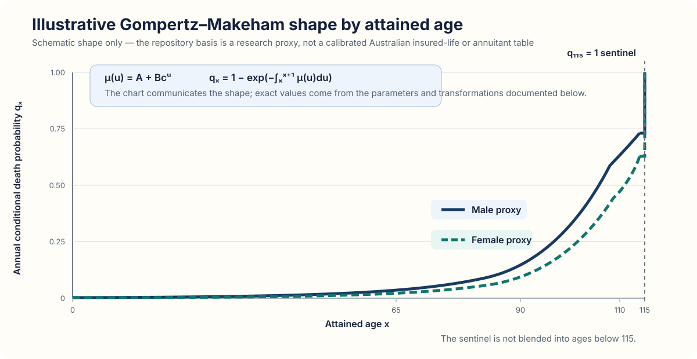
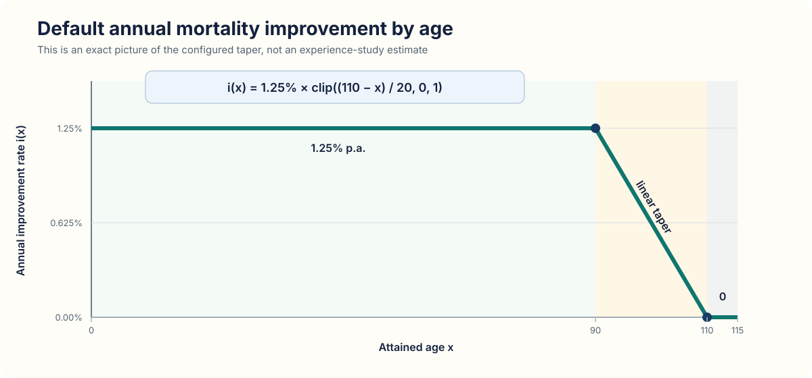
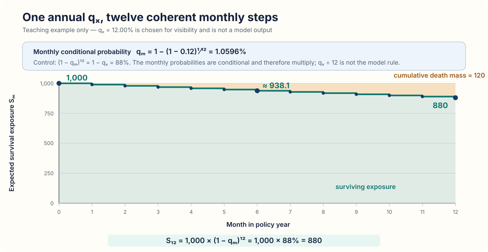
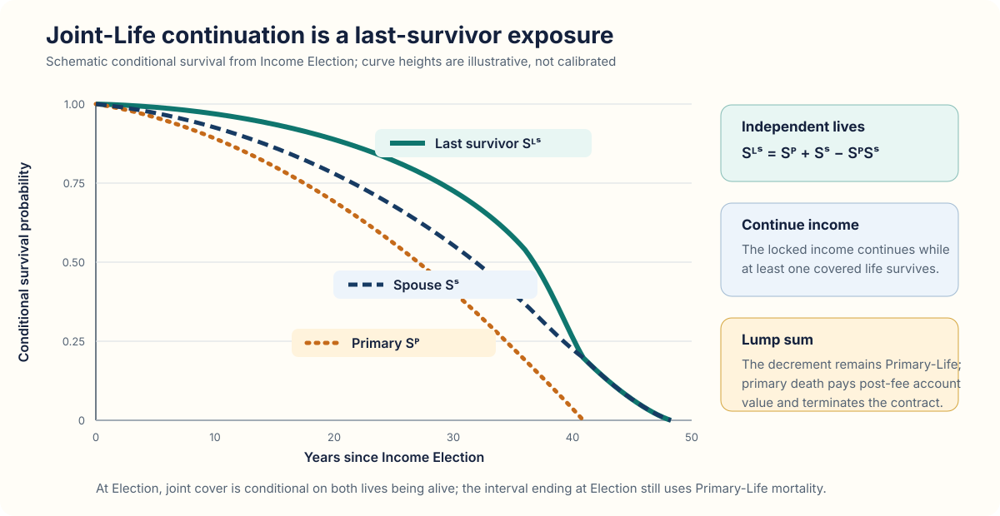
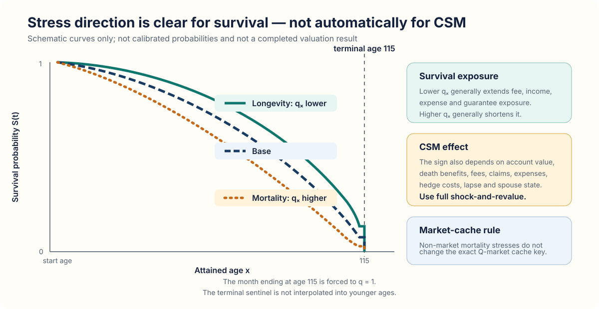

# Mortality Modelling

This document explains the repository's current mortality basis, how it is
converted to monthly decrements, and where it enters product cashflows and the
Contractual Service Margin (CSM) proxy. Here, **policyholder** means the insured
person; a **modelpoint** is one example insured person.

> **Research-basis warning.** The active basis is an illustrative
> Gompertz–Makeham proxy. It is not a calibrated Australian insured-life,
> annuitant or company-experience table and must not be presented as one.

## At a glance

Mortality answers a contractual question: *is each covered life alive at a
payment or decision date?* It is an exogenous decrement, not a policyholder
decision.

- **Mortality-rate inputs:** attained age, sex and commencement year.
- **Coverage inputs:** spouse age, spouse sex and death-benefit election, where
  relevant. These determine which life is covered; they do not recalibrate the
  mortality basis.
- **Transformation:** illustrative annual mortality → generational improvement
  → configured stress → policy-year-anchored monthly probability.
- **Use:** survivor-contingent income and fees, death-contingent benefits,
  Joint-Life status, guarantee exposure and the final actuarial valuation of a
  fitted behaviour policy.
- **Separation from markets:** mortality is independent of the simulated market
  paths in the baseline. Mortality and longevity stresses do not change the
  exact Q-market or hedge-price cache keys.

The current operating runners construct the proxy directly in code. They do
not read a mortality calibration file, and mortality is not inferred from the
Australian interest-rate curve or from equity-model parameters.

## Concepts and notation

| Symbol | Meaning |
|---|---|
| $x$ | Attained age at the relevant policy-year anchor |
| $q_x$ | Probability of dying before age $x+1$, conditional on being alive at age $x$ |
| $p_x=1-q_x$ | Corresponding annual conditional survival probability |
| $q_m$ | Conditional death probability in monthly interval $m$ |
| $S_m$ | Survival exposure at monthly grid point $m$ |
| $D_{m+1}$ | Death mass in the interval from $m$ to $m+1$ |
| $d$ | Policy duration in years |
| $y$ | Calendar year; $\max(y-2022,0)$ is the non-negative time from the base year |

The word **conditional** is essential. A $q_x$ of 2% does not mean that 2% of
the original issue cohort dies in every later year. It means that 2% of those
still alive at age $x$ die before age $x+1$.

Three clocks are kept distinct:

- **attained age** selects or interpolates the mortality rate;
- **calendar year** determines the generational improvement applied to that
  rate;
- **policy duration** determines policy-year anchoring and whether a first-year
  catastrophe add-on applies.

## Illustrative base table

### Gompertz–Makeham construction

For each sex, the research proxy starts from a force of mortality

$$
\mu(u)=A+Bc^u.
$$

The force is integrated over one year and converted to an annual conditional
probability:

$$
q_x^{\mathrm{base}}
=1-\exp\left(-\int_x^{x+1}\mu(u)\mathrm{d}u\right)
=1-\exp\left(
-A-Bc^x\frac{c-1}{\log c}
\right).
$$

The active defaults are:

| Proxy | $A$ | $B$ | $c$ |
|---|---:|---:|---:|
| Male | $3.0\times10^{-4}$ | $1.7\times10^{-5}$ | $1.103$ |
| Female | $2.0\times10^{-4}$ | $0.9\times10^{-5}$ | $1.106$ |

Values are clipped to valid probabilities, with a numerical lower bound of
$10^{-6}$. Fractional ages use linear interpolation between annual $q_x$
values. The hard terminal value at age 115 is treated separately and is not
interpolated backwards into age 114.x.

  

*Figure 1 — Schematic shape of the active proxy. The curves explain the
age pattern and sex ordering; they are not plotted calibration data. The final
point is the technical table sentinel.*

An external governed table can be supplied programmatically through
`MortalityTable.from_qx`. By default it must cover ages 0 through 114; constant
endpoint extrapolation requires an explicit research override. This factory is
not used by the current operating runners.

### Generational mortality improvement

The default annual improvement is 1.25% through age 90, tapers linearly to zero
at age 110, and is zero thereafter:

$$
i(x)=0.0125\times\mathrm{clip}\left(\frac{110-x}{110-90},0,1\right).
$$

  

*Figure 2 — Exact shape of the configured improvement taper. It is a fixed
research assumption, not an estimate from observed deaths.*

Before the terminal-age override, the annual probability is calculated
schematically as

$$
q(x,y,d)=\mathrm{clip}\left(
q_x^{\mathrm{base}}
[1-i(x)]^{\max(y-2022,0)}\times s
+a\times\mathbf{1}_{0\le d<1},
0,1
\right),
$$

where $s$ is a multiplicative mortality stress and $a$ is an additive
first-policy-year catastrophe shock. In the projector, `commencement_year`
supplies the initial offset from 2022 and each completed policy year advances
both attained age and calendar time. Years before the base year do not reverse
the improvement because the exponent is floored at zero.

The implemented order is therefore:

1. interpolate the sex-specific base $q_x$ at attained age;
2. apply age-dependent generational improvement;
3. apply the multiplicative stress;
4. add any first-policy-year catastrophe shock and clip to $[0,1]$;
5. convert the anchored annual result to monthly probabilities;
6. overwrite the first monthly interval whose end reaches age 115 with
   $q_m=1$.

## Annual-to-monthly conversion

One improved and stressed annual $q_x$ is anchored at each policy anniversary.
It is converted to a constant conditional monthly probability for the following
twelve months outside the terminal policy year:

$$
q_m=1-(1-q_x)^{1/12}.
$$

This construction gives the exact reconciliation identity

$$
\left(1-q_m\right)^{12}=1-q_x.
$$

  

*Figure 3 — Annual-to-monthly reconciliation. Markers and steps are monthly
model-grid points. The deliberately visible annual input $q_x=0.12$ (12%) is a
teaching input, not a modelpoint result. The monthly rate is about 1.0596%, not
1%.*

On the monthly grid, expected survival and death mass obey

$$
\begin{aligned}
D_{m+1}&=S_mq_m,\\
S_{m+1}&=S_m(1-q_m),\\
S_m&=D_{m+1}+S_{m+1}.
\end{aligned}
$$

The last identity is the monthly mass-control: every unit of exposure is either
alive at the next grid point or dies in the interval. A projection that starts
between anniversaries first uses the remainder of the already anchored policy-
year rate. The start duration must lie on the monthly grid.

The twelve-month reconciliation applies outside the terminal policy year. In
the terminal year, the ordinary anchored rate is converted first and the
interval whose end first reaches age 115 is then assigned $q_m=1$. This monthly
override, rather than interpolation of the terminal sentinel, removes the final
surviving exposure.

## Application in the monthly projection

### Event order around mortality

The order matters because it determines both the death benefit and eligibility
for later transactions. In the active projector, the relevant monthly order is:

1. evolve the reference fund and, at an anniversary, complete the old crediting
   year;
2. accrue fees and post them when contractually due;
3. process mortality for the interval just ended under the **pre-Election**
   coverage state;
4. pay the death benefit from positive post-fee account value, without a market
   value adjustment (MVA), and terminate if the covered death is terminating;
5. allow only survivors to elect Income at an eligible anniversary, then start
   the new cap and hedge period;
6. pay monthly income in arrears only to lives covered at month-end;
7. process eligible partial or full voluntary withdrawals.

Thus a death in the interval ending at an anniversary is not combined with the
post-Election life basis. A deceased modelpoint cannot elect Income, receive
that month's income payment or take a later voluntary action.

### Expected decrements, pathwise states and least-squares Monte Carlo

The repository uses the same annual and monthly basis in different ways, but
the active least-squares Monte Carlo (LSMC) fitting convention is an important
exception.

| Treatment | Mechanics | Current use | Mortality seed |
|---|---|---|---|
| Expected Single-Life decrement | Death cashflow uses $wq_m$; surviving exposure becomes $w(1-q_m)$ | Standard aggregated Single-Life valuation | None |
| Pathwise Joint-Life state | Independent uniforms determine Primary and Spouse death on each path | Standard portfolio Joint-Life runs and state-dependent behaviour rollouts | Required |
| Expected Joint-Life fallback | Uses a conditional last-survivor decrement without separate life-state account cohorts | Direct deterministic calls when pathwise Joint-Life is not forced | None |
| Optimal-behaviour LSMC fit | Sets mortality to zero and fits conditional on survival | Training and validation of the action policy | Normalised to zero and economically irrelevant because $q_m=0$ |

The fitted LSMC policy is subsequently rolled out under the actual mortality
basis for actuarial valuation. Mortality therefore affects the final cashflows
and CSM, but death events and death benefits are deliberately excluded from the
current conditional-survival LSMC fit. This prevents mortality from being
mislabelled as an exercise decision.

Mortality random numbers are separate from market and behaviour random numbers.
Portfolio comparisons can reuse the same mortality draws across alternatives
as common random numbers. The baseline has no systematic mortality factor and
no dependence between mortality and market returns.

## Joint-Life and spouse continuation

Before Income Election, spouse continuation is not active. Primary death
terminates the contract; spouse death alone does not terminate a living
Primary's contract.

At Election in a pathwise run:

- if both lives are alive, the Joint-Life rate and joint cover are locked;
- if the spouse has already died, the Single-Life rate is used;
- the interval ending at Election still uses Primary-Life mortality;
- Joint-Life mortality starts in the following monthly interval.

The income rate itself comes from the product rate card. The mortality table is
used to value survival-contingent exposure; it does not set that contractual
rate.

For independent Primary and Spouse deaths, conditional last-survivor survival
after Election is

$$
S^{LS}(t)=S^P(t)+S^S(t)-S^P(t)S^S(t),
$$

and its next-month conditional decrement is

$$
q_{m+1}^{LS}=1-\frac{S_{m+1}^{LS}}{S_m^{LS}}.
$$

  

*Figure 4 — Schematic Joint-Life survival. Under `continue_income`, the locked
amount continues while either covered life survives. Under `lump_sum`, the
decrement remains tied to Primary death.*

The pathwise `continue_income` treatment distinguishes both alive, Primary only,
Spouse only and neither alive. Death of the last covered life terminates income
and pays any remaining positive post-fee account value as the death benefit.
Under `lump_sum`, Primary death instead pays the positive post-fee account value
and terminates immediately.

The deterministic expected fallback does **not** maintain separate
both-alive/Primary-only/Spouse-only account-value and fee cohorts. The standard
portfolio workflow therefore forces pathwise Joint-Life states where behaviour
depends on who is alive. Common mortality shocks, dependence between lives,
divorce and later spouse-eligibility changes are omitted.

## Cashflow and CSM impact

The repository's standard profitability measure is the CSM proxy. With
present value denoted by PV,

$$
\mathrm{CSM}
=\mathrm{PV}_{\mathrm{fees}}
+\mathrm{PV}_{\mathrm{other}}
-\mathrm{PV}_{\mathrm{claims}}
-\mathrm{PV}_{\mathrm{costs}}.
$$

Mortality changes several terms at once:

| CSM channel | Mortality mechanism |
|---|---|
| Fee Income | Termination shortens product-fee and lifetime-income-fee exposure. |
| Other Income | The duration of money-market backing income and any retained hedge gains changes with in-force account value. |
| Claims | Lifetime-income guarantee exposure changes, while death-benefit timing and amount may move in the opposite direction. |
| Costs | Future maintenance expenses and future annual call-spread purchases depend on whether the contract remains in force. |

Higher mortality can shorten lifetime-income claims but also reduce fees,
accelerate death benefits and change future hedge and expense exposure.
Longevity can reverse several of those movements. The net CSM sign must
therefore be measured by full **shock-and-revalue**, not inferred from the
direction of $q_x$ alone.

## Mortality, longevity and catastrophe stresses

The current portfolio and capital workflow uses these research stresses:

| Stress | Transformation of annual $q_x$ | Duration |
|---|---:|---|
| Longevity | $q_x\times0.80$ | Permanent |
| Mortality | $q_x\times1.15$ | Permanent |
| Mortality catastrophe | $q_x+0.0015$ | First policy year only |

All stressed probabilities are clipped to $[0,1]$. Outside the terminal policy
year, the annual result is converted coherently to twelve monthly probabilities.
In the terminal policy year, that conversion is followed by the separate
$q_m=1$ override for the interval ending at age 115. Other research sensitivity
runners may use different explicitly labelled factors; those must not be
confused with the portfolio/capital stress set above.

  

*Figure 5 — Schematic stress direction. Survival exposure moves predictably,
but the CSM direction remains product-state dependent and requires a complete
revaluation.*

> **Cache rule:** mortality, longevity, catastrophe, expense and other
> non-market stresses do not change the Q-market cache key. The valuation must
> reuse the exact validated market paths and, where applicable, the matching
> hedge-price cache; it changes the mortality basis, not the market scenario.

## Projection horizon and terminal treatment

With `horizon_years=None`, the standard valuation horizon extends to
`ProjectionConfig.max_age`, whose default is age 115. For a
`continue_income` contract, the default covers the longer remaining lifetime of
the Primary and Spouse. The market scenario must be long enough to support that
horizon.

An explicitly shorter horizon or lower configured maximum age is respected.
Any remaining account value is then reported as `terminal_closeout`; truncation
is not reclassified as death. At the full default lifetime horizon, the hard
terminal-age mortality convention removes surviving covered exposure.

Years with no surviving and in-force exposure must not create behaviour fits,
Income Elections or cap decisions.

## Validation and controls

### Implemented numerical controls

- mortality arrays must be finite, immutable, have one value for every age 0
  through 115, remain in $[0,1]$ and end at one;
- improvement and stress parameters are range-checked;
- projection monthly curves anchor one annual rate per policy year;
- survival is accumulated from the same monthly curve used by the projector;
- life expectancy uses trapezoidal integration on that monthly grid;
- annuity factors use the same payment-date survival convention as monthly
  income, with payments in arrears.

### Current test evidence

The test suite currently covers:

- decreasing survival, plausible age-65 life expectancy and higher life
  expectancy under longevity stress in
  [`test_projection_pricing.py`](../tests/test_projection_pricing.py);
- first-policy-year-only catastrophe treatment in
  [`test_review_fixes.py`](../tests/test_review_fixes.py) and
  [`test_independent_audit_fixes.py`](../tests/test_independent_audit_fixes.py);
- payment of income only to month-end survivors in
  [`test_independent_audit_fixes.py`](../tests/test_independent_audit_fixes.py);
- spouse conditioning at Election and the Primary decrement under `lump_sum`
  in [`test_spouse_conditioning.py`](../tests/test_spouse_conditioning.py);
- Joint-Life horizon/annuity behaviour and defensive immutability in
  [`test_audit_fixes.py`](../tests/test_audit_fixes.py);
- mortality-free conditional-survival LSMC fitting in
  [`test_optimal_behaviour_lsmc.py`](../tests/test_optimal_behaviour_lsmc.py).

Useful explicit additions would be a direct twelve-month reconciliation test, a
fractional-age boundary test proving that the age-115 sentinel is not blended
into age 114.x, and an end-to-end assertion of the `lump_sum` death payment.

## Limitations and production requirements

The current baseline omits:

- a governed experience or pricing table and formal data lineage;
- selection, underwriting, socioeconomic and policy-duration effects;
- calibrated mortality improvement and parameter uncertainty;
- systematic longevity risk, mortality-market dependence and a mortality risk
  premium distinguishing P from Q;
- dependence or common shocks between Primary and Spouse;
- separate four-state account-value and fee cohorts in the expected Joint-Life
  fallback;
- credibility analysis, reinsurance and validation against observed deaths.

Production use would require governed tables, improvement calibration,
experience monitoring, documented margins and independent validation. None of
those inputs should be inferred from the Australian market curve or equity
parameters.

## Implementation map

- Base rates, improvements, monthly curves, survival and annuity factors:
  [`mortality.py`](../code/policy_engine/mortality.py)
- Monthly event order and cashflow application:
  [`projection.py`](../code/policy_engine/projection.py)
- Default horizon resolution:
  [`pricing.py`](../code/policy_engine/pricing.py)
- Portfolio aggregation and Joint-Life handling:
  [`portfolio.py`](../code/policy_engine/portfolio.py)
- Mortality/longevity stress construction and capital revaluation:
  [`portfolio_stresses.py`](../code/policy_engine/portfolio_stresses.py) and
  [`capital.py`](../code/policy_engine/capital.py)
- Conditional-survival optimal-behaviour fit:
  [`optimal_behaviour_lsmc.py`](../code/policy_engine/optimal_behaviour_lsmc.py)
- Modelpoint mortality and spouse fields:
  [`model_points.py`](../code/policy_engine/model_points.py)
