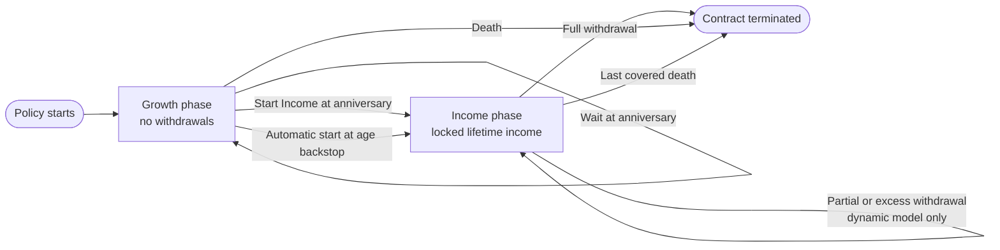
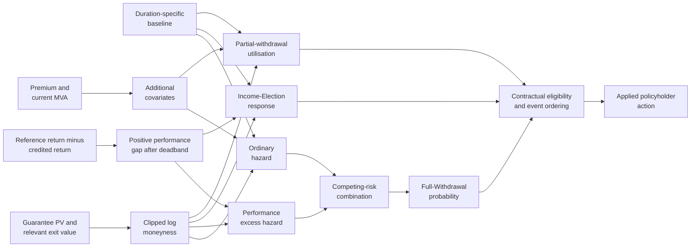
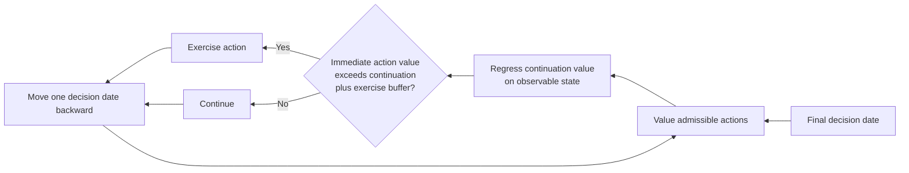
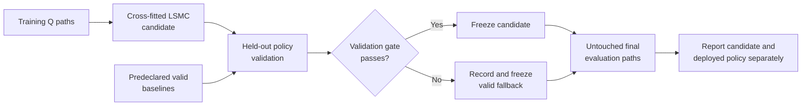

# Policyholder Behaviour

## Decisions in scope

The repository concentrates on two forms of behaviour:

- the annual decision to leave Growth and start lifetime income;
- voluntary actions in Income, especially full withdrawal and the amount of an
  excess withdrawal.

Growth-phase withdrawals are prohibited by the product. Mortality is a separate
decrement and is never fitted as voluntary behaviour.

Two alternative models are used: transparent statistical dynamic functions and
policyholder-value-maximising LSMC.

### Contract states and decisions

The product state machine is common to both behaviour approaches. What differs
is how an admissible voluntary action is selected.

Mortality and the age backstop are contractual transitions, not voluntary
behaviour. Income Election and Full Withdrawal are the two decisions shared by
the statistical and LSMC approaches; partial withdrawal is currently modelled
only by the statistical approach.

| Question | Statistical dynamic model | Optimal LSMC model |
|---|---|---|
| Interpretation | Transparent empirical-style proxy | Fitted value-maximising policy under Q |
| Income Election | Annual probability conditional on eligibility | Annual `WAIT` versus `START_INCOME_NOW` |
| Income Full Withdrawal | State-dependent ordinary and performance hazards | Annual `CONTINUE` versus `FULL_WITHDRAWAL_NOW` |
| Partial withdrawal | Event probability and conditional amount | Not in the current action set |
| Main safeguard | Probability bounds and contractual gates | Cross-fitting, validation gate and recorded fallback |

## Statistical dynamic behaviour

The dynamic model is intended to resemble common actuarial behaviour functions:
it starts from a duration-dependent baseline and modifies it through observable
contract states. It is not calibrated to company experience.

The calculation is deliberately modular: observable state changes signals,
signals change cause-specific response functions, and contractual gates decide
whether the resulting action can occur.

### Moneyness

The relevant signal depends on the decision. For income lapse, guarantee
moneyness compares the economic value of remaining guaranteed income with the
cash value available on surrender. The implementation uses a clipped log ratio,
which is stable around one and treats proportional deviations symmetrically.

A high-value guarantee reduces the propensity to surrender. A high account
value relative to the guarantee can increase the attractiveness of extracting
funds, particularly because the fixed income has no ratchet.

Schematically, the signal is

$$
m=\operatorname{clip}\!\left(
\log\!\left(\frac{G}{E}\right),m_{\min},m_{\max}
\right),
$$

where $G$ is the pathwise present value of remaining contractual income and
$E$ is the exit value relevant to the decision. For Income Full Withdrawal,
$E$ is the current surrender value. The implementation safeguards zero and
near-zero denominators before taking the logarithm.

| Signal | Economic reading | Typical Income Full-Withdrawal effect |
|---:|---|---|
| $m>0$ | Remaining guarantee is worth more than the exit value | Lower propensity to surrender |
| $m=0$ | Guarantee PV and exit value are balanced | Baseline response, all else equal |
| $m<0$ | Exit value exceeds the remaining guarantee PV | Higher propensity to surrender |

### Proportional-hazard response

For a baseline annual probability $p_0$, the model first converts the
probability to an integrated hazard and applies a multiplicative predictor:

$$
\begin{aligned}
h_0&=-\log(1-p_0),\\
\eta&=\beta_m m+\beta_p z+\beta_{mp}mz+\beta_{\mathrm{MVA}}s,\\
h&=h_0\operatorname{clip}\!\left(e^\eta,L,U\right),
\qquad p=1-e^{-h}.
\end{aligned}
$$

Here $m$ is clipped log moneyness, $z$ is clipped log premium relative to a
reference premium, and $s$ is an optional MVA signal. $L$ and $U$ bound the
relative-hazard multiplier; a separate floor and cap bound the final annual
probability. Annual probabilities are converted to coherent monthly
conditional probabilities by the projector.

### Performance-sensitive lapse

Income lapse also contains a separate performance cause. The signal is the
positive gap between trailing gross reference-fund performance and the return
credited to the customer. A deadband avoids reacting to immaterial differences.
The excess hazard rises with the gap but is attenuated when the remaining
guarantee is valuable. Ordinary and performance exits are combined as competing
risks so the total probability remains bounded and cause diagnostics reconcile.

This signal uses only the customer reference fund and credited history. It does
not use the insurer's backing return or hedge P&L.

### Income take-up

The baseline take-up schedule is conditional on still being in Growth. Dynamic
take-up applies a state response at each eligible anniversary, subject to:

- the minimum one-year growth period;
- survival to the election time;
- one irreversible election;
- automatic start at the contractual age backstop.

### Excess withdrawal

The model separates event probability from conditional utilisation. A bounded
fractional-logit response changes the conditional withdrawal fraction with
moneyness and related state variables. The projector then applies contractual
minimum transaction, residual account-value, MVA and proportional income-
reduction rules.

### Competing actions

Full withdrawal terminates the contract and guarantee. Partial withdrawal
changes account value and future income but keeps the contract in force. The
monthly state machine applies event eligibility and ensures that no path is
simultaneously counted in mutually exclusive voluntary exits.

### Illustration from a completed Dynamic run

*Illustrative cause decomposition from completed Dynamic-only run
`20260714T054131.308036Z`. The performance-sensitive component falls as the cap
rises, while the ordinary component rises modestly; the combined event mass
still falls on this four-point grid. The dashed line is the contractual 6% cap.
This is a four-model-point proxy with 1,000 common Q paths and uncalibrated
behaviour assumptions, not an experience study. See the
[figure provenance](../results/document_figures/capital_run_20260714T054131.308036Z.provenance.json).*

## Optimal LSMC behaviour

The optimal model asks which admissible action maximises the policyholder's
risk-neutral discounted benefits within a fitted basis. It replaces statistical
voluntary actions; the two models are not applied on top of one another.

### Action set

| Phase | Decision time | Current actions |
|---|---|---|
| Growth | Policy anniversary | Wait one year; start income now |
| Income | Policy anniversary | Continue one year; full withdrawal now |

Partial withdrawal is deliberately excluded from the current LSMC action set.
This keeps the ordered multiple-stopping problem identifiable and matches the
validated portfolio workflow.

### Backward induction

For each decision date, regression estimates the continuation value conditional
on state observable at that date. Immediate exercise value is evaluated from
the complete contractual cashflow. The selected action is the one with the
larger fitted policyholder value, subject to an exercise buffer based on
regression error.

Growth election and income surrender are fitted as one ordered policy: the value
of waiting in Growth includes the later optimal Income actions. Treating them as
independent options would miss this interaction.

The backward direction is important: a Growth `WAIT` value already includes
the optimally modelled Income decisions available later on the same path.

### Cross-fitting and validation

Whole economic paths, not individual rows, are assigned to folds. Fitted values
for a held-out fold must not use that fold in the regression. Training, policy
validation and final evaluation use distinct market, take-up and mortality seed
namespaces.

The candidate is compared with predeclared fixed-behaviour baselines. If a
validation gate fails, the final rollout uses the recorded valid fallback. A
failed candidate must not be labelled as the deployed optimal policy.

### Interpretation

The result is a fitted lower bound within the chosen basis, action frequency and
action set. It is sensitive to path support and regression quality. It does not
prove globally rational behaviour, and Q-optimal exercise should not be
interpreted as an empirical forecast.

### Illustration of deployed behaviour

*Dynamic statistical behaviour versus the actually deployed annual-action
LSMC fallback in completed run `20260714T002637.233689Z`. Every LSMC cell in
this figure is a validated fallback; no accepted candidate is shown, and the
fallback has no voluntary Full-Withdrawal rate in these cells. The chart is
therefore evidence about deployed model policies, not proof of optimal
behaviour. The dashed line marks the contractual 6% cap. See the
[figure provenance](../results/document_figures/risk_run_20260714T002637.233689Z.provenance.json).*

## Diagnostics

Publishable behaviour results should include:

- eligible exposures and action frequencies by policy year;
- income-election distribution;
- ordinary and performance lapse causes;
- moneyness distribution at decisions;
- regression rank, condition number, RMSE and held-out fit metrics;
- training/validation/evaluation seed identities;
- candidate and actually deployed policy labels;
- comparison with deterministic or no-voluntary-action controls.

Zero action frequency is not automatically evidence of model stability: it may
reflect economic dominance, insufficient support, an invalid fit or a fallback.

## Inputs and limitations

The statistical parameters in `input_data/dynamic_behaviour/` are versioned
uncalibrated proxies. Low/base/high sets are model-risk sensitivities, not
confidence intervals. The LSMC model likewise depends on simulated state support
and the predeclared basis. Production use would require experience calibration,
governance, stability monitoring and an explicit treatment of customer tax and
advice effects.
