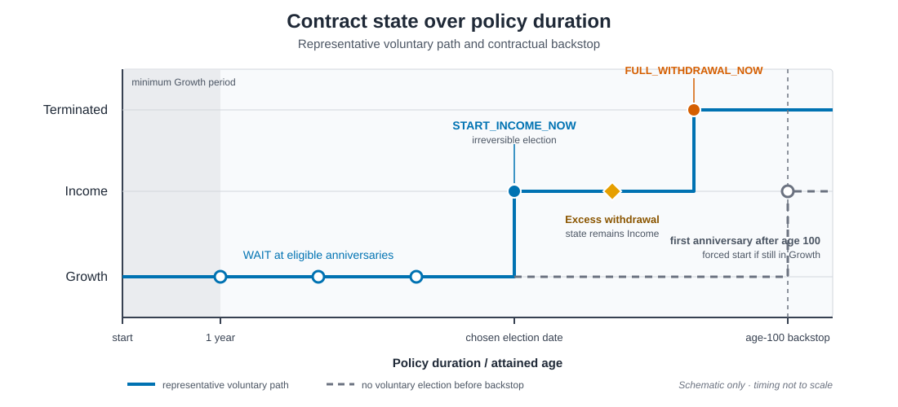
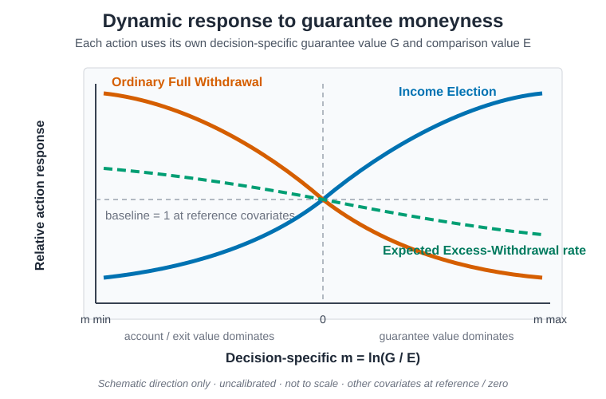
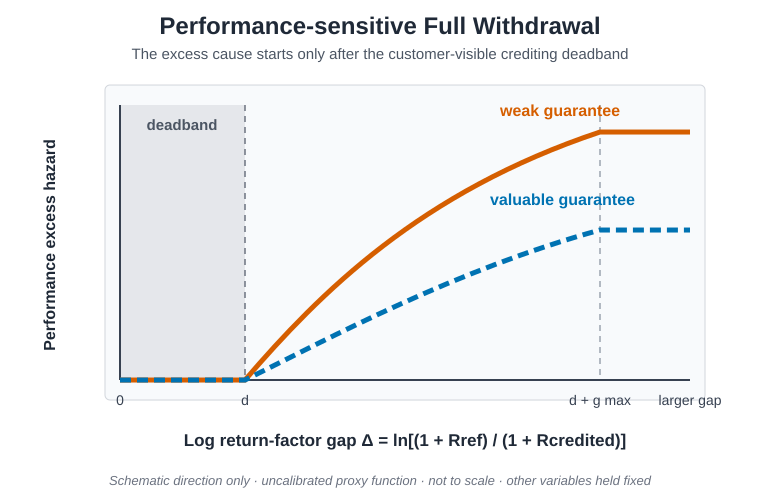
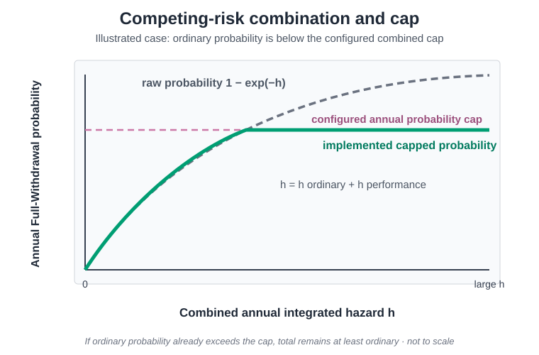

# Policyholder Behaviour

This document describes how voluntary Policyholder decisions are represented in
the generic product model. The contractual mechanics in
[`product_design.md`](product_design.md) remain authoritative. Behaviour changes
which admissible action is taken; it never creates an action that the contract
does not permit.

Two alternative approaches are supported:

- **Statistical Dynamic behaviour** applies transparent, state-dependent proxy
  functions to Income Election, Income Full Withdrawal and the expected amount
  of an Income-phase Excess Withdrawal.
- **Optimal LSMC behaviour** fits a policy that maximises the Policyholder's
  expected contractual present value as viewed at time zero, within a
  restricted annual action set and regression basis.

The approaches are alternatives. Statistical actions must not be layered on top
of an LSMC rollout. Neither approach is calibrated to company experience, and a
Q-optimal LSMC policy is not an empirical behaviour forecast.

## Decisions, states and terminology

The model distinguishes voluntary behaviour from contractual transitions and
other decrements.

| Term | Meaning in this repository |
|---|---|
| **Income Election** | Irreversible transition from Growth to Income at an eligible policy anniversary. |
| **Scheduled Income** | Fixed nominal lifetime-income instalment locked at election and paid monthly in arrears. It is not a voluntary withdrawal decision. |
| **Excess / Partial Withdrawal** | Additional Income-phase deduction above Scheduled Income. The contract remains in force and future locked income is reduced proportionally. |
| **Full Withdrawal** | Voluntary surrender in Income. The surrender value is paid and the contract and guarantee terminate. In behaviour diagnostics this is also called voluntary lapse. |
| **Mortality** | Separate decrement governed by the coverage rules. It is never fitted as voluntary lapse. |
| **Account exhaustion** | Account Value reaches zero through Scheduled Income. This is not surrender; insurer-funded guaranteed income can continue. |
| **MVA** | Market Value Adjustment: a bounded contractual reduction to an eligible withdrawal or surrender value, not a behavioural event. |

Growth-phase withdrawals are prohibited. The automatic age backstop is a
contractual forced Income Election, not voluntary behaviour.

| Phase | Admissible voluntary decision | Statistical Dynamic | Optimal LSMC |
|---|---|---|---|
| Growth | `WAIT` or `START_NORMAL_INCOME` at an eligible anniversary | Annual conditional probability | Annual value comparison |
| Growth | Partial or Full Withdrawal | Prohibited | Prohibited |
| Income | Continue with Scheduled Income | Residual state after allowed actions | `CONTINUE` action |
| Income | Excess / Partial Withdrawal | State-dependent expected amount, currently on the annual action frequency | Not in the current action set |
| Income | Full Withdrawal | Annual hazard converted to coherent monthly probabilities | Annual `CONTINUE` versus `FULL_SURRENDER` |

*Schematic contract-state path. Horizontal positions are illustrative, not
frequencies or calibrated timing. A death can terminate Growth or Income under
the contractual coverage rules but is omitted from the line so that voluntary
decisions remain visually distinct.*

### Timing and event order

At an anniversary, information is used in contractual order:

1. settle the completed crediting year;
2. post accrued fees;
3. process mortality for the ending interval;
4. permit eligible surviving Growth contracts to elect Income; and
5. start the new crediting period.

Scheduled Income is then paid monthly in arrears; the election month has no
Income payment. On the current statistical basis, the expected Excess
Withdrawal is applied at its configured annual boundary before the monthly
Full-Withdrawal settlement. Under LSMC, the Income Full-Withdrawal decision is an
anniversary-only action and Partial / Excess Withdrawal is suppressed. The
Scheduled Income instalment already booked at that boundary is common to
`CONTINUE` and `FULL_SURRENDER`; the surrender settlement follows it.

This order matters: Election uses the post-fee Account Value and information
from the completed crediting year, while an Income surrender uses the current
post-fee surrender value. The exact state transitions are implemented in
[`projection.py`](../code/policy_engine/projection.py).

## Statistical Dynamic behaviour

The Dynamic approach is an actuarial-style response model. A duration-dependent
baseline is modified by observable contract state, then contractual eligibility
gates are applied. The supplied parameter sets are transparent research proxies,
not an experience calibration.

### Decision-specific guarantee moneyness

The central state signal compares the economic value of the remaining or
prospective guarantee with the value relevant to the action. Define

$$
r = \frac{G}{\max(E,\varepsilon)}, \qquad
m = \min(m_{\max},\max(m_{\min},\log(r))).
$$

Here $G$ is the pathwise present value of the guarantee, $E$ is the
decision-specific comparison value, and $\varepsilon$ protects zero and
near-zero denominators. The clipped log ratio is stable around one and treats
proportional deviations on either side symmetrically.

| Decision | Guarantee value $G$ | Comparison value $E$ | Interpretation of higher $m$ |
|---|---|---|---|
| Income Election | PV of the prospective locked lifetime income | Current post-fee Account Value at election | The prospective guarantee is more valuable relative to the current Account Value |
| Income Full Withdrawal | PV of remaining locked lifetime income | Current cash surrender value | Retaining the guarantee is more valuable than surrender |
| Income Excess Withdrawal | PV of remaining locked lifetime income | Current Account Value | Extracting additional Account Value is less attractive |

Thus $m=0$ means the two values are balanced, $m>0$ means the guarantee
dominates, and $m<0$ means the alternative account or exit value dominates.
There is no operational Growth Full-Withdrawal moneyness because that action is
contractually prohibited.

### Response shapes

*These curves show direction only. They are not fitted observations, run
results or a scale representation. Income Election responds positively to a
more valuable prospective guarantee; Income Full Withdrawal and the expected
Excess-Withdrawal rate respond negatively to remaining-guarantee moneyness.
The performance cause begins only after its deadband and is attenuated by a
valuable guarantee.*

### Proportional-hazard response

Income Election and ordinary Full Withdrawal start from an annual baseline
probability $p_0$. For an interior baseline $0<p_0<1$, the model converts it to
an integrated hazard, applies a bounded relative-hazard multiplier, and converts
back to a probability:

$$
h_0=-\log(1-p_0),
$$

$$
\eta=\beta_m m+\beta_z z+\beta_{mz}mz+\eta_s,
\qquad
q=\min(U,\max(L,e^{\eta})),
$$

$$
h=h_0q, \qquad p=1-e^{-h}.
$$

$z$ is clipped log gross premium relative to the reference premium and
$\eta_s$ collects any additional enabled state terms. The versioned Income-Election
response can also use Account Value, prospective income and the completed-year
performance gap. Separate output floors and caps bound the final annual
probability for interior baselines. A structural baseline of zero remains zero,
while a structural baseline of one is handled separately and remains one even
if that overrides the ordinary output cap.

Annual Full-Withdrawal probabilities are converted to the monthly projection
grid without changing the implied annual survival probability:

$$
p_{\Delta t}=1-(1-p_{\mathrm{annual}})^{\Delta t},
\qquad \Delta t=\frac{1}{12}.
$$

Income Election remains an anniversary decision and is therefore not converted
to a monthly election probability.

### Performance-sensitive Full Withdrawal

The customer-visible performance signal compares the completed trailing
Reference-Fund factor with the return actually credited to the customer:

$$
\Delta=\log(1+R_{\mathrm{reference}})
-\log(1+R_{\mathrm{credited}}).
$$

After a deadband $d$, the effective non-negative shortfall is

$$
g=\min(g_{\max},\max(0,\Delta-d)).
$$

The additional annual integrated hazard rises smoothly towards its configured
limit and is reduced when guarantee moneyness is positive. First define the
bounded positive moneyness used by this response:

$$
m_+=\min(m_{\mathrm{perf,max}},\max(m,0)).
$$

$$
a(m)=\max(a_{\min},e^{-\gamma m_+}),
$$

$$
h_{\mathrm{perf}}
=a(m)h_{\max}\left(1-e^{-g/c}\right).
$$

Ordinary and performance exits are competing causes. Their hazards are added
before conversion to a total probability:

$$
p_{\mathrm{raw}}
=1-e^{-(h_{\mathrm{ordinary}}+h_{\mathrm{perf}})}.
$$

With $p_{\mathrm{ordinary}}=1-e^{-h_{\mathrm{ordinary}}}$, the implemented
combined-probability cap is

$$
p_{\mathrm{total}}
=\max(p_{\mathrm{ordinary}},
\min(p_{\mathrm{raw}},p_{\mathrm{cap}})).
$$

The cap therefore limits incremental performance risk but never reduces an
already larger ordinary probability. Cause-specific event mass is allocated in
proportion to the two hazards, so the causes reconcile exactly to total Full
Withdrawal without double counting.

The performance signal uses the customer Reference Fund and credited history.
It does not use the insurer's backing return, Money Market Fund income or hedge
P&amp;L. The crediting cap can affect behaviour indirectly through customer
returns, Account Value and moneyness; it is not inserted as an undocumented
direct lapse coefficient.

### Income Election

The baseline Election schedule is conditional on the Policyholder still being
in Growth. At each eligible anniversary the Dynamic response applies current
moneyness and the enabled completed-year state variables to that baseline. The
following contractual gates then override any statistical response:

- at least one full Growth year must have elapsed;
- the covered Policyholder must survive to the election time;
- Election can occur only once and is irreversible;
- the contractual age backstop forces Election if the contract is still in
  Growth.

### Excess Withdrawal

The current Dynamic implementation models an **expected annual gross Excess
Withdrawal rate** $u$, expressed as a fraction of current Account Value. It does
not separately draw an event indicator and then a conditional amount. Starting
from baseline $u_0$, a fractional-logit response is applied when
$0<u_0<1$:

$$
\log\left(\frac{u}{1-u}\right)
=\log\left(\frac{u_0}{1-u_0}\right)
+\beta_m m+\beta_z z+\beta_{mz}mz+\beta_s s_{\mathrm{MVA}}.
$$

The response is bounded in $[0,1]$. A structural baseline $u_0=0$ remains
exactly zero and $u_0=1$ remains one; the numerical log-odds calculation clips
only interior values for stability. Under the supplied central proxy, higher
guarantee moneyness and a larger current MVA bite both reduce the expected
Excess-Withdrawal rate. The projector then enforces the contractual minimum
transaction, remaining Account Value, MVA and proportional reduction of future
locked income.

Scheduled Income itself remains fixed. A voluntary choice to take less than the
locked Scheduled Income is not part of the current model.

### Parameter governance

The complete versioned assumptions are stored in:

- [`dynamic_behaviour_baselines.csv`](../input_data/dynamic_behaviour/dynamic_behaviour_baselines.csv),
  containing duration baselines, structural zeros and frequencies; and
- [`dynamic_behaviour_coefficients.csv`](../input_data/dynamic_behaviour/dynamic_behaviour_coefficients.csv),
  containing link functions, coefficients, clipping bounds, units and source
  status.

The `low`, `base` and `high` values are directional model-risk sensitivities,
not confidence intervals. Implementation of the links and validation of the
input schema are in
[`behavior.py`](../code/policy_engine/behavior.py) and
[`dynamic_behaviour_assumptions.py`](../code/policy_engine/dynamic_behaviour_assumptions.py).

## Optimal LSMC behaviour

The customer LSMC is a finite-horizon, Swing-style stopping problem. It selects
the admissible sequence of actions that maximises the expected contractual
present value as viewed today. For an admissible policy $\pi$, the objective is

$$
V_0(\pi)
=\mathbb{E}^{Q}_0\!\left[
\sum_j P(0,t_j)\,\mathrm{CF}^{\mathrm{customer},\pi}_{t_j}
\right],
$$

where $P(0,t_j)$ is the deterministic discount factor from today's Australian
zero curve. Equivalently, the backward steps use the deterministic forward
discount ratios implied by that same curve. Realised future short rates and the
pathwise stochastic discount factors stored with the market scenarios do
**not** enter this customer objective. Those pathwise factors remain relevant
to insurer cashflows, hedge valuation and CSM.

The fit is **conditional on survival**: mortality decrements are set to zero
and death benefits are excluded. Customer cashflows in the objective are only
Scheduled Income, Full Surrender proceeds and the finite-horizon terminal
closeout. The issue premium is sunk at subsequent decision dates. Customer tax,
advice and non-contractual liquidity preferences are outside the objective.
After the V11 action policy has been fitted, it is rolled out on the same exact
Q-market sample in the actuarial projector with the configured mortality basis
restored. Mortality can therefore affect actuarial cashflows and CSM without
being treated as a voluntary customer action.

### Current action set

| Phase | Decision time | Immediate action | Continuation action |
|---|---|---|---|
| Growth | Eligible policy anniversary | `START_NORMAL_INCOME` | `WAIT` one year |
| Income | Policy anniversary | `FULL_SURRENDER` | Receive normal Scheduled Income and `CONTINUE` for the coming period |

Partial or Excess Withdrawal is deliberately excluded from the current combined
annual LSMC action set. LSMC therefore does not optimise the amount of an Excess
Withdrawal. A voluntary reduction below locked Scheduled Income is not a
contract action in either behaviour regime. Surrender during Growth is also
excluded because the contract prohibits Growth-phase withdrawals. In the code,
the two immediate actions are represented as `START_INCOME_NOW` and
`FULL_WITHDRAWAL_NOW` respectively.

### Value comparison and backward induction

At decision date $t_k$, let $A_k(s)$ denote the value of acting now and
$C_k(s)$ the value of continuing. The implementation constructs phase-specific
action-advantage targets and regresses the advantage on state observable at
$t_k$. In Income, the target is immediate surrender value minus realised
continuation value. In Growth, `START_INCOME_NOW` comes from a cross-fitted,
pooled START-value surface and is paired with the `WAIT` target. The selected
action is the pure fitted expected-PV argmax:

$$
A_k(s)>C_k(s).
$$

There is no RMSE-scaled exercise buffer. A Growth `WAIT` value includes the
later optimally modelled Income actions on the same path; Income Election and
surrender are therefore fitted as one ordered policy, not as independent
options.

The ordered fit moves backward in two stages:

1. solve the annual Income `FULL_SURRENDER` minus `CONTINUE` advantages
   from the final admissible Income date backward;
2. construct `START_NORMAL_INCOME` as the exact projector state transition
   followed by the already-solved Income policy, not as an immediate cash
   payment;
3. fit the Growth `START_NORMAL_INCOME` minus `WAIT` advantages backward; and
4. apply the contractual gates and carry the selected value to the preceding
   date.

At the finite projection horizon, the terminal payout is the remaining
post-fee Account Value booked as `terminal_closeout`. It is included in the
customer objective and is the final value used by the backward induction. The
LSMC does not append an extra guarantee-income tail beyond that horizon.

The observable state includes:

- scaled Account and surrender values, locked or prospective Income, and
  guarantee moneyness;
- attained age, duration and time to the automatic Election backstop;
- short rate, five-year-minus-short rate slope, Heston variance and MVA state;
  and
- coverage indicators, the previous cap for Growth Election or announced cap
  for Income Full Withdrawal, and completed-year performance signals.

Quadratic and selected interaction terms are included. The exact feature lists
and numerical safeguards are defined in the implementation. Life-status fields
remain in the schema but do not vary through death on the conditional-survival
fit basis. See
[`optimal_behaviour_lsmc.py`](../code/policy_engine/optimal_behaviour_lsmc.py).

### Continuation estimation and direct deployment

Whole economic paths, not individual rows, are assigned to internal
cross-fitting folds. A fold's continuation targets are estimated only with the
other complete paths. This is part of the conditional-expectation estimator;
it is not an independent out-of-sample policy test. There is no separate
validation or final-evaluation path sample and no OOS acceptance gate.

The directly fitted V11 policy is the deployed customer policy. It is not
replaced by a fixed-behaviour rule on the basis of a confidence bound or an
in-sample comparison. Structural controls remain hard requirements: a
non-finite, incomplete, materially unsupported or otherwise invalid regression
fit aborts the run instead of silently deploying a substitute behavioural
rule.

The advantage basis is reduced from full to core features when necessary for a
stable estimator. For a materially sparse far-tail decision boundary, its final
documented basis may be an intercept-only, cross-fitted constant advantage.
That remains the expected-advantage argmax on a coarser information set; it is
not a prescribed `CONTINUE` rule or another substitute policy.

Customer-LSMC runs use exactly one modelpoint. The mortality-free fit and the
actual-mortality actuarial/CSM rollout share one exact market-path sample and
its recorded fingerprint. This same-sample convention is intentional and must
not be reported as OOS validation.

## Effect on cashflows and CSM

The repository's standard profitability measure is the Contractual Service
Margin proxy

$$
\mathrm{CSM}
=\mathrm{PV(Fee\ Income)}+\mathrm{PV(Other\ Income)}
-\mathrm{PV(Claims)}-\mathrm{PV(Costs)}.
$$

Behaviour affects CSM by changing the timing and duration of Account Value,
fees, guarantee exposure and hedge requirements.

| Behaviour | Main state and cashflow effects |
|---|---|
| Earlier Income Election | Locks Income sooner, changes the Account-Value runoff and the timing of guarantee claims, fees and hedge exposure. |
| Excess Withdrawal | Pays additional customer cash from Account Value, can generate retained MVA, reduces the future fee base and reduces locked Income proportionally. |
| Full Withdrawal | Settles the surrender value, can generate retained MVA, and terminates future fees, Income and guarantee claims. |
| Continue / Wait | Preserves future optionality, Account Value and the associated fee, guarantee and hedge exposure. |

Customer-funded Scheduled Income, surrender and partial-withdrawal amounts are
investment-component cashflows and are not deducted a second time as insurer
claims in the CSM proxy. Insurer-funded guarantee payments are Claims. Other
Income can include Money Market Fund income, retained MVA and hedge gains;
Costs include expenses and the market cost of the annual option spread. A
higher crediting cap generally makes the sold upper call less valuable and the
call spread more expensive. In the standard hedge the insurer buys the lower
call and sells the upper call in the capital market; it does not sell either
option to the customer. This hedge-cost relation is an insurer design effect,
not a Policyholder action.

## Valuation basis and cache discipline

For regular market-consistent valuation and optimisation, market paths use the
Heston-Hull-White model under the risk-neutral measure. Exact Q market paths,
monthly pathwise discount factors and Reference-Fund paths must be read from a
validated matching entry under `results/cache/q_market_paths`. Annual
Monte-Carlo Call-Spread prices for `mc_conditional` must be read from the
path-congruent cache under `results/cache/q_hedge_prices`.

Behaviour, valuation and optimisation runners are cache readers. They must not
simulate missing Q paths or hedge prices ad hoc, use an approximate cache key or
silently fall back from `mc_conditional` to Black-Scholes. The authorised
precompute runner is the sole cache writer. These controls affect the economic
paths on which behaviour is evaluated; they do not turn Dynamic proxy
probabilities into calibrated real-world forecasts.

For avoidance of doubt, the cached stochastic discount factors are not the
discount basis of the customer LSMC. Its expected-PV objective uses the
deterministic $P(0,t)$ schedule from today's Australian curve. The cached
pathwise factors continue to be used where required by the insurer valuation
and CSM calculation.

## Required diagnostics

Publishable behaviour results should include:

- eligible exposure and action frequency by phase and policy year;
- Income-Election timing, including voluntary and forced Election separately;
- ordinary, performance-sensitive and total Full-Withdrawal mass;
- Excess-Withdrawal amount and resulting Income reduction;
- moneyness and performance-gap distributions at decision times;
- regression rank, condition number, ridge choice, cross-fitted RMSE and final
  basis level, including any constant-advantage tail basis;
- the single market-sample seed and path fingerprint, the one modelpoint used,
  and the deterministic time-zero-curve objective basis;
- direct deployment of V11 and the structural fit-validity outcome; and
- comparison with deterministic and no-voluntary-action controls.

Zero observed action frequency is not by itself evidence of stability. It can
reflect economic dominance, insufficient state support or an invalid fit.

## Current limitations

- Dynamic parameters are versioned uncalibrated proxies. Production use would
  require experience calibration, governance and stability monitoring.
- The current model does not represent a voluntary reduction below locked
  Scheduled Income.
- Dynamic Excess Withdrawal is an expected amount response rather than a
  separately simulated event and conditional severity.
- The combined annual LSMC action set excludes Partial / Excess Withdrawal.
- LSMC optimises risk-neutral discounted contractual value within its basis; it
  is not a real-world behavioural prediction.
- The customer LSMC has a finite terminal closeout and does not value an
  additional guarantee-income tail beyond the projection horizon.
- Tax, financial advice, liquidity needs and other customer-specific utility
  effects are omitted.
